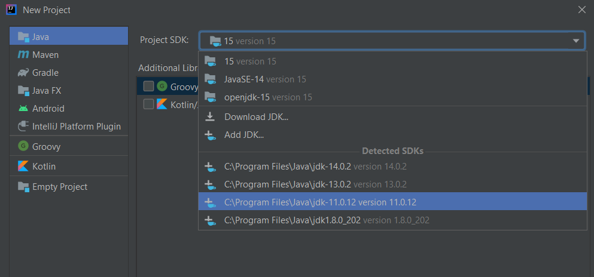
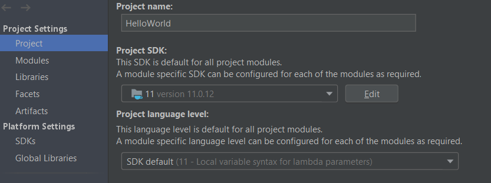
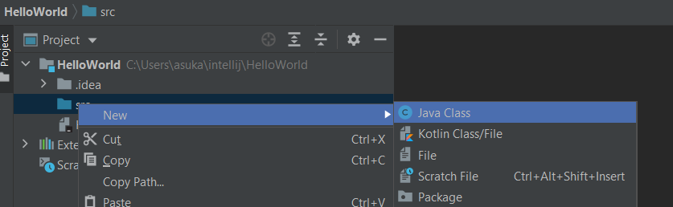
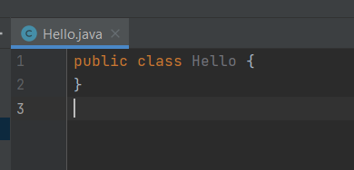
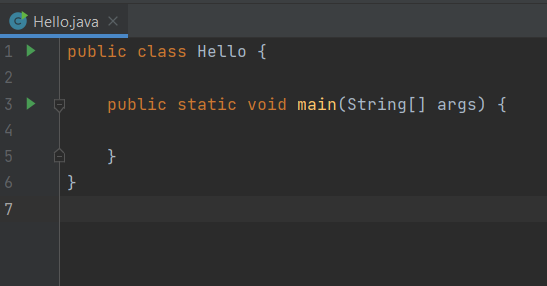
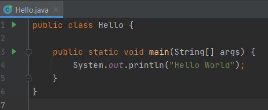

# 💾 Proyecto "Hola Mundo". Estructura de un programa

Cada vez que estás aprendiendo un nuevo lenguaje de programación es una *tradición* crear un nuevo programa muy simple que genera el texto **Hola mundo**.
Veamos como podemos hacer esto en IntelliJ.

1. Hacemos click en crear nuevo proyecto y elegimos el JDK que hemos instalado.

2. Luego en Next, Next, añadimos nombre al proyecto y Finish.

3. Creamos una nueva clase Java llamada Hello.java

4. Vamos a crear un método para imprimir el mensaje *Hola mundo*. Usaremos un método especial llamado **main**. El main es el primer método que Java busca y ejecuta en el proyecto. Es el punto de entrada.

5. Ejecutamos el programa mediante

6. Añadimos y ejecutamos la siguiente sentencia dentro del método main: *System.out.println("Hello World");*

## Challenge

!!! question
    Modifica el programa para que imprima por pantalla *Hello Teacher*.

!!! question
    Realizar las actividades 1 y 2.
