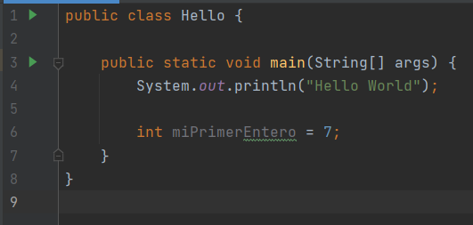

# 💾 ¿Qué son las variables?

<p style='text-align: justify;'>Las variables en Java es una forma de almacenar información en nuestro ordenador. Definimos variables asignándoles un nombre. De igual manera se puede acceder a la información que guardan las variables, simplemente accediendo por el nombre que le hemos dado. Es el ordenador el que se encarga de averiguar dónde se almacena internamente en la memoria RAM del ordenador.
</p>
<p style='text-align: justify;'> Como su nombre indica "variable", se puede modificar el contenido que ésta almacena, es decir, es variable. Lo único que tenemos que hacer es decirle al PC qué tipo de información queremos guardar en nuestra variable y darle un nombre.
Existe diferentes tipos de información que podemos utilizar para definir nuestras variables. Se les conoce como <strong>tipos de datos</strong> o data types.
Los tipos de datos son palabras reservas <strong>keywords</strong> en Java, es decir, no podemos utilizarlas fuera del contexto de tipo de datos.
</p>
<p style='text-align: justify;'> Para definir una variable, necesitamos especificar el tipo de datos, luego darle un nombre a nuestra variable, y opcionalmente, podemos agregar una expresión para inicializar la variable con un valor.
</p>

## Reglas para el nombrado de variables

+ Tiene que comenzar con una letra o '_', nunca con números.

+ Puede contener números. No debe contener espacios en blanco.

+ No debe ser muy largo y debe expresar algo en el contexto.

+ No se pueden usar palabras reservadas.

+ Mayúsculas y minúsculas se tratan diferente.


Definimos nuestra primera variable en el programa de la siguiente forma:


La línea que acabamos de escribir se conoce como **sentencia de declaración**.

## Keywords

Son palabras reservadas del lenguaje. Es decir, son palabras que tienen un significado especial en Java y no puedes usarlas fuera de ese contexto. Es decir, **no se puede declarar variables utilizando palabras reservadas como nombre.**
Ejemplos: public, class, void, static, etc.
Existen 61 [keywords](https://en.wikipedia.org/wiki/List_of_Java_keywords) en Java.

## Vida de las variables

Las variables son memorias reservadas para almacenar valores en RAM. Estas posiciones de memoria se liberan tan pronto como termina la vida de la variable. Según la vida de las variables, hay tres tipos de Variables.

**1. Variables locales**: La vida permanece dentro de un bloque donde se ha declarado.

**2. Variables de instancia**: Declaradas dentro de la clase pero fuera de los métodos. No debería ser estático.

**3. Variables estáticas**: es como una variable global. Declarado como estático en la clase pero fuera de los métodos.

```java
    static int pi = 3.14;
```

## Visibilidad de las variables

En las variables locales, su ámbito y uso se encuentra dentro del método o bloque en el que se definió y se destruyen después de la ejecución del método. Es decir, no se puede usar una variable local fuera del método actual.

A las variables de instancia se puede acceder solo a través de objetos de la clase para la que se definió.

Un campo / variable estático pertenece a la clase y se cargará en la memoria junto con la clase. Se invocan sin crear un objeto. (Usando el nombre de la clase como referencia). Solo hay una copia de la variable estática disponible en toda la clase, es decir, el valor de la variable estática será el mismo en todos los objetos. Puede definir una variable estática utilizando la palabra clave **static**.

## Mutación o manipulación de las variables

Supongamos que hemos ejecutado la siguiente línea de código:

```java
int number = 5;
```

¿Cómo podríamos sumar 6 al valor actualmente almacenado en `number`? Un enfoque ingenuo podría ser probar esta línea de código:

```java
    number + 6;
```

Sin embargo, esta línea de código es una expresión que da como resultado un valor: **no hemos alterado el valor de `number`**.

```java
// Recuerda, number es una variable que contiene el valor 5
number + 6; // se evalúa como:
5 + 6; // y luego da como resultado:
11;

// Pero 11; no es una declaración que Java entienda,
// entonces el compilador lanza un error cuando ve: number + 6;
```

Para aumentar el valor de `number` en 6, necesitamos reasignar el valor de `number` para que sea el resultado de `number + 6`:

```java
number = number + 6; // se evalúa como:
number = 5 + 6; // y luego se suman los valores
number = 11;// como resultado se asigna el valor 11 a number
```

Aquí, hemos usado el valor de `number` para calcular y almacenar un nuevo valor en la variable `number`; en este caso, 11.

## Creación de una variable

Para crear una variable se especifica el tipo de dato y se le da un nombre descriptivo que de información sobre esa variable.
Ejemplo de creación de una variable:

```java
int numero;
```

## Inicialización de las variables

La variable anterior `numero` no tiene un valor inicial asignado, es decir, no está inicializada. Inicializar una variable significa darle un valor inicial acorde al tipo de dato definido para esa variable en el momento de su creación. En Java además, las variables deben ser inicializadas antes de poder ser usadas.

Ejemplo:

```java
int numero = 99; //Se crea y se inicializa
```


## Scope - Ámbito de las variables

El alcance o ámbito (**scope**) de una variable es la parte de un programa *en la que existe.* En Java, el alcance de una variable comienza donde se declara y termina cuando se alcanza la llave de cierre del bloque que la contiene.

Ejemplo de variables en programación Java

```java
public static void main(String[] args) {
     int valor = 5;
     for (int i = 1; i <= 5; i++) {
        int y = 10;
        System.out.println(valor) // ¡valor todavía está dentro del alcance aquí!
     }
     System.out.println(valor) // ¡valor todavía está dentro del alcance aquí también!
}
```

+ `valor` está dentro del alcance entre su declaración en la línea 2 y la llave que la encierra en la línea 8.
+ `y` está dentro del alcance entre su declaración en la línea 4 y la llave que la encierra en la línea 6.
+ Las variables de bucle están dentro del alcance entre sus bucles `for` { }. Entonces, `i` está dentro del alcance entre las líneas 3 - 6.
Nota: Dos variables con el mismo nombre no pueden existir dentro del mismo ámbito (scope).

## Buenas prácticas con variables

- **Utiliza nombres descriptivos** que reflejen el propósito de la variable. Evita nombres genéricos como "x" o "temp". Un nombre descriptivo como "numeroDeEstudiantes" es más claro y evita futuros comentarios en código. Recuerda que un código muy comentado significa que está mal escrito. Y un código bien escrito tendrá muy pocos comentarios, solo cosas significativas para aclarar código complejo.

- **Evita el uso de abreviaturas confusas** que puedan confundir a otros desarrolladores. Usa nombres completos y legibles en su lugar.

- **Convenio de nombres**. Sigue un convenio de nombres consistente, como CamelCase o snake_case, según las convenciones de estilo de tu lenguaje de programación.

- **No uses palabras reservadas** del lenguaje como nombres de variables, ya que puede causar conflictos y errores.

- **Manten buen alcance (scope)**, limita el alcance de las variables al mínimo necesario. Declarar variables en el ámbito más cercano a su uso mejora la legibilidad y reduce la posibilidad de errores.

- **Inicialización oportuna**, inicializa las variables en el momento de la declaración o antes de su primer uso. Evita dejar variables sin inicializar, ya que puede causar comportamientos inesperados.

- **Comentarios significativos**. Agrega comentarios relevantes cuando el propósito de una variable no sea obvio. Esto ayuda a otros programadores a entender tu código.

- **Evita variables globales**. Limita el uso de variables globales, ya que pueden causar problemas de mantenimiento y depuración. Usa variables locales siempre que sea posible.

- **Evita variables reutilizadas** para diferentes propósitos en diferentes partes de tu código. Esto puede causar confusión y errores.

- **Usa constantes para valores fijos**. Si un valor es constante y no debe cambiar, decláralo como una constante en lugar de una variable.

- **Evita magia numérica**, es decir, evita usar valores numéricos sin explicación directa en el código. Usa constantes descriptivas o comenta el propósito de los números mágicos.

- **Refactoriza nombres cuando sea necesario**. Si el propósito de una variable cambia, renómbrala para reflejar el nuevo propósito en lugar de reutilizarla.

- **Evita variables muertas**. Elimina variables que ya no se utilizan en el código. Las variables inactivas dificultan la lectura y pueden llevar a confusiones.

- **No crear variables demasiado largas**. Si una variable tiene un nombre excesivamente largo, puede ser difícil de leer. Encuentra un equilibrio entre la claridad y la concisión.