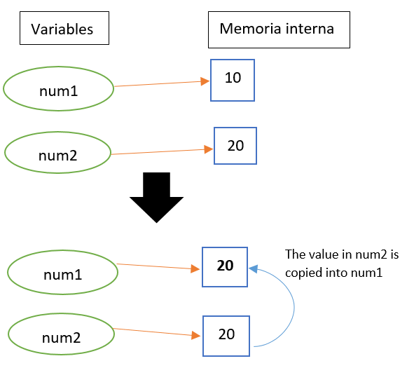
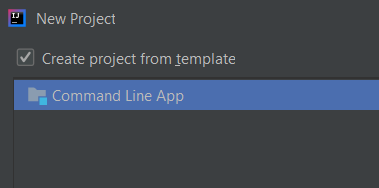

# 💾 Sentencias

<p style='text-align: justify;'>Hemos comentado que un programa es un conjunto de instrucciones. Estas instrucciones se llaman sentencias o statements en inglés. Una sentencia es un segmento de código que realiza una acción en el programa.
A medida que se ejecuta un programa, decimos que ejecuta sentencias, lo que significa que lleva a cabo las acciones especificadas por esas sentencias.
En nuestro programa Hello World, tenemos un statement en la <strong>línea 4 y 6</strong>. La regla en Java es que las sentencias deben terminar con un punto y coma.
Si se olvida, se produciría un error de sintaxis.
</p>

## Sentencias de declaración

Se usan para definir una variable de un tipo de dato en particular. En Java, una variable debe declararse antes de que pueda usarse en un programa. De no hacerlo, se produciría un error de sintaxis.
En su forma más simple una declaración incluye el tipo de datos y el nombre de la variable. Opcionalmente se puede establecer la variable a cierto valor. Es decir, se dice que se ha inicializado.

```java
Ejemplos:
   int numero;
   int a = 3; //se crea la variable a y se le asigna el valor 3
   int dia;
```

## Sentencias de asignación

Una sentencia de asignación es una sentencia que almacena (asigna) un valor en una variable. Una sentencia de asignación utiliza el signo igual (=) como operador de asignación. En su forma más simple, tiene una variable en el lado izquierdo del signo igual y algún tipo de valor en el lado derecho.

```java
Ejemplos:
    numero = 6; //asigno el valor 6 a la variable numero
    a = 0;
    dia = 22;
```

***
En el siguiente ejemplo, hay variables tanto a la izquierda como a la derecha del operador de asignación (=). Pero tienen un significado muy diferente. La variable de la derecha (num2) se trata como un valor. Si esa variable almacena 20, entonces ese es su valor. De hecho, cualquier cosa que ocurra en el lado derecho de un operador de asignación se trata como un valor. La variable de la izquierda (num1) se trata como una ubicación de memoria. Es donde se almacenará el valor 20 como resultado de la ejecución de esta declaración. El efecto de esta declaración es copia el valor almacenado en num2 en num1, como se ilustra en la siguiente imagen.

```java
Ejemplo
    //se crean las variables
    int num1 = 10;
    int num2 = 20;

    num1 = num2; //se copia el valor de num2 a la variable num1
```


***

## Challenge

!!! question
    En el programa Hello World, imprime por pantalla la variable miPrimerEntero que hemos creado.

### Challenge2

!!! question
    En el programa Hello World, crea las siguientes variables adicionales justo debajo de la declaración "int miPrimerEntero = 7;" en el programa:

    + **num1** de tipo int y con un valor de 10.
    + **num2** de tipo int y con un valor de 8.
    + y una tercera **total** que sea la suma de las anteriores.
    + imprime por pantalla la variable total.

## Paquetes en Java - Java Packages

Un paquete es una forma de organizar nuestros proyectos Java. Se pueden ver como carpetas dentro de la estructuración interna del proyecto.

Los paquetes son el mecanismo que usa Java para facilitar la modularidad del código. Un paquete puede contener una o más definiciones de interfaces y clases, distribuyéndose habitualmente como un archivo. Para utilizar los elementos de un paquete es necesario importar este en el módulo de código en curso, usando para ello la sentencia **_import_**.

IntelliJ nos ofrece la opción de automatizar esto cuando creamos un proyecto, simplemente seleccionando la opción:
