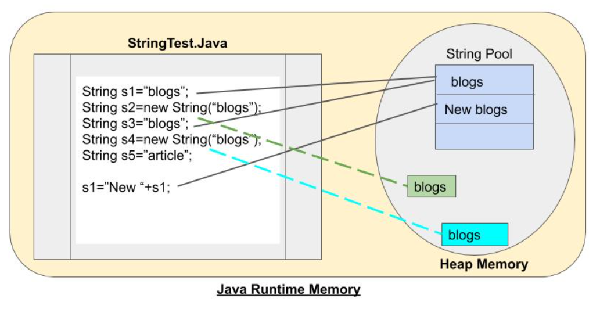
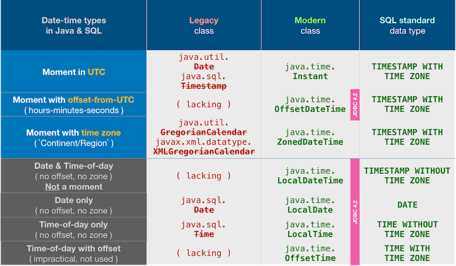

# 💾 No primitivos u objetos

En Java, los tipos de datos no primitivos son los tipos de datos de referencia o los tipos de datos creados por el usuario. Todos los tipos de datos no primitivos se implementan utilizando conceptos de objeto. Cada variable del tipo de datos no primitivo es un objeto. Los tipos de datos no primitivos pueden utilizar métodos adicionales para realizar determinadas operaciones. El valor predeterminado de la variable de tipo de datos no primitivos es nulo.

## String - Cadena de caracteres

String es una clase integrada en el lenguaje Java ampliamente utilizada y definido en el paquete java.lang. Representa cadenas de caracteres y se utilizan para almacenar varios atributos como nombre de usuario, contraseña, etc. Los String son **inmutables**; es decir, no se pueden modificar una vez creados. Siempre que se modifica un objeto String, en realidad se crea uno nuevo String.

Existen varias formas para crear un String:

```java
    String texto = "Severo Ochoa";
    String texto2 = new String("Severo Ochoa");
```

### Asignación de memoria de objetos String

La memoria se divide en dos partes, el String Pool y la memoria Heap.



Veamos como funcionaría para la imagen anterior.

1. Siempre que creamos un String con comillas dobles, se almacenan en String Pool. String Pool almacena el único valor en él. Es por eso que, String s1 = "blogs" se almacenan como el primer valor en el String Pool.

2. Siempre que creamos un objeto usando la palabra clave _new_, se almacena en la memoria Heap pero fuera del String Pool. Aquí se puede almacenar valores duplicados ya que pertenece a diferentes objetos. Entonces, para la declaración String s2 = new String(“blogs”), aunque el valor de s1 y s2 es el mismo, s2 se almacenará fuera del String Pool.

3. Cuando creamos otro String usando comillas dobles, primero verifica todos los valores en el String Pool y si coincide con alguno se asigna la misma ubicación asignada a otro objeto de referencia. Por lo tanto, String s3 = ”blogs” no agregará una nueva entrada en el String Pool.

4. Pero si creamos otro objeto con un valor existente usando la palabra clave _new_. Asignará nueva memoria al nuevo objeto en el Heap. Por lo tanto, a String s4 = new String ("blogs") se le asignará nueva memoria.

5. Ahora, si manipulamos el valor en s1 usando s1 = ”New“ + s1, no actualizará la entrada o referencia existente de s1. Este proceso creará una nueva entrada en el String Pool con el valor "New blogs" y la referencia de memoria cambiaría para el objeto s1.

### Java String Class Methods

La clase [java.lang.String](https://docs.oracle.com/en/java/javase/11/docs/api/java.base/java/lang/String.html) proporciona muchos métodos útiles para realizar operaciones en la secuencia de valores char.

## Date

En sus inicios se crearon las clases **_java.util.Date_** y **_java.sql.Date_** para almacenar y manejar fechas.
Pero ambas clases son defectuosas en diseño e implementación.
Por ejemplo, las clases existentes (como _java.util.Date_ y _SimpleDateFormatter_) no son thread-safe, lo que genera posibles problemas de concurrencia para los usuarios.

Por tanto, desde Java 8 y posteriores se ha desarrollado una nueva [API _java.time_](https://docs.oracle.com/en/java/javase/11/docs/api/java.base/java/time/package-summary.html) que resuelve los problemas que presentaban las librerías anteriores.



!!! Note "More information"
    [Why do we need a new date and time library?](https://www.oracle.com/technical-resources/articles/java/jf14-date-time.html)

Ejemplo de código para mostara la fecha y la hora:

```java
  //mostrar fecha
  LocalDate ld = LocalDate.now();
  System.out.println(ld);
  
  //mostrar hora
  LocalTime lt = LocalTime.now();
  System.out.println(lt);

  //mostrar fecha y hora
  LocalDateTime ldt = LocalDateTime.now();
  System.out.println(ldt);

  //formatear la fecha con un formato dado
  DateTimeFormatter formatter = DateTimeFormatter.ofPattern("dd-MM-yyyy HH:mm:ss");
  String formatted = formatter.format(ldt);
  System.out.println(formatted);
```