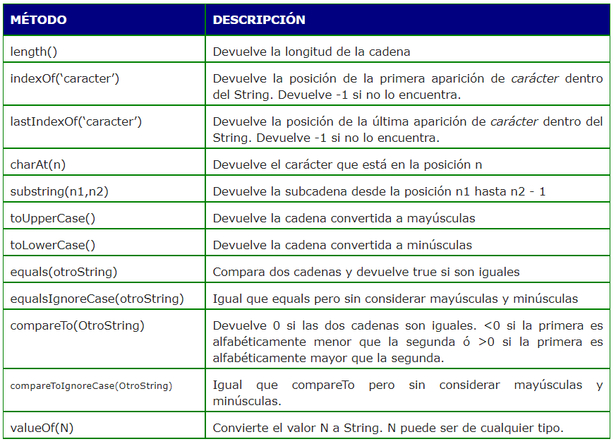
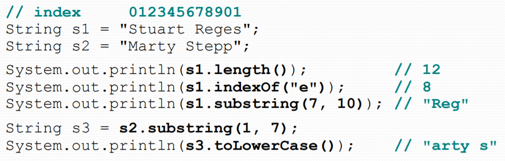

# 💾 String en Java

Un String es un tipo de dato no primitvo que, en Java representa una cadena de caracteres no modificable.
Todos los literales de la forma "cualquier texto", es decir, literales entre comillas dobles, que aparecen en un programa java se implementan como objetos de la clase String.

A diferencia de muchos objetos vimos que un String se puede crear sin la palabra new.

String text = "hola";

## Creación de String

Se puede crear un String de varias formas.

```java
    String texto = "Severo Ochoa";

    //Utilizando new
    String texto2 = new String("Severo Ochoa");

    //Utilizando el operador concatenación +
    String s2 = text + " 2021";      //s2 contiene "Severo Ochoa 2021"
```

## El operador concatenación

La clase proporciona el operador + (concatenación) para unir dos o más String.
El resultado de aplicar este operador es un nuevo String concatenación de los otros.
Por ejemplo, si tenemos dos String b y c:

```java
String b = "Ordenador";
String c = " Portátil";
```


La operación

```java
b = b + c;
```

Crea un nuevo String que se incluye en el String Pool:


## Índices

Cada uno de los caracteres que forman un String son del tipo primitivo **char**.
Los caracteres de un string están numerados internamente con índices empezando desde el cero:


El primer carácter tiene índice 0 y el último tiene la longitud del string menos 1.

## Métodos de la clase String

La clase String proporciona métodos para el tratamiento de las cadenas de caracteres: acceso a caracteres individuales, buscar y extraer una subcadena, copiar cadenas, convertir cadenas a mayúsculas o minúsculas, etc.



Para acceder a alguno de los métodos siguientes utilizamos la notación "."

```java
  String texto = "Clase";
  int longitud = texto.length(); //devuelve 5
```



!!! Tip
    Para más información consulta la documentación oficial de la clase [String](https://docs.oracle.com/en/java/javase/11/docs/api/java.base/java/lang/String.html)

## Comparar Strings

Los operadores relacionales como == o < > **NO** se utilizan para comparar Strings, aunque el código compile no es correcto, ya que == compara objetos, y devolvería falso aunque dos strings tuvieran el mismo texto puesto que son objetos diferentes.

Para comparar strings utilizamos el método _equals_.

```java
  String name = "Patri";
  
  if (name.equals("Patri")) {
    System.out.println("Coincide.");
  }
```

La siguiente tabla muestra los métodos que se utilizan para comparar Strings.


## char dentro de String

Como se ha comentado, un String está compuesto de caracteres tipo char.

Para acceder a los caracteres dentro de un String usamos el método **charAt**.

Se puede usar la concatenación + para concatenar char con String.

```java
String food = "cookie";
char firstLetter = food.charAt(0); // 'c'
System.out.println(firstLetter + " is for " + food); 
```

También podemos recorrer el String con un bucle for e imprimir cada uno de los caracteres que lo forman.

```java
String major = "CSE";
for (int i = 0; i < major.length(); i++) {
  char c = major.charAt(i);
  System.out.println(c);
}
```

```java
OUTPUT
C
S
E
```

## char

A todos los valores char se les asigna un número internamente por el ordenador, son los llamados valores ASCII.
Por ejemplo:
> el carácter 'A' es 65 en código ASCII
>
> el carácter 'a' es 97 en código ASCII

Mezclar tipos de datos char e int automáticamente cause una conversión en entero.
Por ejemplo:
> 'a' + 10 --> devuelve 107.

Para convertir un entero en su equivalente a carácter (char) haríamos:
> (char) ('a' + 2) --> devuelve 'c'.

## Diferencias entre char y String

+ String es un objeto, por tanto, contiene métodos.
+ char es un tipo de dato primitivo, no puedes llamar a métodos con él.
+ String utiliza comillas dobles.
+ char utiliza comillas simples.
+ No se puede comparar un String usando operadores relacionales.
+ Si se puede comparar un char usando operadores relacionales: 'a' < 'b', 'X' == 'X', ...
