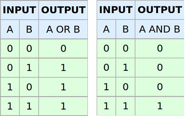
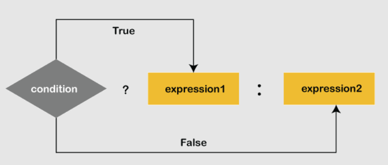

# 💾 Operadores en Java

Los **operadores** son símbolos especiales que realizan operaciones entre uno o varios **operandos** y devuelven un resultado.  
Uno de los más usados es el operador **suma (+)** como ya vimos en clases anteriores.

---

## 🧱 Operando

Un **operando** es cualquier término (una variable o un valor) que es manipulado por un operador.

```java
int valor = 8;
int numero = valor + 12; // operador: + ; operandos: valor y 12
```

En este ejemplo:  

- `+` es el operador
- `valor` y `12` son los operandos
- `valor + 12` es la expresión, que devuelve 20.

## 🧮 Expresiones

Una **expresión** es una combinación de literales, operadores, nombres de variables y paréntesis que se utilizan para calcular un valor.

```java
  int miPrimerEntero = 7 + 5;
  int resultado = 0;

  resultado = (miPrimerEntero * 10) / (32 + 12);
```

➡️ Java evalúa la parte derecha del `=` y asigna el resultado a la variable.

📌 **Reglas:**

1. Cada operador debe tener el número correcto de operandos.    
    - `*`, `/`, `+`, `-` → necesitan dos operandos.  
    - `-` unario y `+` unario → van delante de un único operando.  
2. Los **paréntesis** pueden agrupar expresiones y alterar la precedencia.


---

### 🔀 Expresiones mixtas con `int` y `double`

- Si ambos operandos son `int` → resultado entero.  
- Si uno es decimal (`float` o `double`) → resultado decimal.

```java
int a = 5;
double b = 2.0;
double c = a / b; // 2.5 (porque b es double)
```

---

## 🔖 Tipos de operadores en Java

Java ofrece muchos tipos de operadores, que se clasifican en:

- 📝 Asignación  
- ➕ Aritméticos  
- ➖ Unarios  
- ⚖️ Relacionales  
- 🔗 Lógicos  
- 🔢 De bits  
- ❓ Ternario  
- ⚡ Abreviaciones (compound)  

---

### 📝 Operador de asignación (`=`)

Asigna un valor a una variable.  
El valor de la derecha se almacena en la variable de la izquierda.

```java
int x = 10;
```

---

### ➕ Operadores aritméticos

Se usan para operaciones matemáticas básicas.

| Símbolo | Operación | Ejemplo         |
|---------|-----------|-----------------|
| +       | Suma      | `a + b`         |
| -       | Resta     | `a - b`         |
| *       | Producto  | `a * b`         |
| /       | División  | `a / b`         |
| %       | Módulo(resto)    | `a % b` → resto |

---

### 🔄 Operadores unarios

Solo necesitan un operando.

| Símbolo | Operación        | Ejemplo        |
|---------|------------------|----------------|
| ++      | Incremento (+1)  | `a++`, `++a`   |
| --      | Decremento (-1)  | `a--`, `--a`   |
| !       | NOT lógico       | `!true` → false|

🔹 **Pre-incremento/decremento**: el valor se aumenta/disminuye primero y luego se calcula el resultado.

  ```java
   int a = 8, b = 1;
   b = ++a; //b=9, a=9
  ```


🔹 **Post-incremento/decremento**: el valor se usa por primera vez para calcular el resultado y luego se incrementa/decrementa.

  ```java
   int a = 8, b = 1;
   b = a++;//b = 8, a = 9
  ```


---

### ⚖️ Operadores relacionales

Comparan dos valores y devuelven `true` o `false`.

| Símbolo | Operación         | Ejemplo   | Descripción                                                |
|---------|-------------------|-----------|------------------------------------------------------------|
| ==      | Igual a           | `a == b`  | Devuelve `true` si ambos operandos son **iguales**.        |
| !=      | Distinto de       | `a != b`  | Devuelve `true` si los operandos son **diferentes**.       |
| <       | Menor que         | `a < b`   | Devuelve `true` si el operando izquierdo es **menor**.     |
| <=      | Menor o igual que | `a <= b`  | Devuelve `true` si el izquierdo es **menor o igual**.      |
| >       | Mayor que         | `a > b`   | Devuelve `true` si el operando izquierdo es **mayor**.     |
| >=      | Mayor o igual que | `a >= b`  | Devuelve `true` si el izquierdo es **mayor o igual**.      |

```java
  int a = 20, b = 10;
  System.out.println("a == b :" + (a == b));//Devuelve falso, porque a no es igual a b
```

---

### 🔗 Operadores lógicos

Se usan en condiciones booleanas.

| Símbolo | Operación | Ejemplo           | Descripción                                           |
|---------|-----------|-------------------|-------------------------------------------------------|
| &&      | AND       | `a > b && b > 0`  | Devuelve `true` si **ambas** condiciones son ciertas. |
| \|\|    | OR        | `a > b \|\| b > 0`| Devuelve `true` si **al menos una** condición es cierta. |
| !       | NOT       | `!(a > b)`        | Invierte el valor: si es `true` → `false`, y viceversa. |



```java
    int a = 20, b = 10, c= 10;
    System.out.println((b == c && a == c)); //False
    System.out.println((a == c && b == c)); //False
    System.out.println((a == b || b == c)); //True
```

---

### 🔢 Operadores de bits

Trabajan a nivel binario (bit a bit).

| Símbolo | Operación | Descripción          |
|---------|-----------|----------------------|
| &       | AND       | Ambos bits = 1 → 1   |
| \|      | OR        | Al menos un 1 → 1    |
| ^       | XOR       | Distintos → 1        |
| ~       | NOT       | Invierte los bits    |
| <<      | Shift izq | Desplaza a la izquierda |
| >>      | Shift der | Desplaza a la derecha |
| >>>     | Shift der lógico | Rellena con 0 |

---

### ❓ Operador ternario (`?:`)

Versión corta de un `if-else`. Tiene tres operandos y de ahí el nombre ternario. El formato general es:



```java
int nota = 7;
String resultado = (nota >= 5) ? "Aprobado" : "Suspendido";
System.out.println(notaFinal); //muestra Aprobado
```

---

## ⚡ Abreviaciones (compound operators)

Permiten escribir expresiones más cortas:

```java
int a = 5;
a += 5; // a = a + 5
a -= 5; // a = a - 5
a *= 5; // a = a * 5
a /= 5; // a = a / 5
a %= 5; // a = a % 5
```

---

## 📊 Precedencia de operadores

El **orden de precedencia** indica qué operador se evalúa antes.  
📎 Consulta la tabla completa aquí: [Java Operator Precedence Table](http://www.cs.bilkent.edu.tr/~guvenir/courses/CS101/op_precedence.html)

---

## 🔄 Conversiones de tipo

### ✅ Conversiones automáticas (widening)

👉 Cuando combinas diferentes tipos de datos en una expresión Java convierte automáticamente al tipo más grande o más “seguro” para no perder información.

#### 📌 Regla general

Cuando hay mezcla de tipos en una operación, Java:

- Mira los operandos (los valores implicados).
- “Sube” el más pequeño al tipo más grande, siguiendo este orden de promoción:

```java
byte/short/char → int → long → float → double
```
⚠️ El tipo char también se convierte en int al entrar en operaciones.

#### Ejemplos

- Enteros pequeños se convierten a int

```java
byte a = 5;
short b = 10;
// Resultado de a+b es int, no byte o short
int c = a + b; 
```

➡️ Aunque ambos sean `byte`, Java los convierte en `int` antes de sumar.

- Mezcla de int y long

```java
int a = 10;
long b = 20;
long c = a + b; // a se convierte en long automáticamente
```

- Mezcla de enteros con decimales

```java
int a = 5;
double b = 2.0;
double c = a / b; // a se convierte en double
System.out.println(c); // 2.5
```

- char en operaciones

```java
char letra = 'A'; // código 65 en Unicode
int resultado = letra + 1; // letra se convierte en int
System.out.println(resultado); // 66
```

---

#### 📊 Tabla resumen

| Si un operando es | El otro se convierte en |
|-------------------|-------------------------|
| double            | double                  |
| float             | float                   |
| long              | long                    |
| byte / short      | int                     |

Si se aplican dos regla, se elige la que aparece primero en la tabla.

👉 En resumen:

- Cualquier operación con `byte`, `short` o `char` → se convierte a `int`.
- Si mezclas enteros con `long`, el resultado es `long`.
- Si mezclas con `float`, todo se convierte a `float`.
- Si hay un `double`, todo se convierte a `double`.

---

### 🛠️ Conversiones forzadas (casting, narrowing)

Conversión forzosa es decirle explícitamente a Java: **“trata este valor como si fuera de otro tipo”**. Se escribe poniendo el tipo entre paréntesis delante del valor o expresión.

Se suele llamar **Narrowing (reducción)**: a un tipo “más pequeño/menos preciso”. No se recomienda su uso,
ya que se puede perder información.


```java
float a = 8.5f;
int b = (int) a; // convierte float a int

int a = 130;
byte b = (byte) a;
```

---

### Buenas prácticas (regla de oro):

- ✅ Mejor usar widening (casteo automático) cuando sea posible.
- ✅ Haz cast narrowing solo cuando:    
    - Sabes que el valor cabe en el tipo destino, y 
    - Aceptas conscientemente la pérdida (truncamiento/overflow).   
- ✅ Documenta con un comentario corto el porqué del cast cuando no sea obvio.
- ❌ No uses cast para silenciar errores del compilador si no controlas el rango.
- ❌ No uses cast para “arreglar” divisiones: si quieres decimales, promociona antes.

---

!!! Note "Otros operadores"
    Existen más operadores que no se han mencionado en el curso. Si se desea consultar todos los operadores de Java se pueden ver en su documentación oficial. [More information](https://docs.oracle.com/javase/tutorial/java/nutsandbolts/opsummary.html)

---

## 🧮 Métodos de la clase `Math`

| Método      | Descripción                     | Ejemplo                   |
|-------------|---------------------------------|---------------------------|
| Math.abs    | Valor absoluto                  | `Math.abs(-308)` → 308    |
| Math.ceil   | Redondeo hacia arriba           | `Math.ceil(2.13)` → 3.0   |
| Math.floor  | Redondeo hacia abajo            | `Math.floor(2.93)` → 2.0  |
| Math.max    | Máximo de dos valores           | `Math.max(45, 207)` → 207 |
| Math.min    | Mínimo de dos valores           | `Math.min(3.8, 2.75)` → 2.75 |
| Math.pow    | Potencia                        | `Math.pow(3, 4)` → 81.0   |
| Math.round  | Redondeo al entero más cercano  | `Math.round(2.718)` → 3   |
| Math.sqrt   | Raíz cuadrada                   | `Math.sqrt(81)` → 9.0     |

---
