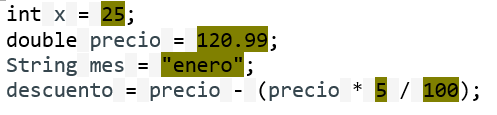

# 💾 Constantes y literales en Java

## 🔒 Constantes
Una **constante** es un valor que no cambia durante la ejecución del programa.  
En Java se definen usando la palabra clave `final`.

```java
final int EDAD_MINIMA = 18;
final double IVA = 0.21;
```

🔹 **Diferencia con variables**:  
- Una *variable* puede cambiar su valor durante el programa.  
- Una *constante* mantiene siempre el mismo valor.

### 🎯 Ventajas de usar constantes
- Mayor legibilidad: el código es más fácil de entender.  
- Mantenimiento más sencillo: si se cambia el valor de la constante, se actualiza en todo el programa.  
- Evita errores: asegura que un valor no sea modificado por accidente.

Ejemplo práctico:
```java
final double IVA = 0.21;
double precio = 100;
double total = precio * (1 + IVA);
System.out.println("Total con IVA: " + total);
```

---

## 💡 Literales

Un **literal** es el valor que se asigna directamente a una variable o constante.   

Ejemplo:
```java
int numero = 25;     // 25 es un literal entero
double pi = 3.1416;  // 3.1416 es un literal double
char letra = 'A';    // 'A' es un literal de tipo char
```

### 🔢 Tipos de literales en Java

#### 🔢 Enteros y reales
- **Enteros**: se escriben sin decimales.  
  ```java
  int a = 10;
  long b = 100000L;  // sufijo L indica tipo long
  ```

- **Reales (decimales)**: incluyen un punto decimal.  
  ```java
  double x = 3.14;   
  float y = 3.14f;   // sufijo f indica tipo float
  ```

#### 📝 Caracteres y cadenas
- **Carácter**: se escriben entre comillas simples.  
  ```java
  char letra = 'B';
  char salto = '\n';   // carácter especial salto de línea
  ```

- **Cadenas**: se escriben entre comillas dobles.  
  ```java
  String saludo = "Hola mundo";
  String texto = "Primera línea\nSegunda línea";
  ```

#### ✅ Booleanos
```java
boolean activo = true;
boolean terminado = false;
```

#### 🕳️ Nulo
```java
String nombre = null;
```

---

## 🏛️ Constantes de clase (`static final`)
Cuando una constante pertenece a toda la clase, se declara con `static final`.  
Suelen escribirse en mayúsculas y con guiones bajos.

```java
public class Configuracion {
    public static final int MAX_USUARIOS = 100;
    public static final String VERSION = "1.0";
}
```

Se acceden usando el nombre de la clase:
```java
System.out.println(Configuracion.VERSION);
```

---

## 🚫 Mala práctica: demasiados literales

En Java (y en programación en general), **tener muchos literales dispersos en el código se considera una mala práctica**.  
Estos valores se llaman *números mágicos* o *cadenas mágicas* porque no explican claramente su propósito.

### ⚠️ Problemas de usar muchos literales
- **Falta de claridad**: `if (x > 37)` no dice nada; en cambio `if (x > TEMPERATURA_UMBRAL)` es mucho más comprensible.  
- **Mantenimiento costoso**: si un valor cambia, hay que buscar y modificar todas las apariciones en el código.  
- **Duplicación y errores**: dos literales iguales pueden significar cosas distintas y generar confusión.  
- **Dependencia rígida**: valores que deberían venir de configuración (como URLs, contraseñas, rutas o timeouts) quedan fijos en el código.  

### ✅ Buenas prácticas en lugar de literales
1. **Constantes (`static final`)**:  
   ```java
   public static final int TEMPERATURA_UMBRAL = 37;
   public static final double IVA = 0.21;
   ```

2. **Enums** para estados o categorías:  
   ```java
   enum Rol { ADMIN, PROFESOR, ALUMNO }
   ```

3. **Ficheros de configuración** (properties, variables de entorno, etc.) para valores que cambian según el entorno.  

4. **Resource bundles** para textos (internacionalización).  

5. **Objetos de valor** para representar magnitudes específicas: dinero, porcentajes, duraciones, etc.

### 🟢 Excepciones
No pasa nada por usar literales obvios como `0`, `1`, `-1`, `true`, `false` o `""` (cadena vacía), siempre que tengan un significado universal y claro.  

---

## 📋 Resumen
- 🔒 Las **constantes** se definen con `final` y no cambian su valor.  
- 💡 Los **literales** son los valores directos que se asignan (números, caracteres, cadenas, booleanos, `null`).  
- 🔢 Se pueden usar sufijos (`L`, `f`, `d`) para indicar el tipo de un literal.  
- 🎯 Usar constantes mejora la claridad, seguridad y mantenimiento del código.  
- 🚫 Evita abusar de los literales: conviértelos en constantes o configúralos externamente para un código más limpio y profesional.

---


