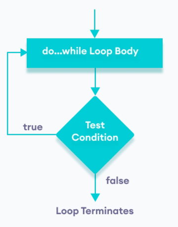

# 🖲️ Bucle `do-while` en Java

Un `do-while` en Java es un bucle de control que **ejecuta un bloque de instrucciones al menos una vez**, y **luego** comprueba la condición para decidir si debe repetirse.

---

## 📌 Sintaxis básica

```java
    //inicializadores
    do {
        //bloque de código: sentencia(s)
        //actualizador
    } while (condición);  // ← OJO: aquí hay punto y coma
```

- **El `;` final es obligatorio.**  
- La **condición** es booleana; si es `true` se repite, si es `false` se detiene.
- El **bloque se ejecuta siempre al menos UNA VEZ**, incluso si la condición era falsa desde el principio.



---

## 🧭 ¿Cuándo usar `do-while`?
- ✅ **Necesitas ejecutar una acción mínimo una vez** (mostrar un menú, pedir un dato, lanzar una partida…).
- ✅ **Validación de entrada**: repetir hasta que el usuario introduzca algo correcto.
- ✅ **Bucles con “salida controlada”** al final del ciclo.

> Si **no** necesitas que el bloque se ejecute la primera vez sin comprobar, suele bastar un `while` normal.

---

## 🆚 `while` vs `do-while` (comparativa rápida) ⚖️
| Aspecto | `while` | `do-while` |
|---|---|---|
| Comprobación | **Antes** del bloque | **Después** del bloque |
| Mínimo de iteraciones | 0 | **1** |
| Uso típico | Repetir si ya sé que la condición es true | **Menus**, **validaciones**, **intentos** |
| Sintaxis final `;` | No | **Sí** |

---

## 🔍 Ejemplo mínimo : _Muestra los números del 0 al 4_

```java
    int i = 0;

    do {
        System.out.println(i);
        i++;
    } while (i < 5);
```

Salida

```code
    0
    1
    2
    3
    4
```

Traza

| Iteración | Variable | i < 5          | Acción                   |
|-----------|----------|----------------|--------------------------|
|           | i = 0    | no se verifica | imprime 0, incrementa i=1 |
| 1a        | i = 1    | true           | imprime 1, i = 2          |
| 2a        | i = 2    | true           | imprime 2, i = 3          |
| 3a        | i = 3    | true           | imprime 3, i = 4          |
| 4a        | i = 4    | true           | imprime 4, i = 5          |
| 5a        | i = 5    | false          | termina                  |

---

## Ejemplo: _Sumar los números del 0 al 10_

```java
    int i = 0; //inicializador
    int suma = 0;

    do {
        suma = suma + i;
        i++;//actualizador
    } while (i <= 10);

    System.out.println(suma);
```

Salida

```code
    55
```

---

## 🧪 Validación de entrada (patrón clásico) ✅
```java
Scanner sc = new Scanner(System.in);
int edad;
do {
    System.out.print("Edad (0-120): ");
    edad = sc.nextInt();
} while (edad < 0 || edad > 120);

System.out.println("Tu edad es: " + edad);
```
> **Tips Scanner**: si mezclas `nextInt()` con `nextLine()`, limpia el salto de línea (intro) con un `sc.nextLine()` tras leer el entero.

---

## 🧰 Menú interactivo (loop de aplicación) 📋
```java
Scanner sc = new Scanner(System.in);
int opcion;
do {
    System.out.println("=== MENÚ ===");
    System.out.println("1) Alta");
    System.out.println("2) Baja");
    System.out.println("3) Listar");
    System.out.println("0) Salir");
    System.out.print("Opción: ");

    opcion = sc.nextInt();

    switch (opcion) {
        case 1 -> System.out.println("Alta...");
        case 2 -> System.out.println("Baja...");
        case 3 -> System.out.println("Listado...");
        case 0 -> System.out.println("Saliendo...");
        default -> System.out.println("Opción inválida.");
    }
    System.out.println();
} while (opcion != 0);
```
> **Regla de oro**: la condición de salida debe **cambiar dentro** del bucle o el bucle se hará infinito.

---

## 🎯 Patrón “reintento hasta éxito” (contraseñas, conexiones, etc.)
```java
final String CLAVE = "secreto";
Scanner sc = new Scanner(System.in);
String intento;
int reintentos = 3;

do {
    System.out.print("Clave: ");
    intento = sc.nextLine();
    if (!intento.equals(CLAVE)) {
        reintentos--;
        System.out.println("Error. Te quedan " + reintentos + " intento(s).");
    }
} while (!intento.equals(CLAVE) && reintentos > 0);

if (intento.equals(CLAVE)) System.out.println("Acceso permitido");
else System.out.println("Acceso denegado");
```

---

## 🧠 Errores típicos y cómo evitarlos 🚧
- ❌ **Olvidar el `;`** al final del `while (condición);`
- ❌ **Nunca cambiar las variables** que afectan a la condición → **bucle infinito**.
- ❌ **Condición al revés**: `while (opcion == 0)` cuando querías `!= 0`.
- ❌ Mezclar `nextInt()` y `nextLine()` sin limpiar el salto.
- ❌ Validar mal rangos: usar `&&` donde necesitas `||` (o viceversa).

---

## ✅ Resumen
- `while`: puede no ejecutarse nunca.
- `do-while`: siempre al menos una vez.
- `do-while`: Ideal para menus, validaciones, reintentos.