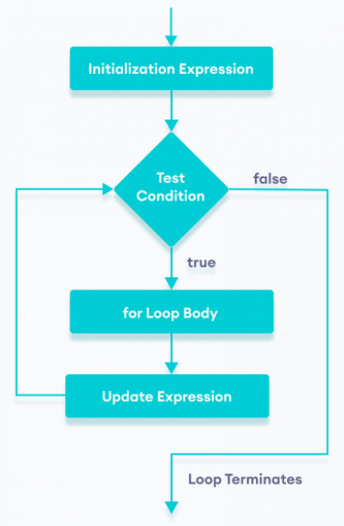

# 🖲️ Bucle `for` en Java

El bucle `for` es ideal cuando **conoces (o puedes calcular) cuántas veces** quieres repetir un bloque de código. Es compacto porque agrupa **inicialización**, **condición** y **actualización** en una sola línea.

---

## 🧱 Sintaxis básica
```java
for (inicializador; condición; actualizador) {
    // bloque de código
    //cuerpo del bucle
}

//VARIANTES: Si solo tiene una sentencia en el cuerpo también 
//se puede escribir sin llaves
for(inicializador; condición; modificador)
    //sentencia;

for(inicializador; condición; modificador) //sentencia;
```
- **Inicializador**: se ejecuta **una vez** al inicio (p. ej., `int i = 0;`).
- **Condición**: si es `true`, entra/continúa; si es `false`, termina (p. ej., `i < 5`).
- **Actualizador**: se ejecuta **al final de cada iteración** (p. ej., `i++`).

> 🧯 **Regla de oro**: el índice debe avanzar hacia **terminar** el bucle; evita bucles infinitos o “atascos”.

---

## 🔍 Ejemplo: Mostrar del 0 al 4
```java
for (int i = 0; i < 5; i++) {
    System.out.println(i);
}
```
**Salida:**
```
0
1
2
3
4
```

**Traza rápida**

| Iter. | i antes | i<5 | acción            | i después |
|------:|:-------:|:---:|-------------------|:---------:|
| 1     |   0     | ✔   | imprime 0         |     1     |
| 2     |   1     | ✔   | imprime 1         |     2     |
| 3     |   2     | ✔   | imprime 2         |     3     |
| 4     |   3     | ✔   | imprime 3         |     4     |
| 5     |   4     | ✔   | imprime 4         |     5     |
| —     |   5     | ✖   | termina           |     —     |

---

## 🧭 Proceso

1. Inicializador: inicializa y/o declara variables y se ejecuta solo una vez.
2. Condición: se evalúa la condición. Si la condición es verdadera, se ejecuta el cuerpo del bucle for.
3. Modificador: actualiza el valor de _inicializador_.
4. La condición se evalúa nuevamente. El proceso continúa hasta que la condición es falsa.



---

## ⏫ Contar hacia arriba / ⏬ hacia abajo / ⏭️ saltos
```java
// ↑ de 1 en 1
for (int i = 1; i <= 5; i++) { /* ... */ }

// ↓ de 1 en 1
for (int i = 5; i >= 1; i--) { /* ... */ }

// saltos de 2 en 2
for (int i = 0; i <= 10; i += 2) { /* ... */ }
```

---

## 🧩 Variantes útiles del `for`
### 1) 🔗 Múltiples variables
```java
for (int i = 0, j = 10; i < j; i++, j--) {
    System.out.println(i + " - " + j);
}
```

### 2) 🔁 `for` “sin partes” (estilo `while`)
```java
int i = 0;
for ( ; i < 5; ) {          // inicializador y actualizador vacíos
    System.out.println(i);
    i++;
}
```

### 3) 🧺 `for-each` (enhanced for) para colecciones/arrays

Este bucle lo veremos más adelante cuando veamos arrays y colecciones.

```java
int[] notas = {7, 8, 9};
for (int n : notas) {
    System.out.println(n);
}
```
> ✅ Más legible cuando **no necesitas el índice**.  
> ⚠️ **Sí**, si necesitas el índice/posición, usa el `for` clásico.

---

## 📦 Iterar sobre cadenas
```java
String s = "JAVA";
for (int i = 0; i < s.length(); i++) {
    char c = s.charAt(i);
    System.out.println("#" + i + ": " + c);
}
```

---

## 🎯 Filtros y contadores con `if` dentro del `for`
```java
int pares = 0, impares = 0;
for (int i = 1; i <= 10; i++) {
    if (i % 2 == 0) {
        pares++;
    } else {
        impares++;
    }
}
System.out.println("Pares=" + pares + ", Impares=" + impares);
```

---

## 🧭 Control de flujo: `break` y `continue`
```java
for (int i = 1; i <= 10; i++) {
    if (i == 7) break;       // corta el bucle completo
    if (i % 2 == 0) continue; // salta pares
    System.out.print(i + " ");
}
// Salida: 1 3 5
```

> 🧠 `break` rompe el bucle; `continue` **salta al siguiente ciclo**.

---

## 🧪 Ejemplos prácticos

### 1) 📋 Tabla de multiplicar
```java
int n = 7;
for (int i = 1; i <= 10; i++) {
    System.out.printf("%d x %d = %d%n", n, i, n * i);
}
```

### 2) 🔎 Buscar el primer múltiplo de 7 en 1..100
```java
int encontrado = -1;
for (int i = 1; i <= 100; i++) {
    if (i % 7 == 0) { encontrado = i; break; }
}
System.out.println("Primero: " + encontrado);
```

### 3) 🧮 Suma dígitos de un número
```java
//con un bucle while
public static void main(String[] args) {
    int numero = 479; //4+7+9=20
    int suma = 0;
    int digito = 0;

    while(numero > 0) {
        digito = numero % 10;//obtengo el último dígito, menos significativo
        suma += digito;
        numero /= 10;//hago el número más pequeño, le quito el último dígito
    }
    System.out.println(suma);
}

//con un bucle for
public static void main(String[] args) {
    int suma = 0;
    int digito = 0;
    for (int numero = 479; numero > 0; numero/=10) {
        digito = numero % 10;
        suma+=digito;
    }
    System.out.println(suma);
}
```

### 4) 🎲 Números aleatorios y conteo
```java
int cuentaMayores = 0;
for (int i = 0; i < 100; i++) {
    int n = (int)(Math.random() * 100) + 1; // 1..100
    if (n > 50) cuentaMayores++;
}
System.out.println("Mayores que 50: " + cuentaMayores);
```

---

## 🧠 Errores típicos y cómo evitarlos 🚧
- ❌ **Off‑by‑one**: usar `<= length` en vez de `< length`.  
- ❌ **Modificar el índice dentro** del cuerpo de forma confusa (además de `i++` del `for`).  
- ❌ **Variable de control no coherente** con la condición (sube cuando debería bajar).  
- ❌ Si creo un bucle de la siguiente forma `for(int i = 0; i < 10; i++);` ese bucle no hará nada, porque acaba en `;`. Con el `;` estamos indicando fin de statement o sentencia, es decir, fin de bucle, cualquier línea detrás del ; no será parte del bucle. Esto no solo se aplica para el bucle `for`, también para la sentencia `if` o `while`.

---

## 🧰 Debug rápido 🐞
- Imprime trazas: `System.out.println("i=" + i);`  
- Valida límites antes de acceder: `if (i >= 0 && i < arr.length) { ... }`  
- Revisa la **condición** y el **actualizador**: ¿se acercan al fin del bucle?

---

## ✅ Resumen exprés
- `for` es perfecto cuando **sabes cuántas iteraciones** quieres.   
- Usa `< length` con arrays/Strings para evitar errores.    
- `for-each` simplifica cuando **no necesitas índice**.      
- `break`/`continue` te dan control fino del flujo.     

---

## 🧩 Plantillas útiles (copia/pega)
```java
// for clásico con índice
for (int i = 0; i < N; i++) { /* ... */ }

// recorrer array con índice
for (int i = 0; i < arr.length; i++) { /* ... */ }

// enhanced for
for (Tipo x : coleccion) { /* ... */ }

// contar hacia atrás
for (int i = N; i >= 0; i--) { /* ... */ }
```