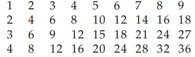
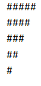

# 🖲️ Bucles anidados en Java

Los **bucles anidados** son bucles **dentro de otros bucles**. Se usan para recorrer **estructuras bidimensionales** (tablas, matrices), generar **patrones** o repetir acciones por **filas y columnas**.

> 🧠 **Idea mental**: piensa en **dos contadores**: el de **fuera** controla la *fila* y el de **dentro** controla la *columna*.

---

## 🧱 Estructura general (for de filas y columnas)

```java
for (int fila = 0; fila < nFil; fila++) {        // bucle exterior: filas
    for (int col = 0; col < nCol; col++) {       // bucle interior: columnas
        // acción para la celda (fila, col)
    }
}
```
- El **exterior** se ejecuta **nFil** veces.        
- Por **cada** vuelta del exterior, el **interior** se ejecuta **nCol** veces.      
- Total de iteraciones: **nFil × nCol**.        

---

## 🧭 Orden de ejecución (traza por capas)

Para `nFil=2`, `nCol=3`:

```
fila=0 → col=0,1,2
fila=1 → col=0,1,2
```

**El interior recorre todas las columnas por cada fila.**

---

## 🔍 Ejemplo 1 — Imprimir una matriz de número

Por ejemplo, imagina que quieres imprimir algo como la siguiente tabla de números, donde en la fila y columnas superiores aparecen las posiciones y dentro de las filas tenemos fila x columna.



Para producir esta tabla de multiplicar, podríamos usar los siguientes bucles _for_ anidados:

```java
1    for (int fila = 1; fila <= 4; fila++) { //para cada una de las 4 filas
2        for (int col = 1; col <= 9; col ++) //para cada una de las 9 columnas
3            System.out.print(col * fila + "\t"); //muestra la multiplicación
4        System.out.println(); //Empieza una nueva fila
5    }
```

---

## 🔍 Ejemplo 2 — Imprimir una rejilla F×C de asteriscos

```java
int F = 3, C = 5;
for (int fila = 0; fila < F; fila++) {
    for (int col = 0; col < C; col++) {
        System.out.print("*");
    }
    System.out.println(); // salto de línea al acabar la fila
}
```
**Salida (3 filas x 5 columnas):**
```
*****
*****
*****
```

---

## 🎯 Ejemplo 3 — Tabla de multiplicar (1..10)

```java
for (int i = 1; i <= 10; i++) {
    for (int j = 1; j <= 10; j++) {
        System.out.printf("%4d", i * j);
    }
    System.out.println();
}
```

---

## 🧩 Triángulos (patrones de texto)

Ejemplo de patrón:



El número de símbolos # en cada fila varía inversamente con el número de fila. En la fila 1, tenemos cinco símbolos; en la fila 2 tenemos cuatro; y así sucesivamente hasta la fila 5, donde tenemos un #.

Para producir este tipo de patrón bidimensional, necesitamos **dos contadores**:

+ uno para contar el número de fila y
+ otro para contar el número de símbolos # en cada fila.

> Debido a que tenemos que imprimir los símbolos de cada fila antes de pasar a la siguiente fila, el ciclo externo contará los números de fila y el ciclo interno contará los símbolos en cada fila.

La siguiente tabla muestra la relación que queremos:

| Fila | Límite (6-i) | Núm. símbolos |
|------|-----------------|---------------|
| 1    | 6-1             | 5             |
| 2    | 6-2             | 4             |
| 3    | 6-3             | 3             |
| 4    | 6-4             | 2             |
| 5    | 6-5             | 1             |

Si dejamos que j sea el contador del bucle interno, entonces j estará limitado por la expresión _6 - i_. Esto conduce a la siguiente estructura de bucle anidado:

```java
    for (int i = 1; i <= 5 ; i++) {
        for (int j = 1; j <= (6 - i); j++) {
            System.out.print('#');
        }
        System.out.println();
    }
```

Otra solución si no queremos usar un literal en la condición del bucle interno sería:

```java
    for (int i = 1; i <= 5 ; i++) {
        for (int j = 5; j >= i; j--) {
            System.out.print('#');
        }
        System.out.println();
    }
```

A menudo los literales que aparecen como límites en los bucles for se denominan números mágicos y pueden crear problemas de redundancia en el código o código no legible. Para solucionar esto utilizamos constantes:

```java
    final int MAX_WIDTH = 5;

    for (int i = 1; i <= MAX_WIDTH ; i++) {
        for (int j = MAX_WIDTH; j >= i; j--) {
            System.out.print('#');
        }
        System.out.println();
    }
```

### Triángulo creciente
```java
int n = 5;
for (int fila = 1; fila <= n; fila++) {
    for (int col = 1; col <= fila; col++) {
        System.out.print("#");
    }
    System.out.println();
}
```
**Salida:**
```
#
##
###
####
#####
```

### Triángulo alineado a la derecha
```java
int n = 5;
for (int fila = 1; fila <= n; fila++) {
    for (int esp = 1; esp <= n - fila; esp++) System.out.print(" ");
    for (int col = 1; col <= fila; col++) System.out.print("#");
    System.out.println();
}
```

**Salida:**
```
    #
   ##
  ###
 ####
#####
```

---


## 🧠 Errores típicos (y cómo evitarlos) 🚧

- ❌ **No reiniciar el índice interior**.  
  ✅ El `for` interior reinicia su **contador** al inicio de **cada fila**; si usas `while`, **recoloca** la variable.
- ❌ **Límites incorrectos** (`<=` en lugar de `<` o al revés).  
  ✅ Para `0..n-1` usa `< n`. Para `1..n` usa `<= n`.
- ❌ **Imprimir saltos de línea mal situados** (dentro del interior).  
  ✅ El salto de línea va **después** del interior, al cerrar cada fila.
- ❌ **Usar la longitud de la fila equivocada** en matrices irregulares.  
  ✅ Usa `m[f].length` para la columna.
- ❌ **Complejidad sin control**: anidar más bucles de la cuenta.  
  ✅ Recuerda: **O(n·m)**, **O(n³)**, etc. Evita grandes anidamientos si no es necesario.

---

## 🔁 while + for (o viceversa): equivalencias

```java
// while exterior y for interior
int fila = 0, F = 3, C = 4;
while (fila < F) {
    for (int col = 0; col < C; col++) {
        System.out.print("*");
    }
    System.out.println();
    fila++;
}
```

```java
// for exterior y while interior
for (int f = 0; f < F; f++) {
    int c = 0;
    while (c < C) {
        System.out.print("*");
        c++;
    }
    System.out.println();
}
```

---

## 🧰 Plantillas (copia/pega)

```java
// Rejilla F x C
for (int f = 0; f < F; f++) {
    for (int c = 0; c < C; c++) {
        // ...
    }
}

// Rectángulo hueco
for (int f = 0; f < F; f++) {
    for (int c = 0; c < C; c++) {
        boolean borde = (f == 0 || f == F-1 || c == 0 || c == C-1);
        System.out.print(borde ? "#" : " ");
    }
    System.out.println();
}

// Recorrer matriz irregular
for (int f = 0; f < m.length; f++) {
    for (int c = 0; c < m[f].length; c++) {
        // usar m[f][c]
    }
}
```

---

## 🐞 Depuración rápida

- **Trazas** con coordenadas: `System.out.println("f=" + f + ", c=" + c);`
- **Imprime solo algunas celdas** para no saturar la consola.
- **Comprueba límites** antes de acceder: `0 ≤ f < m.length` y `0 ≤ c < m[f].length`.
- **Aísla el problema**: prueba primero el interior con 1 fila, luego aumenta filas.

---

## ✅ Resumen exprés

- Un bucle **exterior** (filas) y uno **interior** (columnas).  
- Piensa en **coordenadas** `(fila, col)`; al terminar el interior, cambia de fila.  
- Úsalos para **tablas, matrices, patrones y búsquedas 2D**.  
- Respeta límites y reinicios; ojo con **O(n·m)**.
