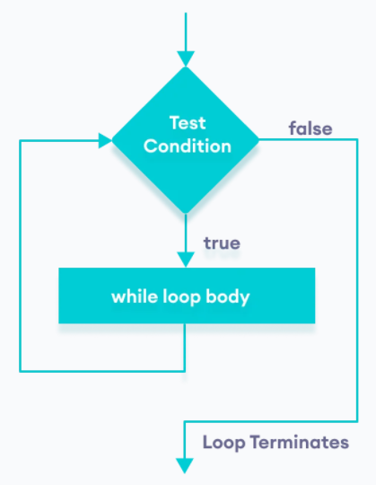

# Sentencia _WHILE_

Una estructura de repetición es una estructura de control que repite una declaración o secuencia de declaraciones de forma controlada. Las estructuras de repetición también se denominan estructuras de **_bucle_**. Muchos tipos de tareas de programación requieren una estructura de repetición. Por ejemplo:

+ Sumar los cuadrados de los números del 1 al 100.
+ Un empleado de seguridad informática quiere probar todas las contraseñas posibles para entrar en la cuenta de un presunto espía.
+ Quieres que los jugadores inserten movimientos durante un turno en un juego hasta que el juego ha terminado.



La instrucción **while** es una instrucción de bucle en la que la condición de bucle ocurre antes que el cuerpo del bucle. Tiene la siguiente estructura:

```java
    while (condición) {
        //cuerpo del bucle
        //bloque de código: sentencia(s)
    }

    //VARIANTES: Si solo tiene una sentencia en el cuerpo 
    //también se puede escribir así
    while (condición)
        //sentencia;
```

Contiene la palabra reservada _while_ seguida de un bloque de código. Un bloque es un conjunto de sentencias encerradas entre corchetes { y }.

Cuando se ejecuta la instrucción while, se evalúa la condición del bucle, que es una expresión booleana y sucede alguno de los siguientes escenarios:

1. Si esto se evalúa como falso, la ejecución continúa en la instrucción inmediatamente después del cuerpo del bucle(fuera del bloque).
2. Si la condición de bucle se evalúa como verdadero, el cuerpo del bucle se ejecuta y luego la condición se evalúa nuevamente y se repite el proceso.

El cuerpo del bucle continúa ejecutándose hasta que la condición se evalúa como falsa.

Para que una declaración while realice una tarea, la variable o variables en la condición de entrada de bucle deben inicializarse correctamente antes; y además estas variables deben actualizarse correctamente al final del cuerpo de bucle. Podemos reformular las pautas anteriores como un principio de diseño:

!!! warning "Una estructura while correctamente diseñada debe incluir 3 partes:"
    + un inicializador,
    + una condición de bucle y
    + un actualizador. El actualizador debe garantizar que la condición de entrada del bucle finalmente falle, **permitiendo así que el bucle termine**.

```java
    //inicializadores
    while ( condición ) {
        //sentencias
        //actualizador
    }
```

## Ejemplo: _Mostrar los 3 primeros números_

```java
    int i = 1; //inicializador

    while (i <= 3) {
        System.out.println(i);//Sentencia
        i = i + 1;//actualizador
    }
```

Salida

```code
    1
    2
    3
```

Traza

| Iteración | Variable | i <= 3 | Acción                         |
|-----------|----------|--------|--------------------------------|
| 1a        | i = 1    | true   | imprime 1, incrementa i=2 |
| 2a        | i = 2    | true   | imprime 2, incrementa i = 3             |
| 3a        | i = 3    | true   | imprime 3, incrementa i = 4             |
| 4a        | i = 4    | false  | termina el bucle               |

## Ejemplo: _Sumar los números del 0 al 10_

```java
    int i = 0; //inicializador
    int suma = 0;
    
    while (i <= 10) {
        suma = suma + i;
        i++;//actualizador
    }

    System.out.println(suma);
```

Salida

```code
    55
```

Traza

| Iteración | Variable     | i <= 10 | Acción          |
|-----------|--------------|---------|-----------------|
| 1a        | suma=0, i=0  | true    | suma=0, incrementa i(1)      |
| 2a        | suma=0, i=1  | true    | suma=1, incrementa i(2)      |
| 3a        | suma=1, i=2  | true    | suma=3, incrementa i(3)      |
| 4a        | suma=3, i=3  | true    | suma=6, incrementa i(4)      |
| 5a        | suma=6, i=4  | true    | suma=10, incrementa i(5)     |
| ..        | ..           | ..      | ..              |
| 12a       | suma=55, i=11 | false   | termina         |
