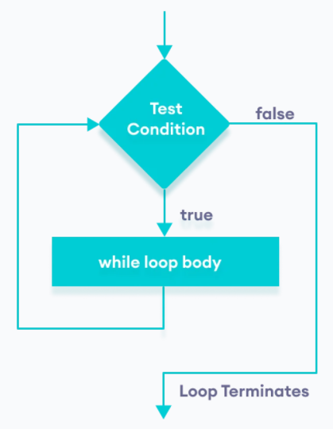

# 🖲️ Bucle `while` en Java

El bucle `while` nos permite **repetir** un bloque de instrucciones **mientras se cumpla una condición**.

---

## 📌 Sintaxis básica

```java
while (condición) {
    //cuerpo del bucle
    // bloque de sentencias
}

//VARIANTES: Si solo tiene una sentencia en el cuerpo 
    //también se puede escribir así sin llaves
    while (condición)
        //sentencia;
```



- La **condición** debe ser de tipo `boolean` (`true` o `false`).
- Primero se ejecuta la condición.
- El bloque o cuerpo del bucle se ejecuta **solo si la condición es verdadera**.
- Se repite hasta que la condición sea falsa.

---

## 🧩 Ejemplo sencillo

```java
int i = 1;

while (i <= 5) {
    System.out.println("Valor de i: " + i);
    i++;
}
```

**Salida:**

```
Valor de i: 1
Valor de i: 2
Valor de i: 3
Valor de i: 4
Valor de i: 5
```

---

## ⚠️ Importante: riesgo de bucle infinito

Una estructura while correctamente diseñada debe incluir 3 partes para no tener un bucle infinito:      
+ un inicializador,
+ una condición de bucle y
+ un actualizador. El actualizador debe garantizar que la condición de entrada del bucle finalmente falle, **permitiendo así que el bucle termine**.

Si la condición **nunca llega a ser falsa**, el bucle **no termina**.

```java
//WHILE CORRECTO
int i = 1; //inicializador

while (i <= 3) { //condición
    System.out.println(i);//Sentencia
    i = i + 1;//actualizador
}

//WHILE INCORRECTO
int i = 1;//inicializador

while (i <= 5) { //condición
    System.out.println("i vale: " + i);//Sentencia
    // ❌ Falta incrementar i → bucle infinito, no hay actualizador
}
```

👉 Recuerda siempre que el valor de la condición debe **cambiar en algún momento**.

---

## 🎯 Casos de uso típicos

- 🔢 **Contadores:** recorrer números de un rango.  
- 🎮 **Lectura de datos:** repetir hasta que el usuario introduzca algo válido.  
- 📂 **Procesamiento:** recorrer una estructura hasta que se acabe.  

---

## 🖥️ Ejemplo práctico: pedir contraseña

```java
import java.util.Scanner;

public class Main {
    public static void main(String[] args) {
        Scanner sc = new Scanner(System.in);
        String password = "java123";
        String intento = "";

        while (!intento.equals(password)) {
            System.out.print("Introduce la contraseña: ");
            intento = sc.nextLine();
        }

        System.out.println("¡Acceso concedido!");
    }
}
```

---

## Ejemplo: _Mostrar los 3 primero números_

```java
int i = 1;

while (i <= 3) {
    System.out.println(i);
    i = i + 1;
}
```

Salida

```code
    1
    2
    3
```

Traza

| Iteración | Variable     | i <= 3 | Acción          |
|-----------|--------------|--------|-----------------|
|1a         | i=1          | true   |imprime 1, incrementa i=2    |
|2a         |	i = 2      | true   |imprime 2, incrementa i = 3  |
|3a         |	i = 3	   | true	|imprime 3, incrementa i = 4  |
|4a         |	i = 4	   | false	|termina el bucle             |

## Ejemplo: _Sumar los números del 0 al 10_

```java
    int i = 0; //inicializador
    int suma = 0;
    
    while (i <= 10) {
        suma = suma + i;
        i++;//actualizador
    }

    System.out.println(suma);
```

Salida

```code
    55
```

Traza

| Iteración | Variable     | i <= 10 | Acción          |
|-----------|--------------|---------|-----------------|
| 1a        | suma=0, i=0  | true    | suma=0, incrementa i(1)      |
| 2a        | suma=0, i=1  | true    | suma=1, incrementa i(2)      |
| 3a        | suma=1, i=2  | true    | suma=3, incrementa i(3)      |
| 4a        | suma=3, i=3  | true    | suma=6, incrementa i(4)      |
| 5a        | suma=6, i=4  | true    | suma=10, incrementa i(5)     |
| ..        | ..           | ..      | ..              |
| 12a       | suma=55, i=11 | false   | termina         |

---

## 💡 Consejos para no liarte

- Asegúrate de que la **condición cambiará** en algún momento.  
- Empieza siempre con ejemplos **muy simples**.  
- Si el bucle no termina: revisa **incrementos** o **condiciones lógicas**.  
- Úsalo cuando **no sepas cuántas repeticiones exactas** habrá.  