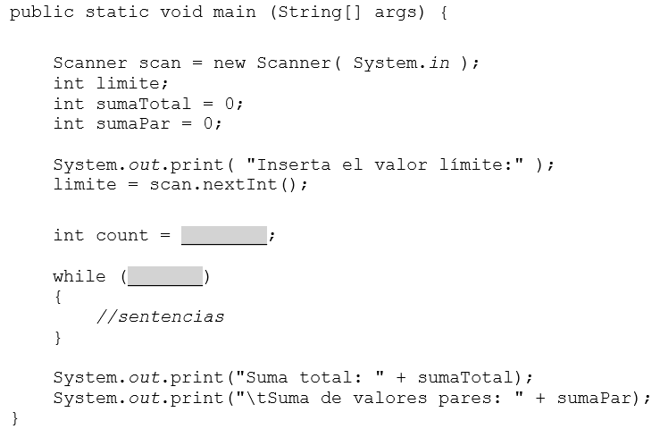
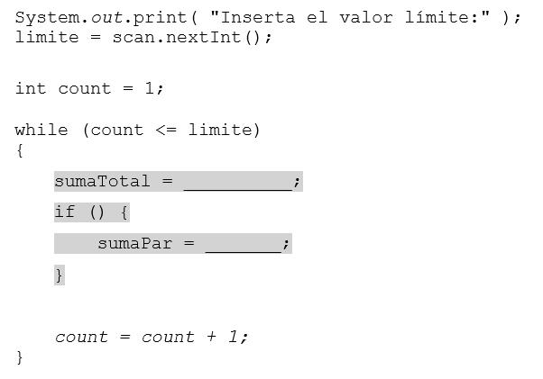

# Bucles _WHILE_ con sentencias _IF_

Este capítulo muestra cómo los bucles while y las instrucciones if se usan juntas para implementar la lógica de un programa.

El siguiente código muestra un esqueleto de un programa que suma todos los números enteros hasta un límite y suma también los que son números pares.

## _STEP 1_

Primero, inicializamos la variable count. El bucle debe contar desde uno hasta el límite(incluido).
En este programa, la mayor parte de la lógica está contenida dentro del cuerpo del bucle.

Comprobamos que el programa se puede compilar y ejecutar. Si no fuera así, corrige los errores de sintaxis (si los hay) y busca qué errores tienes. Inserta algunas sentencias println temporales para ayudarte en la búsqueda de errores. (O usa un depurador).

!!! tip
    Es mejor escribir un programa por etapas. Escriba y depura cada etapa antes de construir sobre el. En un programa con un bucle principal, la primera etapa es construir el bucle.

## _STEP 2_

El bucle de momento solo cuenta números hasta un límite, pero todavía no hace nada con ellos. Esto es lo que queremos que suceda:

+ Sumar cada entero y asignarlo a sumaTotal.
+ Sumar cada entero par y asginarlo a sumaPar.

**¿Cómo decidimos cuando agregar un número entero a sumaPar?**
Para ello necesitaremos la sentencia **_if_**.

El cuerpo del bucle en este programa contiene una instrucción if. Una instrucción if dentro de un cuerpo de bucle se denomina if anidado. No tiene nada de especial funciona igual que fuera del cuerpo del bucle.

¿Cómo calculamos los números que son pares? Los números pares son aquellos que son divisibles por 2.
Podemos hacerlo usando el operador %. Si el resto al dividir entre 2 da 0, entonces obtenemos un número par.

