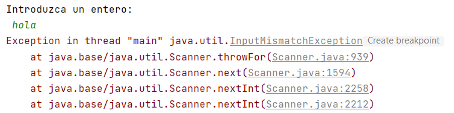
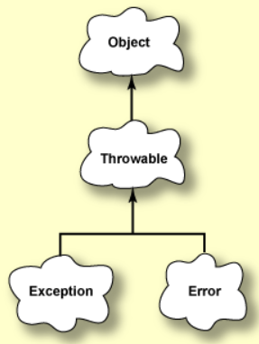
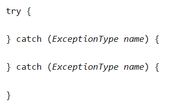

# Excepciones

## Jerarquía de excepciones en Java

La clase Throwable es la clase base incorporada que se usa para manejar todas las excepciones en Java.
El tipo más genérico de excepción, java.lang.Exception, se encuentra en el paquete java.lang, pero la mayoría de sus subclases están contenidas en otros paquetes.


Un programa a menudo encuentra problemas mientras se ejecuta. Puede tener problemas para leer datos, puede haber caracteres ilegales en los datos o un índice puede salirse de los límites. La clase Java que gestiona estos problemas se llama **_Exception_**.

La entrada y la salida son especialmente propensas a errores. El manejo de excepciones es esencial para la programación de I/O.

Por ejemplo, ¿qué ha ido mal en el siguiente programa?:



Si hacemos un seguimiento a la pila de errores, vemos que el usuario insertó "hola" y la clase Scanner, en concreto el método nextInt no pudo convertir ese texto en un número, por tanto, se lanzó una excepción.

Eso no significa que el programa esté mal, simplemente el fallo está en los datos. Cuando nextInt encuentra el problema lanza la excepción _InputMismatchException_. La ejecución del programa Java detecta la excepción y detiene el programa imprimiendo los mensajes de error.

{==

Es muy importante leer bien la pila de errores en la consola cuando se lanza una excepción para encontrar el fallo.

==}



## ¿Qué es un error?

Un *error* indica que se ha producido un fallo no recuperable, del que no se puede recuperar la ejecución normal del programa. Un error está representado por un objeto de clase **_Error_**.

La clase _Throwable_ tiene dos subclases: _Exception_ y _Error_. Un método Java puede "lanzar" un objeto de clase Throwable. Por ejemplo, Scanner lanzó una excepción cuando intentó convertir "hola" en un número entero.

Las excepciones son diferentes de los errores porque los programas se pueden escribir para recuperarse de las excepciones, pero los programas no se pueden escribir para recuperarse de los errores.

## ¿Qué es una excepción?

Una excepción es un problema que ocurre cuando se ejecuta un programa. Cuando ocurre una excepción, la máquina virtual Java crea un objeto de clase Exception que contiene información sobre el problema.
Cuando se lanza una excepción, se puede capturar la excepción para recuperarse del programa.

### Bloques **_try_** -  **_catch_**



Para capturar una excepción realizamos los siguientes pasos:

1. Colocar el código que pueda lanzar una excepción dentro de un bloque try.
2. Colocar el código que maneja la excepción dentro de un bloque catch (captura).
3. El bloque catch debe seguir inmediatamente al bloque try.

Cada bloque catch es un manejador de excepciones que maneja el tipo de excepción indicado por su argumento. El tipo de argumento, ExceptionType, declara el tipo de excepción que el controlador puede manejar y debe ser el nombre de una clase que hereda de la clase Throwable.

El siguiente ejemplo arroja dentro del bloque try una InputMismatchException, el bloque catch comienza a ejecutarse inmediatamente. Se omiten las sentencias restantes en el bloque try.

```java
    Scanner sc = new Scanner(System.in);
    int numero;

    System.out.println("Introduzca un entero:");

    try {
        numero = sc.nextInt();
    } catch (InputMismatchException e) {
        System.out.println("No has introducido un número.");
        e.printStackTrace();
    }

    System.out.println("Sigue ejecutándose el programa");
```

El parámetro dentro de catch **e** se refiere al objeto de excepción que se lanza.
Si queremos mostrar la pila de errores que genera el error usamos el método **e.printStackTrace();**

Después de ejecutar el bloque catch, la ejecución continúa con la instrucción que sigue al bloque catch. **La ejecución no vuelve al bloque try**.

#### Cómo se ejecuta un try-catch paso por paso


1. Cuando se lanza una excepción dentro de un bloque try, el controlador de excepciones examina la excepción dentro de los bloques catch.
2. Los bloques catch se examinan uno a uno empezando por el primero.
3. El primer bloque catch que encaja con la excepción obtiene el control. Aunque haya muchas excepciones que encajen solo se ejecuta un bloque catch.
4. Si ningún bloque catch encaja con la excepción lanzada se muestra la pila de errores y se termina la ejecución del programa ya que no se ha manejado la excepción.
5. Las clases más especificas deben ir primero seguidas de las más generales.
6. Después de ejecutar la última instrucción dentro del catch el control del programa vuelve a la siguiente línea fuera del try-catch (o finally si hubiera).

#### Capturar más de una excepción en un solo catch

En Java SE 7 y posteriores, un solo bloque catch puede manejar más de un tipo de excepción. Esta función puede reducir la duplicación de código.

En la cláusula catch, se especifican los tipos de excepciones que puede manejar el bloque y se separa cada tipo de excepción con una barra vertical (|):

```java
catch (IOException | SQLException ex) {
     //realizar acciones
}
```

!!! Note
    Si un bloque catch maneja más de un tipo de excepción, el parámetro catch es implícitamente final. En este ejemplo, la variable catch ex es final y, por lo tanto, no puede asignarle ningún valor dentro del bloque catch.

### Sentencia **_throw_**

Utilizando la palabra reservada throw podemos lanzar nosotros explícitamente una excepción.

Podemos construir una instancia de la excepción que queremos lanzar y añadirle un mensaje en el constructor.

Ejemplo:

```java
    try {
        System.out.print("Inserta el numerador: ");
        num = scan.nextInt();
        System.out.print("Inserta el denominador: ");
        div = scan.nextInt();
      
        if ( div == 0 ) throw new ArithmeticException("Error al intentar dividir entre cero");

        ....
    } catch (ArithmeticException ex) { 
      System.out.println("No se puede dividir " + num + " entre " + div);
      System.out.println(ex.getMessage());
    } 
```

### Bloque **_finally_**

El bloque finally siempre se ejecuta cuando sale del bloque try-catch incluso si ocurre una excepción inesperada.

Estructura:

```java
try {
    //código
} catch () {
    //código
} finally {
    //siempre se ejecuta
}
```

Solo puede haber un bloque finally, y debe estar después de los bloques catch.

+ Si el bloque try sale normalmente (no ocurrieron excepciones), entonces el control va directamente al bloque finally.
+ Si el bloque try sale debido a una excepción que es manejada por un bloque catch, primero ese bloque se ejecuta y luego el control va al bloque finally.
+ Si el bloque try sale debido a una excepción que NO es manejada por un bloque catch, el control va directamente al bloque finally. Después de que se ejecuta el bloque finally, se lanza la excepción a la persona que llama y el control vuelve a la persona que llama.


En resumen: si el control entra en un bloque try, siempre entrará en el bloque finally.

!!! important "Importante"
    El bloque finally es una herramienta clave para prevenir fugas de recursos. Al cerrar un archivo o recuperar recursos, coloque el código en un bloque final para asegurarse de que el recurso siempre se recupere.

### Sentencia try-with-resources

Próximamente.

!!! Tip
    Más información en [oracle-exceptions java](https://docs.oracle.com/javase/tutorial/essential/exceptions/index.html)
