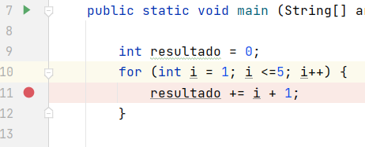

# Prueba y depuración de aplicaciones

Todo IDE ofrece un conjunto de herramientas
para hacer debug.

El debug permite supervisar la ejecución de los
programas, para localizar y eliminar los errores
de programación.

Es necesario que un programa compile para poder
depurarlo.

+ Permite suspender la ejecución de un programa, examinar y establecer los valores de las variables, comprobar los valores devueltos por un determinado método, el resultado de una comparación lógica o relacional, etc...

## Debug en IntelliJ

_Run_ --> _Debug_

## Breakpoint / Punto de ruptura

+ Permite detener un programa en una línea/parte
determinada.

    1) Click sobre el número de línea o CTRL + F8

+ Una vez se detiene el programa podemos:

    1) Analizar el valor de cualquier variable/propiedad

    2) Analizar el valor de una expresión.

    3) Ejecutar línea a línea y comprobar el flujo de la
aplicación.

+ Tras realizar la comprobación, se puede:

    1) Detener el programa.

    2) O continuar su ejecución hasta el final.

## Tipos de ejecución

+ Primero hemos de lanzar el Debug (ALT + SHIFT + F9)
+ Step Over (F8) / Paso a paso:
+ Step Into (F7) / Paso a paso entrando en el método/procedimiento
+ Resume (F9) / Continuar
+ Step Out (SHIFT + F8) / Ejecución de un programa hasta el final

## Examinador de variables

+ En cualquier momento podemos inspeccionar el valor y tipo de una variable
+ Si queremos evaluar esas variables más de una vez, es mejor crear un “Watchpoint” sobre ellas
+ Botón derecho + Add to Watches o pestaña variables

## Proceso de depuración

1) Localizar el problema

2) Poner un breakpoint en la línea del error o en la entrada a la llamada

    ● Poner watchpoint sobre los datos más sensibles

3) Lanzar el Debug y utilizar Step Over o Step Into. En cada paso, evaluar el contenido de las
variables o expresiones fijadas.

4) Una vez localizado el error, detener el debug.

## Cambiar código en caliente

+ Al detener un programa mediante un breakpoint, podemos modificar el valor de cualquier variable y ver cómo actúa nuestro código.
+ Pestaña Variables → campo botón derecho → set value...

