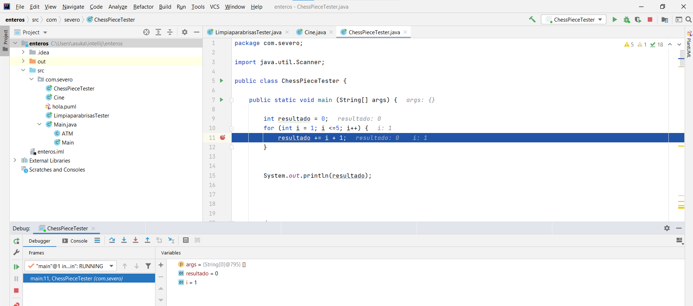
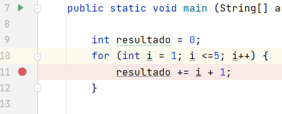
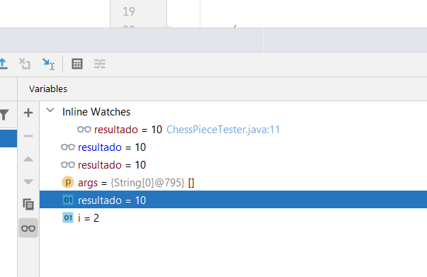

# 🖲️ Guía de Depuración en IntelliJ IDEA

## 💡 ¿Qué significa depurar?

Depurar (o *debugging*) es **ejecutar un programa paso a paso** para encontrar la causa exacta de un error.  
Mientras que las **pruebas** (*testing*) verifican los resultados, la **depuración** te permite **ver qué ocurre dentro del código** mientras se ejecuta.

🔍 **En resumen:**      
- Sirve para encontrar **errores de lógica**, no solo de sintaxis.
- Te deja **ver los valores de las variables** y el **flujo del programa**.
- Se hace con herramientas llamadas **depuradores** (debuggers).

---

## 🧩 Elementos básicos del depurador

| Elemento | Qué hace |
|-----------|-----------|
| **Breakpoint (punto de interrupción)** | Marca dónde se detiene el programa. |
| **Step Over (`F8`)** | Avanza a la siguiente línea sin entrar en métodos. |
| **Step Into (`F7`)** | Entra dentro del método que se está llamando. |
| **Step Out (`Shift+F8`)** | Sale del método actual. |
| **Resume (`F9`)** | Reanuda la ejecución hasta el siguiente breakpoint. |
| **Evaluate / Watch** | Permite ver y evaluar expresiones o variables. |
| **Call Stack** | Muestra qué métodos se han llamado unos a otros. |

---

## ⌨️ Atajos útiles

| Acción | Windows / Linux | macOS |
|--------|------------------|-------|
| Alternar breakpoint | Ctrl + F8 | ⌘ + F8 |
| Ver todos los breakpoints | Ctrl + Shift + F8 | ⌘ ⇧ F8 |
| Debug (iniciar) | Shift + Alt + F9 | ⌘ D (según keymap) |
| Step Over | F8 | F8 |
| Step Into | F7 | F7 |
| Resume | F9 | F9 |

---

## ⚙️ Cómo empezar a depurar en IntelliJ IDEA

1. **Abre tu clase principal** (la que tiene el `main`).  
2. **Coloca un breakpoint** en el margen izquierdo de la línea que quieras analizar.  
   - Atajo: `Ctrl + F8` (Windows/Linux).
3. Haz clic en el icono del 🪲 o elige **Run → Debug**.  
4. Cuando el programa se detenga, verás:
   - Variables locales.
   - Pila de llamadas (*Call Stack*).
   - Botones para avanzar (Step Into, Step Over, etc.).

---

## 🐞 Ejecutar Debug



_Run_ --> _Debug_

## 🐞 Breakpoint / Punto de ruptura



+ Permite detener un programa en una línea/parte
determinada.

    1) Click sobre el número de línea o CTRL + F8

+ Una vez se detiene el programa podemos:

    1) Analizar el valor de cualquier variable/propiedad

    2) Analizar el valor de una expresión.

    3) Ejecutar línea a línea y comprobar el flujo de la
aplicación.

+ Tras realizar la comprobación, se puede:

    1) Detener el programa.

    2) O continuar su ejecución hasta el final.

---

## 🎯 Ejemplo sencillo

```java
public class DepuracionIntro {
    public static void main(String[] args) {
        int x = 5;
        int y = leerEnteroSeguro("7"); // prueba a pasar "siete"
        int z = suma(x, y);
        System.out.println("Resultado: " + z);
    }

    static int leerEnteroSeguro(String s) {
        try {
            return Integer.parseInt(s);
        } catch (NumberFormatException e) {
            return 0;
        }
    }

    static int suma(int a, int b) {
        int r = a + b;
        if (r > 10) r = r - 1; // bug intencionado
        return r;
    }
}
```

👁️‍🗨️ **Pasos guiados:**   

1. Coloca un breakpoint en la línea de `int z = suma(x, y);`    
2. Inicia el modo depuración.   
3. Usa `F7` para entrar en el método `suma`.    
4. Observa cómo cambian los valores de las variables.   
5. Comprueba por qué el resultado no es el esperado.    

---

## 🧠 Tipos de breakpoints

- 🔴 **Normal:** detiene la ejecución en esa línea.  
- 🟡 **Condicional:** solo se activa si se cumple una condición (ej: `i > 10`).  
- 🟢 **De excepción:** se activa cuando se lanza una excepción (por ejemplo `NullPointerException`).  
- 🟣 **Logpoint:** no detiene, solo imprime un mensaje con el valor de una variable.

💬 Ejemplo de breakpoint condicional:
> `acumulado > 50 && nombre.equals("admin")`

### 🔴 Breakpoint normal (línea)

🪄 **Cómo se crea:**        
- Haz clic en el **margen izquierdo** de la línea → aparece un punto rojo.  
- O usa el atajo: **Ctrl + F8** (Windows/Linux) · **⌘ + F8** (macOS).

⚙️ **Opciones disponibles (clic derecho sobre el punto):**      
- ✅ **Enabled**: activar o desactivar sin eliminarlo.  
- ⏸️ **Suspend:** elige si se detiene **todo el programa (All)** o solo el **hilo actual (Thread)**.  
- 🔢 **Hit count:** haz que solo se active a partir de la *n*-ésima vez que pasa por esa línea.  

📍 **Uso típico:** detener el programa justo antes de una línea que sospechas que tiene un error.

---

### 🟡 Breakpoint condicional

🪄 **Cómo se crea:**        
1. Coloca un breakpoint normal.  
2. Haz **clic derecho** sobre él → en el campo **Condition** escribe una expresión Java que devuelva `true` o `false`.

🧮 **Ejemplos de condición:**
```java
i > 10
contador == 5
usuario.equals("admin") && intentos > 3
```

💡 **Truco:** puedes combinar con *Hit count* (ej. “activa solo cuando `i > 10` y sea la 3ª vez que pasa”).

📍 **Uso típico:** detenerte solo cuando ocurre algo específico, sin parar en cada iteración.

---

### 🟢 Breakpoint de excepción

🪄 **Cómo se crea:**        
1. Abre **Run → View Breakpoints…**  
   o usa el atajo **Ctrl + Shift + F8** / **⌘ ⇧ F8**.  
2. Pulsa **+ → Java Exception Breakpoint**.  
3. Escribe el tipo de excepción (ejemplo: `NullPointerException`).

⚙️ **Opciones útiles:**     
- **Caught / Uncaught:** elige si parar también en excepciones capturadas (`try-catch`) o solo en las no capturadas.  
- **Condition:** para filtrar casos (por ejemplo: `obj == null`).  
- **Class filters:** limitar a una clase o paquete específico.

📍 **Uso típico:** detectar exactamente dónde se lanza una excepción, incluso dentro de librerías.

---

### 🟣 Logpoint (sin detener el programa)

🪄 **Cómo se crea:**        
1. Coloca un breakpoint normal.  
2. Haz **clic derecho** sobre el punto.  
3. **Desmarca** la casilla *Suspend* (para que no se detenga).  
4. Marca *Log message to console* y escribe tu mensaje personalizado.

✍️ **Ejemplo de mensaje:**
```
i={i}, acumulado={acumulado}
```

💡 Puedes incluir expresiones entre llaves `{}` para mostrar valores en tiempo real.

📍 **Uso típico:** imprimir trazas o valores de variables sin usar `System.out.println()` ni detener la ejecución.

---

### 🧩 Breakpoints avanzados

⚙️ **Dependientes entre sí**        
- En *View Breakpoints…* puedes hacer que un breakpoint B **solo se active** si antes saltó el A.  
  👉 Usa la opción *“Disable until breakpoint is hit”*.

⚙️ **De método o campo**        
- En *View Breakpoints… → +* puedes añadir:     
  - **Method Breakpoint:** se activa al **entrar o salir** de un método.
  - **Field Breakpoint:** se activa cuando cambia el valor de un atributo.  
  ⚠️ Son más pesados: úsalos solo para casos puntuales.

⚙️ **Mute Breakpoints**     
- En la barra de depuración hay un icono de 🔇 para **silenciar** todos los breakpoints temporalmente sin borrarlos.

---

## 🧪 Experimenta con estos pasos

### 🧩 A. Detección de excepciones
- Pasa `"siete"` como argumento a `leerEnteroSeguro`.  
- Crea un *breakpoint de excepción* para `NumberFormatException`.  
- Observa **dónde se lanza** y **dónde se captura** la excepción.

### ⚙️ B. Localiza el fallo lógico
- Ejecuta el programa con `x=5` y `y=7`.  
- Depura paso a paso y analiza por qué devuelve `11` en lugar de `12`.  
- Corrige el error en el método `suma`.

### 🕵️‍♂️ C. Usa breakpoints condicionales
- Crea un bucle que sume del 1 al 20.  
- Detén el programa solo cuando `acumulado > 50`.  
- Usa la condición en el breakpoint y verifica el comportamiento.

---

## 🧭 Pila de llamadas y variables

Durante la depuración podrás ver:   
- **Variables locales** y sus valores.  
- **Expresiones observadas** (Watch).   
- **Evaluaciones rápidas** (`Alt+F8`).  
- **Call Stack:** la secuencia exacta de métodos llamados.  

Esto te permite entender *quién llama a quién* y *en qué orden* se ejecuta el código.

---

## 🔥 HotSwap: cambiar código sin reiniciar

IntelliJ permite modificar ligeramente el código durante una sesión de depuración.  
Puedes cambiar el contenido de un método y aplicar los cambios con **Ctrl + F9**.  
⚠️ Si cambias estructuras grandes (clases, firmas de métodos…), tendrás que reiniciar.



---

## 🧭 Flujo recomendado al depurar

1. Reproduce el error con los mismos datos.  
2. Coloca breakpoints cerca del problema.  
3. Observa los valores de las variables.  
4. Usa Step Over / Step Into para entender el flujo.  
5. Ajusta condiciones y vuelve a probar.  
6. Una vez localizado el fallo, corrígelo y verifica que desaparece.

---
