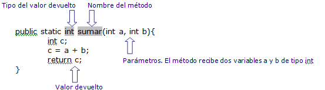

# Introducción a los métodos en Java

Los métodos en Java son bloques de código que realizan una tarea en concreto, se utilizan para encapsular la lógica de un programa en funciones o procedimientos reutilizables. Los métodos sirven para hacer nuestro código más legible, más fácil de mantener y sin código duplicado.

Todo el tiempo hemos estado usando un método llamado main, dentro de él se encuentran todas las sentencias que hemos ido ejecutando, ahora vamos a crear nuestros propios métodos teniendo en cuenta:

## Características de los métodos

- Tienen que estar dentro de una clase
- Tienen una definición: visibilidad [static] tipoDeRetorno nombreMetodo ([parámetros])
    - tipoDeRetorno, indica el tipo de dato que devuelve el método. Si no devuelve ningún valor se pone void
    - nombreDelMetodo
    - parámetros: lista de variables que acepta el método, esto es opcional.
- Invocación a métodos: los métodos se invocan desde otros métodos o desde el main, para llamar a un método se utiliza el nombre y paréntesis, y si tiene se añaden los argumentos.




{==
Los métodos se alinean unos debajo de otros, no se puede insertar un método dentro de otro método, y además deben estar dentro de la clase.
==}

## Sentencia **`Return`** - Valores devueltos

Un valor devuelto es información que un método **devuelve al código que lo llamó**. Cada método solo puede devolver un valor: cuando un método regresa, deja de ejecutarse (y continuamos donde lo dejamos antes de llamar al método). Para que el código que llamó al método use el valor devuelto, **el valor devuelto debe almacenarse en una variable** o **usarse inmediatamente**.

```java
public static type methodName(parameters) { // llamar a nombre de método devuelve expresión
     ...
     return expression;
}
type variableName = methodName(parameters);  // variableName almacena el valor de retorno
```

Ejemplo

```java
public class Main {

    public static void main(String[] args) {
        boolean gameOver = true;
        int puntuacion = 5000;
        int nivelCompletado = 5;
        int bonus = 10;

        int score = calcularPuntuacion(gameOver, puntuacion, nivelCompletado, bonus);
        System.out.println(score);

        //otra forma de hacerlo es pasarle directamente el valor de las variables
        score = calcularPuntuacion(true, 1000, 10, 30);
        System.out.println(score);

    }

    public static int calcularPuntuacion(boolean gameOver, int puntuacion, int nivelCompletado, int bonus) {
        if (gameOver) {
            int puntuacionFinal = puntuacion + (nivelCompletado * bonus);
            puntuacionFinal += 100;
            return puntuacionFinal;
        } else {
            return -1;
        }
    }

    //OTRAS FORMAS MÁS EFICIENTES DE CREAR EL MÉTODO calcularPuntuaciones
    //1. Método más eficiente sin sentencia else
    public static int calcularPuntuacion(boolean gameOver, int puntuacion, int nivelCompletado, int bonus) {
        if (gameOver) {
            int puntuacionFinal = puntuacion + (nivelCompletado * bonus);
            puntuacionFinal += 100;
            return puntuacionFinal;
        }
        return -1;
    }

    //2. Otra forma de realizar el método calcularPuntuacion sin utilizar dos sentencias de return sería
    public static int calcularPuntuacion(boolean gameOver, int puntuacion, int nivelCompletado, int bonus) {
        int puntuacionFinal = -1;
        if (gameOver) {
            int puntuacionFinal = puntuacion + (nivelCompletado * bonus);
            puntuacionFinal += 100;
        }
        return puntuacionFinal;
    }

}
```
