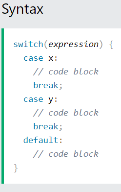

# 🖲️ Instrucción `switch` en Java

La instrucción **`switch`** permite simplificar cadenas largas de `if-else` que comparan un mismo valor.  
Se introdujo en las primeras versiones de Java y desde **Java 14** ha evolucionado con nuevas formas mucho más expresivas y seguras.

---

## 📖 Conceptos clave

- **Switch clásico (statement)**: el de toda la vida, con `case:` y `break`.  
- **Switch moderno (expression)**: introducido en Java 14 (estable en Java 17), devuelve un valor y usa flechas `->`.  
- **Pattern Matching en switch**: desde Java 21 permite trabajar con tipos y condiciones (`when`).

---

## 🔹 Sintaxis clásica (switch statement)

Es una forma abreviada de codificar la [estructura de selección múltiple](./1seleccion.md#sentencia-condicional-if-else-multiple) que vimos en el capítulo anterior.



De forma que el siguiente código expresado con if-else múltiple:

```java
    if (numJugadores == 1) {
        System.out.println("Single player");
    } else if (numJugadores == 2) {
        System.out.println("Two player");
    } else if (numJugadores == 3) {
        System.out.println("Multiplayer");
    } else {
        System.out.println("Not possible, too many players");
    }
```

Es equivalente a:

```java
    switch (numJugadores) {
        case 1:
            System.out.println("Single player");
            break;
        case 2:
            System.out.println("Two player");
            break;
        case 3:
            System.out.println("Multiplayer");
            break;
        default:
            System.out.println("Not possible, too many players");
    }
```

✅ Características:     

- Cada `case` necesita un **`break`** para evitar el *fall-through* (ejecución en cascada).
- El bloque `default` se ejecuta si no coincide ningún `case`.  
  > Aunque suele colocarse al final, puede ir en cualquier posición.

---

## 🚀 Switch expression (Java 14+)

Un *switch expression* devuelve directamente un valor. **Con las flechas no hay fall-through**, cada case ejecuta lo de la derecha y nada más.

```java
int day = 3;
String tipo = switch (day) {
    case 1, 2, 3, 4, 5 -> "Laborable";
    case 6, 7 -> "Fin de semana";
    default -> "Día inválido";
};
System.out.println(tipo);
```

### Ventajas:
- No se necesitan `break`.
- Permite **varias etiquetas en un mismo caso** (`case 1, 2, 3 -> ...`).
- Es **exhaustivo**: todos los valores deben estar cubiertos o debe haber `default`.

---

### 🧩 Bloques con `yield`

Si un caso requiere varias sentencias, se usa bloque `{}` y **`yield`** para devolver el valor:

```java
char grade = 'C';

int score = switch (grade) {
    case 'A' -> 5;
    case 'B' -> 4;
    case 'C' -> {
        System.out.println("Caso intermedio");
        yield 3;  // Devuelve el valor de este case
    }
    default -> 0;
};
```

---

### 📅 Uso con `enum`

Cuando el selector es un **`enum`**, el compilador exige cubrir todos los valores (o usar `default`):

```java
enum Dia { LUN, MAR, MIE, JUE, VIE, SAB, DOM }

String tipo = switch (dia) {
    case SAB, DOM -> "Fin de semana";
    case LUN, MAR, MIE, JUE, VIE -> "Laborable";
};
```

👉 Aquí **no es necesario `default`** porque se han cubierto todos los valores posibles.

---

## 🔎 Tipos soportados

- Primitivos: `byte`, `short`, `char`, `int`  
- Clases envoltorio (`Byte`, `Short`, `Character`, `Integer`)  
- `String` (desde Java 7)  
- `enum`  
- **Pattern Matching** (desde Java 21)  

⚠️ Si el valor es **`null`**:           

- En el switch clásico → lanza `NullPointerException`.  
- En el moderno con *pattern matching* → se puede usar `case null`.

---

## 🧠 Pattern Matching en switch (Java 21)

Ahora el `switch` entiende **tipos** y **guardas (`when`)**:

```java
static String describe(Object obj) {
    return switch (obj) {
        case null -> "es null";
        case String s -> "Cadena de longitud " + s.length();
        case Integer i when i > 100 -> "Entero grande";
        case Integer i -> "Entero pequeño";
        default -> "Otro tipo";
    };
}
```

👉 Beneficios:      

- Más conciso y expresivo.
- Maneja `null` directamente.
- Permite reglas específicas por tipo.

---

## 💡 Buenas prácticas

✔️ Prefiere la sintaxis con flechas `->` para evitar *fall-through*.  
✔️ Usa `enum` siempre que puedas, mejor que literales mágicos.  
✔️ Maneja explícitamente `null` si es posible.  
✔️ Para lógica compleja, usa *switch expression* que devuelve un valor.

---

## 📝 Ejemplos didácticos

### Multi-case
```java
switch (players) {
    case 1 -> "Single player";
    case 2 -> "Co-op";
    case 3, 4 -> "Multiplayer local";
    default -> "No soportado";
}
```

### Bloque con `yield`
```java
int resultado = switch (valor) {
    case 1 -> 100;
    case 2 -> {
        int temp = valor * 50;
        yield temp + 10;
    }
    default -> 0;
};
```

### Pattern matching con guarda
```java
String kind = switch (obj) {
    case Integer i when i % 2 == 0 -> "Número par";
    case Integer i -> "Número impar";
    case String s -> "Texto";
    case null -> "Null";
    default -> "Otro";
};
```

---

## _BREAK_

Cuando el programa Java alcanza la palabra break, se sale del bloque switch. Es decir, ya no se sigue ejecutando más código dentro del switch ni ningún case.

{==

Un break puede ahorrar mucho tiempo de ejecución porque "ignora" la ejecución de todo el resto del código switch.

==}

## _DEFAULT_

La palabra default se usa para ejecutar código cuando no hay ninguna coincidencia con ningún caso (_case_).

---

## ✅ Resumen

- El `switch` clásico sigue existiendo, pero **hoy se recomienda usar la sintaxis moderna** (`->`). Ya que el `switch` clásico tiene fall-through y puede ser accidental y hacer el código más frágil/confuso.
- Con flechas -> no hay fall-through, el código es más declarativo y seguro. 
- Las *switch expressions* devuelven valores y obligan a ser exhaustivas.  
- Desde Java 21, con *pattern matching*, el `switch` se convierte en una herramienta muy potente para trabajar con tipos.

---