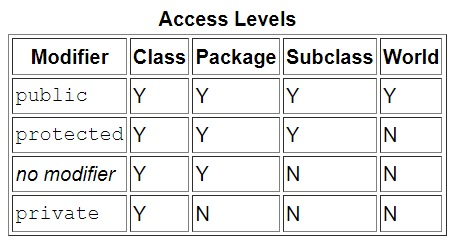

# 🌎 Clases en Java


Las clases es el componente fundamental en la POO. Para entender el concepto de clase, primero necesitamos entender que son los objetos ya que son la clave en la tecnología orientada a objetos.

## Objetos

Los objetos de software son una parte fundamental de la programación orientada a objetos. Son muy similares a los objetos que representan cosas del mundo real. Como puede ser un micrófono, altavoz, ordenador, etc.
Como ya estudiamos en la unidad 1, los objetos del mundo real tienen tres características, **identidad**, **estado** y **comportamiento**.


### ❇️ Identidad

La identidad de un objeto normalmente se implementa a través de un **ID único**. El valor del **ID no es visible para el usuario externo**. Sin embargo, la JVM lo utiliza internamente para identificar cada objeto de forma única.

### ❇️ Estado - Campos

{++Representa el valor de los datos++}. Por ejemplo, para un ordenador, el estado podría ser la cantidad de memoria RAM que tiene, el sistema operativo que incluye, tamaño del disco duro, etc.
En el caso de una persona, el estado puede ser la edad, el nombre, si está casada, etc.

### ❇️ Comportamiento - Métodos

Atendiendo al comportamiento de un ordenador podría ser arrancando, apagándose, reiniciando, escribir en la pantalla, etc.
Para una persona será comer, beber, dormir, etc.

---

Los objetos de software almacenan su estado en **_campos_**. Los campos es lo que conocemos como variables.
Y exponen su comportamiento en lo que llamamos **_métodos_**.

!!! Important "💀 Importante"
    **Un objeto es una instancia de la clase.** Una clase es una plantilla o modelo a partir del cual se crean objetos. Entonces, un objeto es la instancia (resultado) de una clase.

## Clases

Teniendo en cuenta todo esto, podemos pasar a hablar de **clase**.
Una clase es una plantilla para crear objetos.
Para crear un clase en Java utilizamos la palabra reservada `class`.

La nomenclatura del nombre de la clase es primera letra en mayúsculas y usar la regla CamelCase para palabras compuestas.

```java
    public class Coche {

    }
```

`public`: es un modificador de acceso, determina qué acceso queremos permitir a otros en la clase. Existen tres tipos de modificadores de acceso:

- **public**: en este caso, public especifica que no hay ninguna restricción de acceso.
- **private**: nadie puede acceder a la clase.
- **protected**: permite a las clases de este paquete acceder y subclases.

---
- **class**: identificador de clase.

_¿De qué forma nos ayudan las clases en nuestro código?_
Bien, hasta ahora solo hemos trabajado con tipos de datos primitivos como int, short, char, etc. Este tipo de datos es bastante limitado. Por tanto, las clases se podrían considerar como un tipo de dato extra poderoso definido por el usuario que nos permite realizar acciones en las que los datos primitivos se quedan cortos.

Una clase puede contener:

- Campos
- Métodos
- Constructores
- Bloques de código
- Clases o interfaces anidadas

## Miembros de la clase : atributos y métodos

### Atributos, campos de la clase o variables de instancia

Hasta ahora hemos creado variables dentro de un método. A éstas se les llama variables locales porque son propias del método en si. Y no puedes acceder a ellas desde fuera de ese método. También vimos esto dentro de bloques de código {}, donde las variables creadas en un bloque más interno no eran accesibles en bloques más externos.
Ejemplo:

```java
    public static void sumar() {
        int contador = 0;

        while (contador < 10) {
            int suma = 0;
            suma += contador;
            contador ++;
        }

        System.out.println(suma); // esto da error, la variable
        // suma aquí no existe.
    }
```

A diferencia de esto, las clases nos permiten crear variables que pueden ser accesibles desde cualquier lugar dentro de la clase que estamos creando. A estas variables se les conoce con el nombre de **variables miembro/instancia**, o de manera más común como **campos** o **atributos** de la clase.

### Creación de atributos de la clase

Para crear un campo de la clase se debe especificar un modificador de acceso(opcional) + tipo de dato + nombre de la variable + inicialización(opcional).

_Si no se pone modificador utiliza el de por defecto en el que la variable es accesible por las clases dentro del mismo paquete._

El modificador de acceso funciona de la misma forma a como lo hemos explicado anteriormente para la creación de una clase.

```java
    public class Coche {
        
        //campos, atributos o variables de instancia
        private int puertas;
        private int ruedas;
        private String modelo;
        private String color;
    }
```

Estamos definiendo el estado del coche, es decir, sus características.

### Modificadores de acceso de atributos

Un buen diseño de software refuerza la encapsulación. Aquí es donde las variables de instancia de un objeto son visibles solo para los propios métodos del objeto. El código fuera del objeto no puede acceder directamente a estas variables. Se utiliza para hacer esto el modificador de visibilidad privada.
Como regla general, cuando definimos campos para la clase el modificador de acceso será **privado**.
Es decir, usamos el concepto de encapsulación que es una clave fundamental de la programación orientada a objetos. Lo que hacemos es ocultar los campos de la clase del acceso público para que nadie pueda acceder y modificar los campos de la clase.
Significa que la representación del objeto se ocultará a la vista, es decir, el funcionamiento interno del objeto.

Existen los siguientes tipos de modificadores, ordenados de menor a mayor restricción:

+ **public**: son accesibles desde cualquier lugar. 
+ **protected**: son accesibles desde dentro del mismo paquete y en clases heredadas.
+ **sin modificador**: son accesibles desde la propia clase y clases dentro del mismo paquete.
+ **private**: solo son accesibles desde la propia clase, no son accesibles desde fuera.



```java
    //modificador público
    public int speed;

    //modificador protegido
    protected int speed;

    //sin modificador
    int speed;

    //modificador privado
    private int speed;
```

#### Consejos para elegir un nivel de acceso

- Utiliza el nivel de acceso más restrictivo que tenga sentido para un miembro en particular. Usa private a menos que tengas una buena razón para no hacerlo.
- Evita los campos públicos a excepción de las constantes.

### Métodos de instancia

Para actualizar los campos de la clase, como su acceso es privado se utilizan los **métodos de instancia**.
Estos métodos ya no van a ser public static como hemos visto hasta ahora.
Para crear los métodos que actualizan los campos debemos usar la siguiente nomenclatura:

+ Setters: establecen el valor en el campo de la clase
  > public void setNombreCampo(_TipoDatoCampo_ _nombreCampo_), donde el parámetro del método debe ser del mismo tipo ya que vamos a actualizar su valor mediante el método.

+ Getters: devuelven el campo de la clase
  > public _tipoDatoCampo_ getNombreCampo()

```java
    public class Coche {
        
        private int puertas;
        private int ruedas;
        private String modelo;
        private String color;

        //métodos de instancia
        public void setPuertas(int puertas) {
            this.puertas = puertas;
        }

        public int getPuertas() {
            return this.puertas;
        }

        public void setRuedas() {
            this.ruedas = ruedas;
        }

        public int getRuedas() {
            return this.ruedas;
        }

        public void setModelo(String modelo) {
            this.modelo = modelo;
        }

        public String getModelo() {
            return this.modelo;
        }

        public void setColor(String color) {
            this.color = color;
        }

        public String getColor() {
            return this.color;
        }

    }
```

### Creación de una instancia de la clase

```java title='Main.java'
public class Main {
    public static void main(String[] args) {
        //ford es un objeto de la clase Coche, es una INSTANCIA de la clase
        Coche ford = new Coche();
    }
}
```

### **Palabra reservada this**

En un método set como el nombre del parámetro del método es igual al del campo de la clase, necesitamos algo que nos permita distinguir entre uno u otro. Para esto se utiliza la palabra reservada **_this_** que hace alusión al campo de la clase.

## **Clase Object en java**

Es necesario conocer a grandes rasgos la clase `Object`. También es llamada como **clase cósmica**, ya que la clase `Object`, es la clase que está por encima de todas las clases de la api de java.

Esto quiere decir que todas las clases de java que vienen predefinidas en el lenguaje de programación, como las que nosotros construimos, heredan de la clase `object`.

Por eso cuando creamos un objeto, viene ya definido con ciertos métodos que se han heredado de la clase `Object`.
