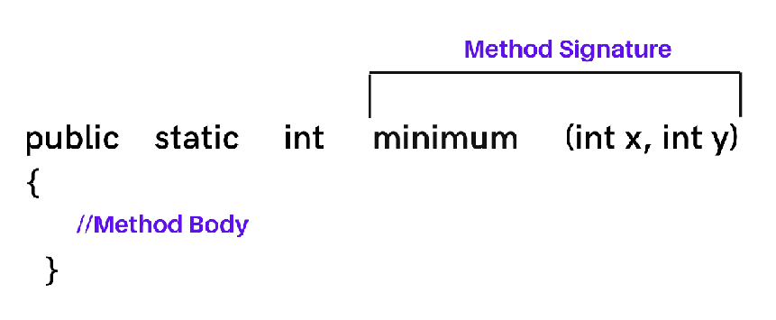

# 🌎 Métodos y sobrecarga de métodos

En el punto [2.6](../ud2/26methods.md) del curso vimos una introducción a los métodos, qué son, cómo definirlos y sus partes. En los siguientes puntos vamos estudiar conceptos relacionados con los métodos.

## Sobrecarga de métodos

**_La sobrecarga de métodos_** es una característica que nos permite tener más de un método _con el mismo nombre_, siempre que usemos diferentes parámetros.
Es la capacidad de crear múltiples métodos con el mismo nombre pero diferentes implementaciones

Esto también se aplica a los constructores como ya hemos visto, teníamos más de un constructor con el mismo nombre pero diferente número de argumentos.


No hay límite en la cantidad de sobrecarga que se puede hacer al diseñar constructores y métodos, la única restricción es que cada método debe tener una signature distinta con el mismo nombre.

La signature(firma) de un método consta del nombre del método, más el número, los tipos y el orden de sus parámetros formales. Una clase no puede contener dos métodos con la misma signature.



## Ámbito de variables locales y argumentos

El estado de un objeto consta de los datos que contiene en sus variables de instancia(campos o atributos). Las variables de instancia mantienen sus valores hasta que se cambian explícitamente o hasta que se destruye el objeto.

Los métodos de un objeto suelen trabajar con otros valores que no se mantienen en las variables de instancia. Estos valores se mantienen en variables y parámetros locales.

En el ejemplo de la clase Cuenta.java teníamos:

```java
public class Cuenta {

    private double balance;
    ...

    public void ingresar(double cantidad) {
        this.balance = this.balance + cantidad;
        System.out.println("Balance actual " + this.balance);
    }
}
```

La persona que llama al método ingresar utiliza el parámetro _cantidad_ para enviar un valor al método. A esto se le llama **pasar un valor al método**.

Desde el método main() llamamos al método ingresar que usa el parámetro para pasar un valor al método:

```java
public static void main( String[] args ) {
    Cuenta patriCuenta = new Cuenta("1234567", 0.0, "Patricia");
    c.ingresar(50);
}
```

Cuando se ejecuta al método _ingresar(50)_, al parámetro cantidad se le da el valor 50, luego se ejecuta el interior del método, y el valor se suma a la variable de instancia o campo balance. El método termina y el control vuelve al método main(), pero el balance del objeto _patriCuenta_ ha cambiado.

Las variables de instancia se utilizan para almacenar el estado de un objeto. Mantienen los valores mientras exista el objeto.

Si intentáramos usar la variable cantidad en otro método, nos daría error de compilación, puesto que esa variable no existe fuera del método _ingresar_, es lo que se conoce como **una variable local**.


Podríamos tener otro método que definiera o usara otra variable llamada _cantidad_.

```java
public class Cuenta {

    private double balance;
    ...

    public void ingresar(double cantidad) {
        this.balance = this.balance + cantidad;
        System.out.println("Balance actual " + this.balance);
    }

    public void retirar(double cantidad) {
        this.balance = this.balance - cantidad;
    }
}
```

En el método _retirar_ la variable **cantidad** es una variable diferente a la que usamos en el método _ingresar_, aunque tengan el mismo nombre ya que están en ámbitos diferentes, no pueden verse entre ellas.
