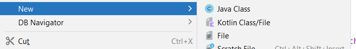
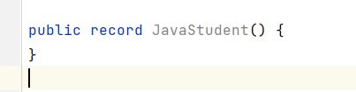

# 🌎 POJO, Record

## POJO

Un _Plain old Java object (POJO)_ o objeto simple de Java es una clase que generalmente solo tiene campos o variables de instancia.

Se utiliza para alojar datos y pasar datos entre clases funcionales. Normalmente tiene pocos métodos o ninguno, además de los getters y setters. Se utiliza mayoritariamente para leer o escribir datos a partir de bases de datos, flujos o ficheros. Se podría decir que es un tipo de datos.

### Ejemplos de POJOS

+ A veces pueden ser llamados bean, o JavaBean. JavaBean es un POJO con extra reglas aplicadas a ellos.
+ Otras veces un POJO puede ser un Entity, relacionado con base de datos porque contiene los datos de las entidades de base de datos.
+ Otro acrónimo usando con los POJOS puede ser un DTO (data transfer object), objeto de transferencia de datos, que es una descripción de un objeto, que puede modelarse como simples datos.

> Ejemplo de POJO que contiene el código necesario para manipular datos de un estudiante:

```java title="Student.java"
public class Student {
    private String id;
    private String name;
    private String dateOfBirth;

    public Student(String id, String name, String dateOfBirth) {
        this.id = id;
        this.name = name;
        this.dateOfBirth = dateOfBirth;
    }

    public String getId() {
        return id;
    }

    public void setId(String id) {
        this.id = id;
    }

    public String getName() {
        return name;
    }

    public void setName(String name) {
        this.name = name;
    }

    public String getDateOfBirth() {
        return dateOfBirth;
    }

    public void setDateOfBirth(String dateOfBirth) {
        this.dateOfBirth = dateOfBirth;
    }

    @Override
    public String toString() {
        return "Student{" +
                "id='" + id + '\'' +
                ", name='" + name + '\'' +
                ", dateOfBirth='" + dateOfBirth + '\'' +
                '}';
    }
}
```

!!! Note Importante
    Casi todo el código es generado con el IDE, es este caso, IntelliJ, que hace gran parte del trabajo por nosotros. Este tipo de código tiene un nombre, es lo que se conoce como **boilerplate code**, o código repetitivo que sigue un patrón.

## Record

Java introdujo un nuevo tipo llamado Record (registro) que pasó a formar parte oficialmente en el JDK 16. Su propósito es reemplazar el código boilerplate del POJO y ser más restrictivo.

Java llama a los Record, "plain data carriers", soporte de datos simples.

{++Record es una clase especial que contiene datos y no está pensada para ser alterada.++} Sólo contiene los métodos más fundamentales, como constructores y getters.
El desarrollador no tiene que escribir nada de este código.

### Cómo crear un Record

Vamos a crear un record de estudiante como hicimos en el POJO anterior. Para ello, En el IntelliJ, dentro del proyecto, en un directorio hacemos botón derecho del ratón, _"New -> Java class"_.



Seleccionamos la opción _"Record"_ (Necesito tener instalado JDK 16 o superiores)




Si nos fijamos en el código generado tenemos, el modificador de acceso `public` más la palabra `record` y luego el nombre que le hemos dado seguido de unos paréntesis. Éstos paréntesis es similar a un constructor, podemos configurar parámetros dentro de los paréntesis. A la parte de paréntesis se le conoce como **record header**.

Copiamos los mismos que teníamos en Student.java:

```java title="JavaStudent.java"
public record JavaStudent(String id, String name, String dateOfBirth) {
}
```

**Hemos modificado todo el código anterior, por estas dos líneas. Teniendo en cuenta, que Record no soporta modificaciones, por tanto, no hay setters**.

### Record header

A los parámetros que están dentro de la record header se les llama componentes. Por cada componente Java genera el siguiente código implícito:

+ Un campo o atributo con el mismo nombre `private` y `final`. A este atributo se le conoce como **component field**.
+ Un método de acceso público que tiene el mismo nombre y tipo del componente. Lo que sería un getter, pero no tiene ningún prefijo tipo _get_ o _is_ delante.
+ Un constructor con los mismos argumentos y en el mismo orden descritos dentro de la cabecera de record.
+ Java genera un método toString que imprime cada atributo formateado.

### Constructores de un Record

Si queremos generar un constructor, dentro de la clase record podemos hacer click botón derecho del ratón -> constructor:


IntelliJ me ofrece tres opciones para generar un constructor:


Los constructores de Record pueden ser de tres tipos:

1. **Constructor canónico o largo** (canonical constructor): es el constructor implícito generado con los mismos componentes que hay en la cabecera. Se puede crear uno explícitamente, por lo que no se generará entonces el implícito. Si se declara uno explícito, se debe asignar a todos los campos un valor.
2. **Constructor personalizado** (custom constructor): es un constructor sobrecargado. Su primera sentencia debe ser una llamada al canónico.
3. **Constructor compacto o corto** (compact constructor): solo se utiliza en los records. Es una forma concisa de declarar un constructor canónico.

#### Canonical constructor - Constructor canónico

Es el constructor con todos los parámetros o componentes. Este constructor está implícitamente creado, pero podemos sobreescribirlo.

En el siguiente ejemplo se ha creado un constructor canónico que **NO es necesario crear porque ya se crea de manera implícita. Crearlo es redundante ya que no hace nada nuevo**. 

El constructor canónico solo tiene sentido crearlo cuado quiero añadir alguna validación en algún campo o dar un comportamiento diferente al de por defecto.

```java title="JavaStudent.java"
public record JavaStudent(String id, String name, String dateOfBirth) {
    //Canonical constructor
    //Hacer esto no tiene sentido, porque ya está implícito cuando poner los componentes en la cabecera
    public JavaStudent(String id, String name, String dateOfBirth) {
        this.id = id;
        this.name = name;
        this.dateOfBirth = dateOfBirth;
    }

    //Canonical constructor
    //En este caso, SI tiene sentido, porque queremos hacer algunas validaciones antes de asignar los valores
    public JavaStudent(String id, String name, String dateOfBirth) {
        this.id = (id.isEmpty()) ? "Unknown": id;
        this.name = name;
        this.dateOfBirth = dateOfBirth;
    }
}
```
#### Constructor personalizado

Es lo que conocemos como constructor sobrecargado. Creamos constructores personalizados con un número menor de elementos que el constructor canónico. El único requisito con este constructor es, **que la primera línea tiene que ser una llamada al constructor canónico para que se inicialicen los campos o componentes**.

```java
public record JavaStudent(String id, String name, String dateOfBirth) {
    public JavaStudent(String id, String name) {
        this(id, name, null);
    }

    public JavaStudent(String id, String dateOfBirth) {
        this(id, null, dateOfBirth);
    }
}
```

#### Compact constructor

+ No se pueden tener ambos constructores, el compact más el canónico explícito.
+ **El compact constructor se declara sin paréntesis y sin parámetros o argumentos.**
+ Tiene acceso a todos los argumentos o parámetros del constructor canónico, no confundir con los campos de la clase o variables de instancia de la clase.
+ No se pueden hacer asignaciones a los campos de instancia de la clase en este constructor.
+ Todas las asignaciones implícitas del constructor canónico ocurren después de la ejecución del código del constructor compacto.

Este constructor está entrelazado con el constructor canónico. El código que se inserte en este constructor será llamado antes que el código en el constructor implícito(canónico), es decir, antes de asignar cualquier valor a las variables de isntancia finales. Por eso este constructor tiene acceso a todos los argumentos o componentes del constructor canónico. Este constructor se utiliza para realizar validaciones en los argumentos o componentes antes de asignarlos a las variables de instancia de la clase.

!!! warning Importante
    Si se ha definido un constructor compacto, no se puede crear o definir explícitamente el constructor canónico.

Ejemplo:

```java
    //Compact constructor
    public JavaStudent {
        if (id.isEmpty())  id ="Unknown";
        //id = this.id; //NO podría hacer esto, porque this.id todavía no se ha inicializado
        //this.id = id; //TAMPOCO podría hacer esto porque se hará más tarde en el constructor
                        //implícito (canónico), y como las variables de instancia son finales, no 
                        //puedo reasignarles valores.
    }
```

### Campos estáticos y métodos estáticos

Los record pueden tener campos y métodos estáticos. **Pero sólo se permiten campos estáticos**. **Los record no pueden declarar campos de instancia**.

```java
public record Vehicle(int price) {
    private static int wheels;
    private static final int ZERO = 0;

    static {
        wheels = 4;
    }

    public Vehicle() {
        this(ZERO);
    }

    public static void printWheels() {
        System.out.println(wheels);
    }

    //también podemos tener métodos de instancia
    public double calculate(int x) {
        return x * 9.99;
    }
}
```

### Record immutable

Con Record no tenemos setters, ni forma de modificar nuestros datos. Esto es debido a que, Record ha sido diseñado para ser inmutable, para que los datos se mantengan encapsulados y protegidos de mutaciones involuntarias. Por tanto, si necesitas modificar los datos de tu clase, nunca usaremos un Record, sino que crearemos un POJO como hicimos anteriormente.
 