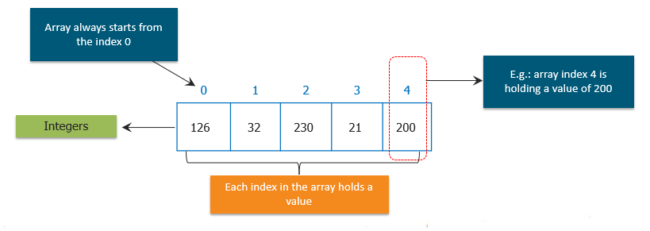

# Arrays de datos primitivos



Los arrays es una estructura de datos que te permite almacenar una secuencia de valores todos del mismo tipo.

Un array está hecho de bloques contiguos de memoria que se divide en varias celdas. Cada celda tiene un valor y todos los valores son del mismo tipo. A veces, las celdas de un array se denominan slots. En el array de la imagen cada celda contiene un int.

En el ejemplo de la imagen hemos creado un array de enteros. También se podría crear un array de caracteres, de String, etc. Esto se podría hacer tanto para tipos de datos primitivos como para objetos.

+ Las celdas están numeradas secuencialmente **empezando por cero.**
+ Si hay N celdas en un array, entonces los índices van del 0 hasta N-1.
+ La longitud de un array es el número de celdas.

Al valor almacenado en la celda de un array se le suele llamar **elemento**.

**Es muy importante tener en cuenta que los arrays empiezan siempre en la posición cero.** Por tanto, si se desea acceder al primer elemento del array, estará almacenado en la posición 0.

## Declaración y reseva de memoria

Para declarar un array, se hace de la misma forma que haríamos si quisiéramos declarar una variable pero añadiendo **_[ ]_**:

```java
    int miVariable; //declaramos una variable normal
    int[] miArray; //declaramos una variable array
```

Si usamos la declaración _tipo[]_ arrayName crea una referencia a una variable de tipo de array, pero no construye el objeto.

Los arrays en Java se crean como objetos, y como cualquier otro objeto en Java, para construirlo utilizamos la palabra reservada _new_. Para inicializar un array usaremos la palabra **new** + tipo de dato + tamaño del array entre corchetes[]:

```java
    int[] miArray = new int[10]; //creamos y reservamos memoria para el array con 10 elementos
    // y valores 0 en cada posición

    double[] dArray = new double[5];
```

Una vez ha sido construido no es posible cambiar su tamaño.
La variable miArray va a ser un array con espacio para 10 elementos de tipo entero.

## Acceso a los elementos del array

Para guardar un valor dentro de una celda del array tenemos que acceder a su posición dentro del array.

```java
    int[] miArray = new int[10];
    miArray[2] = 5; //guardamos en la posición 2 del array el valor 5
```

!!! Warning
    Recuerda que los elementos del array empiezan con índice 0, por tanto, en realidad la posición 2 sería la 3.

Para acceder a un valor de una determinada posición del array y mostrarlo lo haríamos de la siguiente forma:

```java
    int elemento = miArray[2]; //almacenamos el valor 5 en la variable entera elemento
    System.out.println(elemento);

    // o también podemos hacer directamente
    System.out.println(miArray[2]);
```

## Inicialización del array

Hay varias formas de inicializar un array.
Por ejemplo, si quisiéramos darle valor a todas las posiciones del array podríamos hacerlo de la forma:

```java
    miArray[0] = 2;
    miArray[1] = 31;
    miArray[2] = 5;
    ....
    miArray[10] = 4;
```

Lo cual es una forma muy pesada y tediosa. Java nos ofrece otras formas de inicializar los arrays en una sola línea de código que solo es aplicable a la vez que definimos la variable:

```java
    int[] miArray = {2,31,5,7,12,89,6,11,50,4};//correcto

    //no puedo inicializar el array después de haberlo creado
    miArray = {2,31,5,7,12,89,6,11,50,4};//eso da ERROR
```

De esa forma, también le indicamos indirectamente el tamaño del array. Java cuenta el número de elementos que hay entre {} y crea un array de ese tamaño y además los asigna en posiciones consecutivas dentro del array.

>Los índices en un array son enteros que especifican la posición que ocupa el elemento dentro del array. Por tanto podemos manejar los índices con variables enteras.

Una tercera forma sería utilizando la estructura de bucle _for_, para esto, debemos saber con antelación el valor de los elementos del array:

```java
    int[] miArray = new int[10];

    for(int i = 0; i < 10; i++) {
        miArray[i] = i * 10;
    }
```

Lo que hacemos es inicializar cada posición del array utilizando el bucle. Estamos almacenando dentro del array el valor del índice multiplicado por 10, de forma que tendremos, {0, 10, 20, ...., 90}.

La estructura for también es de gran ayuda si queremos imprimir los valores que están guardados en cada posición del array:

```java
    for(int i = 0; i < 10; i++) {
        System.out.println("Elemento " + i + " valor " + miArray[i]);
    }
```

A falta de cualquier otra información, las celdas de un array se inicializan con el valor predeterminado para su tipo. Cada celda de un array de tipo numérico se inicializa a cero.

Y cada celda de un array de referencias a objetos se inicializa en **nulo (null)**.

## Longitud del array

Una buena práctica, es utilizar una propiedad integrada dentro de array, en vez de hardcodear literales de tamaño dentro del bucle. Esta propiedad es **length**:

```java
    for(int i = 0; i < miArray.length; i++) {
        System.out.println("Elemento " + i + " valor " + miArray[i]);
    }
```

Si ahora cambiamos la longitud del array en su definición, no se vería afectado ningún bucle o lugar donde se utilizara _miArray.length_.

## Pasar un array como argumento en un método

Al igual que hacíamos con las variables simples, también podemos pasar arrays a los métodos.

```java
public static void imprimirArray(int[] array) {
    for(int i = 0; i < array.length; i++) {
        System.out.println("Elemento " + i + " valor " + array[i]);
    }
}

public static void main() {
    int[] miArray = new int[10];
    imprimirArray(miArray);
}
```

## Devolver un array en un método

Para devolver un objeto de tipo array en un método simplemente añadiremos []:

```java
public static int[] calcular() {
    int[] miArray = new int[10];
    ....//realizo calculos con el array
    return miArray;
}
```

## Caso práctico real uso de un array

Vamos a presentar un ejemplo de un caso real para el que los arrays son muy efectivos. Por ejemplo pedir al usuario que inserte números y mostrar la media de los números insertados.

```java
public class MiArray {

    private static Scanner sc = new Scanner(System.in);

    public static void main(String[] args) {
        int[] enteros = leerEnteros(5);

        //imprimimos los valores
        for (int i = 0; i < enteros.length; i++) {
            System.out.println("Elemento en posición " + i + " valor " + enteros[i]);
        }
        System.out.println("La media del array es " + calcularMedia(enteros));
    }

    public static int[] leerEnteros(int elementos) {
        System.out.println("Inserta " + elementos + " de tipo entero.");
        int[] array = new int[elementos];

        for (int i = 0; i < array.length; i++) {
            array[i] = sc.nextInt();
        }

        return array;
    }

    public static double calcularMedia(int[] array) {
        int suma = 0;
        for (int i = 0; i < array.length; i++) {
            suma += array[i];
        }
        return (double) suma / (double) array.length;
    }
}
```
