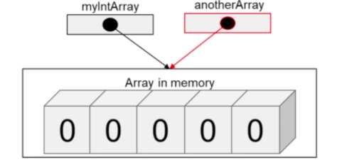

# Tipos de referencia vs tipos de valor

Sabemos que los tipos de datos primitivos como int, double, etc. son tipos de datos primitivos, es decir, son tipos de valor ya que almacenan valores.

A diferencia de éstos, los arrays son tipos de referencia como también los son los String.

Cuando creamos una variable de tipo valor, se asigna un solo espacio en la memoria para almacenar su valor y esa variable contiene directamente el valor.

Si creamos otra variable y le asignamos esa variable como se ve en el siguiente código:

```java
    int variable = 2;
    int otraVariable = variable;//asignamos un 2 a otraVariable

    otraVariable = 5;

    System.out.println(variable);//imprime 2
    System.out.println(otraVariable);//imprime 5
```

El valor es copiado directamente y ambas variables trabajan independientemente. Cada una tiene su propia copia del valor específico, en este caso 2.

Ahora bien, tipos de referencia, como clases o arrays trabajan de forma diferente. Utilizamos la palabra new para crear un nuevo objeto.

```java
    int[] array = new int[5];
```

En este caso, tenemos una referencia a un array. Los tipos de referencia son usados por una referencia. Por lo tanto, una referencia contiene una referencia o una dirección de objeto pero no el objeto en sí.

En el ejemplo anterior, la variable _array_ contiene una referencia o dirección al array en la memoria.

Con los tipos de referencia, usamos una referencia para controlar el objeto en memoria, no podemos acceder al objeto directamente.

**Una referencia es como una dirección de algún objeto en memoria**.

```java
    int[] array = new int[5];
    int[] otroArray = array;
```

En el código anterior, hemos declarado _otroArray_ que es una referencia al mismo array en memoria. Es decir, ahora tenemos dos referencias apuntando al mismo array en memoria.
O dicho de otra forma, tanto _array_ como _otroArray_ contienen la misma dirección en memoria.

Como se puede observar, una forma de saber si es de tipo de referencia es con el operador *new*, ya que este crea un nuevo objeto en memoria.

Para imprimir el contenido de un array, podemos usar un método integrado en Java en la clase `Arrays.toString`. Este método imprime el contenido del array en una sola línea separando los elementos con comas.

```java
    int[] array = new int[5];
    int[] otroArray = array;

    System.out.println(Arrays.toString(array));
    System.out.println(Arrays.toString(otroArray));
```

Ahora mismo, los arrays están vacíos por tanto se imprime todo con valores 0. Vamos a ver que ocurre si modificamos un valor en el array _otroArray_.

```java
    int[] array = new int[5];
    int[] otroArray = array;

    System.out.println(Arrays.toString(array));
    System.out.println(Arrays.toString(otroArray));

    otroArray[0] = 3;

    System.out.println(Arrays.toString(array));
    System.out.println(Arrays.toString(otroArray));
```

Si ejecutamos el código, veremos que ambos arrays han cambiado. Esto ocurre porque las dos variables apuntan al mismo array en memoria. **Solo hay una copia del array en la memoria**. Las dos variables contienen la dirección que apunta al array en memoria.



Para desreferenciar un array y que apunte a otro array en memoria tenemos que usar el operador **new**:

```java
    int[] array = new int[5];
    int[] otroArray = array;

    System.out.println(Arrays.toString(array));
    System.out.println(Arrays.toString(otroArray));

    array = new int[]{1, 2, 3};
    otroArray[0] = 3;

    System.out.println(Arrays.toString(array));
    System.out.println(Arrays.toString(otroArray));
```

## Métodos: paso por referencia

Recuerda que Java usa llamada por valor para pasar datos a métodos, esto es que envía una copia del dato, por tanto cualquier modificación de la copia dentro del método no afecta al original. Con parámetros de tipo array es diferente. Si pasamos a un método el array, ya que le estamos pasando la referencia al array, crearía una nueva variable dentro del método pero ésta apuntaría al mismo array en memoria. Cualquier modificación dentro del método en el array se vería fuera del método puesto que solo hay un objeto array en memoria.
