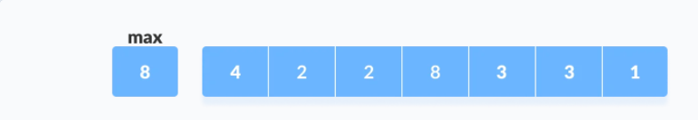
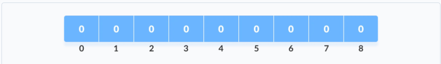
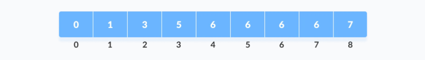
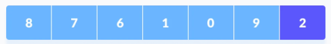
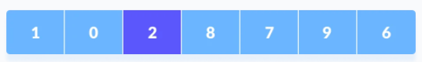
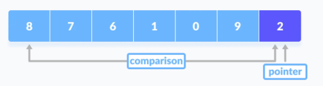
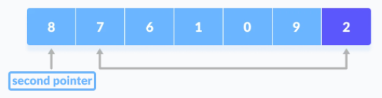
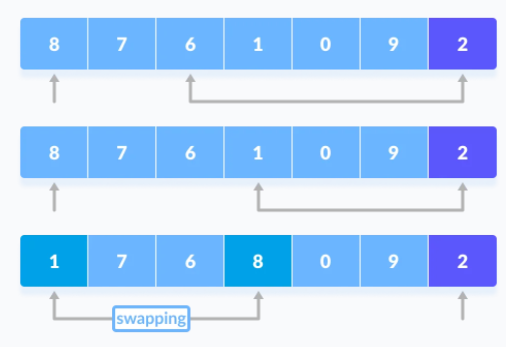
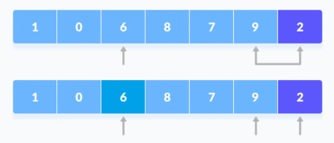

# Algoritmos de ordenación

> La ordenación es una de las técnicas fundamentales que se utilizan en la resolución de problemas, especialmente en los relacionados con la escritura y la implementación de algoritmos eficientes.

Por lo general, la ordenación se combina con la búsqueda, lo que significa que primero ordenamos los elementos de la colección dada, luego buscamos algo dentro de ella, ya que generalmente es más fácil buscar algo en una colección ordenada, en lugar de sin ordenar.

Ordenar un array es el proceso de ordenar sus elementos en orden ascendente o descendente. Los algoritmos de ordenación se encuentran entre los algoritmos más utilizados en computación.

## Bubble sort (Burbuja)

Funciona intercambiando elementos adyacentes si no están en el orden deseado. Este proceso se repite desde el principio del array hasta que todos los elementos están en orden.

Sabemos que todos los elementos están en orden cuando logramos hacer toda la iteración del array sin intercambiar ningún elemento en absoluto; entonces, todos los elementos que comparamos estaban en el orden deseado con sus elementos adyacentes y, por extensión, todo el array.

Ejemplo:

```text
[4, 2, 1, 5, 3] - Paso 1: como 4 > 2, los intercambiamos 
[2, 4, 1, 5, 3] - Paso 2: como 4 > 1, los intercambiamos
[2, 1, 4, 5, 3] - Paso 3: como no se cumple 4 > 5, los dejamos igual
[2, 1, 4, 5, 3] - Paso 4: como 5 > 3, los intercambiamos
[2, 1, 4, 3, 5] - Este es el resultado del array después de la primera iteración del bucle externo.
```

Como al menos se produjo un intercambio durante la primera iteración (en realidad hubo tres), debemos revisar todo el array otra vez y repetir el mismo proceso.

Repetiremos este proceso, **hasta que no se realicen más intercambios**, que será cuando tengamos el array ordenado.

La razón por la que este algoritmo se llama Bubble sort es porque los números "burbujean" hasta la "superficie".

Si seguimos haciendo trazas en el ejemplo, siguiendo un número en particular (4 es un gran ejemplo), verás que se mueve lentamente hacia la derecha durante el proceso.

### Complejidad temporal

Para calcular la complejidad temporal de Bubble Sort, necesitamos mirar el peor escenario posible. ¿Cuál es la cantidad máxima de veces que necesitamos pasar por todo el array antes de ordenarlo?

El peor escenario sería `[5, 4, 3, 2, 1]`. En la primera iteración, 5 "burbujeará hasta la superficie", pero el resto de los elementos permanecerán en orden descendente. Tendríamos que hacer una iteración para cada elemento excepto 1, y luego otra iteración para verificar que todo esté en orden, por lo que un total de 5 iteraciones.

Si pensamos en un array de n elementos, eso significa que necesitamos hacer n iteraciones.

Cada una de esas n veces estamos iterando a través de todo el array, lo que significa que la complejidad temporal en el peor de los casos sería Big-O: O(n^2).

## Counting sort

El ordenamiento por conteo es un algoritmo de ordenamiento que ordena los elementos de un array contando el número de apariciones de cada elemento único en el array. El recuento se almacena en un array auxiliar y la ordenación se realiza mapeando la cuenta como un índice del array auxiliar.

### ¿Cómo funciona?

1. Encuentra el elemento máximo `max` del array dado.

2. Crea un array de longitud `max + 1` con todos los elementos a 0. Este array se utiliza para almacenar el **recuento** de los elementos del array.

3. Almacena el recuento de cada elemento en su índice respectivo en el array de recuento. Por ejemplo: si el elemento 3 aparece 2 veces en el array, entonces 2 se almacena en la tercera posición del array de recuentos. Si el elemento "5" no está presente en el array, entonces 0 se almacena en la quinta posición.

4. Almacena la suma acumulativa de los elementos del array de recuentos. Es útil colocar los elementos en el índice correcto del array ordenado.

5. Encuentra el índice de cada elemento del array original en el array de conteo. Esto da el recuento acumulativo. Coloca el elemento en el índice calculado como se muestra en la figura siguiente.

6. Después de colocar el elemento en la posición correcta del array ordenado, disminuye el array de recuento para ese índice en uno.

### Complejidad

La complejidad temporal en el peor caso es Big-O: O(n).

<!--
## Quicksort

Quicksort es un algoritmo de divide y vencerás. Selecciona un elemento del array como pivote y ordena todos los demás elementos a su alrededor, por ejemplo, elementos más pequeños a la izquierda y más grandes a la derecha.

Esto garantiza que el pivote esté en su lugar correcto después del proceso. Luego, el algoritmo hace lo mismo de forma recursiva para las partes izquierda y derecha del array.

### ¿Cómo funciona ?

1. **Selecciona el elemento pivote**. Existen diferentes variaciones en las que el elemento de pivote se selecciona desde diferentes posiciones. En el ejemplo, seleccionaremos el elemento más a la derecha del array como elemento pivote.

2. **Reorganiza el array**. Ahora los elementos del array se reorganizan de modo que los elementos que son más pequeños que el pivote se colocan a la izquierda y los elementos mayores que el pivote se colocan a la derecha.

Esto lo haremos de la siguiente forma:
   + Un puntero se fija en el elemento pivote. El elemento pivote se compara con los elementos a partir del primer índice.
    
   + Si el elemento es mayor que el elemento pivote, se establece un segundo puntero para ese elemento.
    
   + Ahora, el pivote se compara con otros elementos. Si se alcanza un elemento más pequeño que el elemento de pivote, el elemento más pequeño se intercambia con el elemento más grande encontrado anteriormente.
    
   + Nuevamente, el proceso se repite para establecer el siguiente elemento mayor como segundo puntero. Y cámbielo por otro elemento más pequeño.
    
   + El proceso continúa hasta que se alcanza el penúltimo elemento.
    
   + Finalmente, el elemento pivote se intercambia con el segundo puntero.
    
3. **Dividir subarrays**. Los elementos de pivote se eligen de nuevo para las subpartes izquierda y derecha por separado. Y se repite el paso 2.

Los subarrays se dividen hasta que cada subarray esté formado por un solo elemento. En este punto, el array ya está ordenado.

## Merge sort

Merge Sort usa la recursividad para resolver el problema de la ordenación de manera más eficiente que los algoritmos anteriores y usa el famoso enfoque de **divide y vencerás**.

Usando la técnica "Divide and Conquer", dividimos un problema en subproblemas. Cuando la solución a cada subproblema está lista, 'combinamos' los resultados de los subproblemas para resolver el problema principal.

Supongamos que tuviéramos que ordenar un array `A` que comienza en el índice `p` y termina en el índice `r`, denotado como `A[p..r]`.

### Divide

Si `q` es el punto medio entre `p` y `r`, entonces podemos dividir el array `A[p..r]` en dos subarrays `A[p..q]` y `A [q + 1, r]`.

### Conquer

En el paso de conquista, intentamos ordenar los subarrays `A[p..q]` y `A[q + 1, r]`. Si aún no hemos llegado al caso base, nuevamente dividimos estos dos subarrays e intentamos ordenarlos.

## Fusionar (merge)

Cuando el paso de conquista alcanza el caso base de la recursividad y obtenemos dos subarrays ordenados `A[p..q]` y `A[q + 1, r]` para el array `A[p..r]`, combinamos los resultados creando un array ordenado.

El algoritmo MergeSort divide repetidamente el array en dos mitades hasta que llegamos a una etapa en la que intentamos realizar MergeSort en un subarray de tamaño 1.

Después de eso, la función de combinación entra en juego y combina las matrices ordenadas en matrices más grandes hasta que se fusiona toda la matriz.

Para ordenar un array completo, necesitamos llamar a `mergesort(A, 0, length(A) - 1)`.

Como se muestra en la imagen a continuación, el algoritmo de ordenación merge divide recursivamente el array en mitades hasta que llegamos al caso base del array con 1 elemento. Después de eso, la función de combinación recoge los subarrays ordenados y los fusiona para ordenar gradualmente todo el array.

El algoritmo mantiene tres punteros, uno para cada uno de los dos arryas y otro para mantener el índice actual del array ordenado final.

## ¿Cómo funciona mergesort?

1. Crea copias de los subarrays `L ← A [p..q]` y `M ← A [q + 1..r]`.
2. Crea tres punteros `i`, `j` y `k`
   1. `i` mantiene el índice actual de `L`, comenzando en 1
   2. `j` mantiene el índice actual de `M`, comenzando en 1
   3. `k` mantiene el índice actual de `A[p..q]`, comenzando en `p`.
3. Hasta que lleguemos al final de `L` o `M`, escoge el más grande entre los elementos de `L` y `M` y colócalos en la posición correcta en `A[p..q]`.
4. Cuando nos quedemos sin elementos en `L` o `M`, recoge los elementos restantes y ponlos en `A [p..q]`.
-->
