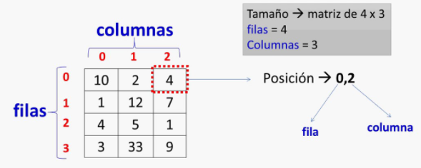
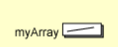
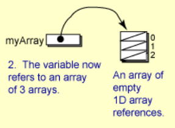
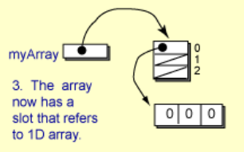
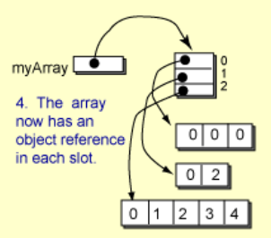
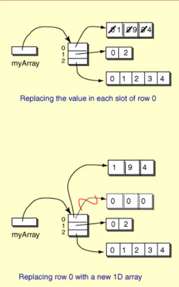

# Arrays multidimensionales

Un array bidimensional o matriz, es un array cuyos componentes son ellos mismos arrays, y es necesario o útil para ciertos tipos de problemas. Por ejemplo, imagina una clase de 7 estudiantes que tienen un examen cada semana durante 5 semanas. El profesor registra las calificaciones en una tabla. Una celda particular de la tabla se designa por número de estudiante y número de semana.

En Java, una tabla se puede implementar como una matriz 2D. Cada celda de la matriz es una variable que puede contener un valor y funciona como cualquier variable. Al igual que con los arrays unidimensionales, todas las celdas de una matriz 2D son del mismo tipo. El tipo puede ser un tipo primitivo o un tipo de referencia de objeto.

**Importante: cada celda de la matriz se especifica con un número de fila y columna, en ese orden.**

`matriz[fila][col]`

Al igual que con los arrays unidimensionales, los índices comienzan en cero.



Para acceder a la posición 0,2 lo haríamos con `matriz[0][2]` y esto devuelve el entero 4.

Al igual que con una matriz 1D o un arrar, un índice de matriz puede ser un literal entero, una variable de tipo entero, un método que se evalúa como un número entero o una expresión aritmética que involucra todas estas cosas:

```java
matriz[3][j] = 34;

suma = matriz[i][j] + suma[i][j + 1];

value = matriz[2][someFunction()];

matriz[1][0] = matriz[i + 3][algunaFunción() - 2];
```

## Declaración de un array 2D o matriz 2D

Recordamos que al igual que los arrays unidimensionales, las matrices bidimensionales son objetos. Para declara un array bidimensional se puede crear una lista. La lista debe contener las filas cada una separada por una coma; y cada fila es una lista de valores.

Ejemplo:

```java
int[][] myArray = { {8,1,2,2,9}, {1,9,4,0,3}, {0,3,0,0,7} };

//también se puede hacer así
int[][] matriz = new int[5][7];//inicializa todo a 0s
```

Cada fila de una matriz 2D puede tener un número diferente de celdas.

Si un programa intenta acceder a una celda que no existe, se lanzará una excepción (que generalmente detendrá su programa). Hacer una asignación a una celda que no existe es un error.

## Longitud de una matriz 2D

**La longitud de una matriz 2D es el número de filas** que tiene. Se puede adivinar que "longitud" podría definirse como un par de números (filas, columnas). Pero el número de columnas puede variar de una fila a otra, por lo que esto no funcionará. Sin embargo, el número de filas no cambia, por lo que funciona como una longitud.

Cada fila de una matriz 2D puede tener un número diferente de celdas (columnas), por lo que cada fila tiene su propia longitud.

## Entender mejor los arrays o matrices 2D

Un array bidimensional se implementa como un array unidimensionales. La declaracion

`int [][] myArray;` // 1.



declara una variable llamada `myArray` que en el futuro puede hacer referencia a un objeto de matriz. En este punto, no se ha dicho nada sobre el número de filas o columnas.

Para crear una matriz de 3 filas, haríamos:

`myArray = new int [3][];` // 2.



Ahora `myArray` hace referencia a un objeto de matriz. El objeto de matriz tiene 3 celdas. Cada celda puede hacer referencia (en el futuro) a una matriz de int, un objeto int []. Sin embargo, ninguna de las celdas se refiere todavía a un objeto. Se inicializan a nulo.

Una forma de crear la fila 0 es esta:

`myArray[0] = new int [3];` // 3.



Esto crea un objeto array 1D y coloca su referencia en la celda 0 de myArray. Las celdas del array 1D se inicializan a 0.

Una matriz o array 1D construida previamente se puede asignar a una fila:

```java
int[] x = {0, 2};
int[] y = {0, 1, 2, 3, 4};

myArray [1] = x;
myArray [2] = y; // 4.
```



No es necesario que las filas tengan el mismo número de celdas.

Las declaraciones anteriores construyen la matriz 2D paso a paso.

### ¿Cómo se podrían reemplazar las celdas individuales de cada fila dentro de una matriz?

Si quisieras reemplazar la fila uno del ejemplo anterior con la siguiente sentencia:

`myArray [0] = {1, 9, 4};` No funcionará.

Una lista de inicializadores entre llaves { } solo se puede usar para inicializar una matriz, no para asignarle valores después de que ya se ha creado y existe.

Si has pensado en hacer algo así:

```java
int[] x = {1, 9, 4}; // declarar e iniciar x
myArray [0] = x; // asignar a myArray
```

Esto si funcionaría, pero no haríamos exactamente lo que se pidió en la pregunta. Es decir, de esta forma reemplazaríamos la antigua fila 0 con una nueva fila. Lo que hacemos es construir un nuevo objeto de matriz 1D (un array) que contiene los valores deseados en sus celdas y luego asigna ese objeto a la fila 0 de `myArray`. La fila 0 anterior ahora es basura.

Lo correcto sería recorrer la fila 0 y reemplazar el **valor** de cada celda.


