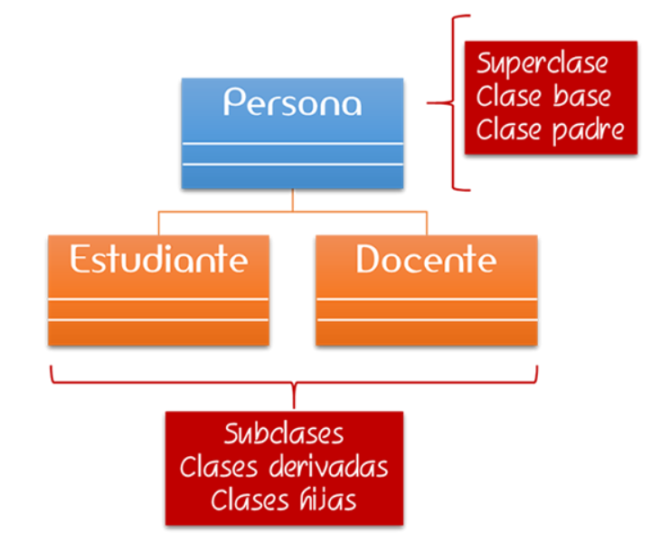
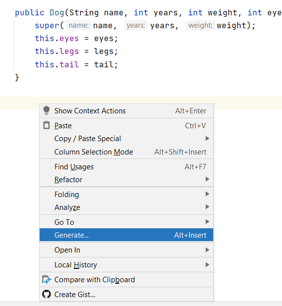
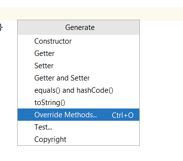
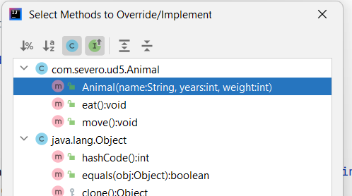

# Herencia

Cuando tenemos una clase con una serie de características  y nuestro programa se actualiza o amplia, tal vez se necesita de una clase con unas características similares, como por ejemplo, Ordenador, posee un ram, cpu, tamaño de disco, etc.

Si ahora queremos añadir la clase Tablet Android en nuestro sistema, como posee todas esas características de ordenador además de algunas específicas, copiaríamos todo lo que hay en ordenador y agregaríamos lo que fuera específico para Tablet. Lo mismo tendríamos que realizar si añadiéramos Pórtatil Mac. Como te habrás dado cuenta, este proceso genera mucho código repetido. Y arreglar un error en él puede ser también complicado. Para ello utilizamos la herencia.

¿Cómo se relacionan las clases entre sí? En Java, y en cualquier otro lenguaje orientado a objetos, las clases se organizan en una **jerarquía de clases**. Una jerarquía de clases es como un árbol al revés. En lo más alto de la jerarquía se encuentra la clase más general, en Java, la clase `Object`. Las clases debajo de `Object` en la jerarquía se conocen como sus **subclases**. Dado que todos los objetos que usamos en nuestros programas pertenecen a una clase u otra, esto es como decir que todos los objetos son `Object`.


En Java, todas las clases heredan de la clase `java.lang.Object`.
La Figura muestra el concepto de jerarquía de clases. Observa que la clase `Object` se encuentra en la parte superior de la jerarquía. Es la clase más generalizada. Tiene características que son comunes a todos los objetos Java. A medida que desciende en la jerarquía, las clases se vuelven cada vez más **específicas**. Un rectángulo es un objeto, pero contiene atributos (largo y ancho) que son comunes a todos los rectángulos, pero no a otros objetos de la jerarquía. Por ejemplo, un objeto `Vehicle` no tiene necesariamente una longitud y una anchura.

También está la clase `Square` en la jerarquía. Un `Square` (cuadrado) es un tipo especial de rectángulo, es decir, uno cuyo largo es igual a su ancho.

Usando la terminología asociada con este tipo de jerarquía, decimos que la clase `Rectangle` es una **subclase** de la clase `Object`. La clase `Square` es una subclase de `Rectangle` y `Object`. Se dice que las clases que se encuentran por encima de una clase dada en la jerarquía son sus **superclases**.

Por lo tanto, la clase `Rectangle` y también `Object` es una superclase de la clase `Square`.

>_En general, decimos que una subclase extiende una superclase, lo que significa que agrega elementos adicionales (atributos y / o métodos) a los contenidos en sus superclases. Como el caso de la clase `Square` que agrega la característica de que su largo y ancho son siempre iguales._

Hay tres conjuntos de terminología para describir las relaciones de herencia:

+ padre / hijo
+ clase base / clase derivada
+ superclase / subclase



El concepto importante asociado con una jerarquía de clases es la noción de **_herencia_** de clases, mediante la cual una subclase hereda elementos (atributos y / o métodos, excepto el constructor) de sus superclases.

!!! Nota
    Los atributos y métodos declarados como `private` _se dice que no se heredan porque su visibilidad es privada y no se puede acceder desde la clase hija, pero si son heredados_.

Un término muy usado en herencia es **reutilización**. Como el propio nombre dice, reutilizar el código repetido en los programas. Es un mecanismo para reutilizar el código existente cuando creamos clases heredadas.

Para ilustrar cómo funciona la herencia pensemos en un ajedrez. Hay varios tipos diferentes de piezas de ajedrez. Hay peones, caballeros, reinas y reyes. Un par de atributos que todas las piezas de ajedrez tienen en común es su posición de fila y columna en el tablero de ajedrez. Debido a que todas las piezas de ajedrez tienen estos atributos en común, habrá una clase en la jerarquía superior llamada `PiezaAjedrez` con estos atributos que serán heredados por todas las subclases de `PiezaAjedrez`.

Una de las acciones que todas las piezas de ajedrez tienen en común es que pueden moverse a una casilla determinada del tablero de ajedrez. Pero los diferentes tipos de piezas de ajedrez tienen diferentes formas de moverse. Por ejemplo, un alfil solo puede moverse a lo largo de diagonales en el tablero de ajedrez, mientras que una torre solo puede moverse a lo largo de una fila o columna en el tablero de ajedrez. Entonces, claramente, no podemos describir un método `moveTo()` que funcione para todas las piezas de ajedrez. Es por eso que colocamos el método `moveTo()` en todas las subclases de `PiezaAjedrez`. La clase `PiezaAjedrez` también tiene un método `moveTo()`, pero tenga en cuenta que su nombre está en cursiva. Esto indica que no se puede definir completamente a ese nivel.

En el ajedrez, el rey tiene ciertos atributos y acciones especiales. Por tanto, sólo el rey puede ser puesto bajo control. Esto significa que el rey está siendo atacado y en peligro de ser capturado, poniendo fin al juego. Del mismo modo, solo el rey tiene la capacidad de enrocar. Este es un movimiento especial que un rey puede realizar junto con una de sus torres bajo ciertas condiciones.
Por lo tanto, la clase `Rey` tiene ciertas características particulares.


En los diagramas, la flecha apunta del hijo al padre y muestra la relación "es-un". La flecha apunta a la clase principal de la clase secundaria. La imagen se puede leer como "un rey es una pieza de ajedrez".

Como vemos, una jerarquía de clases representa una especialización de clases a medida que avanza de arriba hacia abajo. La clase más general, `PiezaAjedrez`, está en la parte superior de la jerarquía. Sus atributos y métodos se transmiten (heredan) sus subclases. Sin embargo, además de los atributos y métodos que heredan de sus superclases, las subclases definen sus propios atributos y métodos especiales. Cada una de las subclases, Peón, Alfil, etc., representa algún tipo de especialización de la superclase.

## Herencia simple

En Java, (a diferencia de los humanos) los hijos heredan características de un solo padre. A esto se le llama **herencia simple**. Aunque algunos lenguajes de programación permiten que una clase hija herede de más de una clase padre. A esto se le llama **herencia múltiple**. Con la herencia múltiple, a veces es difícil saber qué padre contribuyó con qué características al hijo. Java evita estos problemas mediante el uso de herencia simple.

Una clase padre puede tener múltiples hijos.

**La herencia es entre clases, no entre objetos.**

## Sintaxis herencia en Java - _extends_

La sintaxis para heredar de una superclase es:

```java
public class Child extends Parent {
    // los nuevos miembros y constructores de la clase hija van aquí
}
```

Los miembros (variables y métodos) de la clase padre se incluyen automáticamente en el hijo por herencia. Si se quieren agregar miembros adicionales en la clase hija se hace en su definición de clase.

{==

Las clases declaradas como `final` no pueden ser extendidas.

==}

## Ejemplo clase Animal

Vamos a crear una clase base `Animal` que tendrá una serie de características comunes para todos los animales como puede ser, nombre, peso, tamaño, etc.

```java
public class Animal {

    private String name;
    private int size;
    private int weight;

    public Animal(String name, int size, int weight) {
        this.name = name;
        this.size = size;
        this.weight = weight;
    }

    //getters y setters
}
```

Ahora queremos crear un tipo de animal `Dog` que contendrá todas las características (atributos y métodos) de la clase `Animal`:

```java
public class Dog extends Animal {
    
}
```

Cuando creamos una subclase, necesitamos llamar al constructor de la superclase para inicializarla, ya que hereda de ella. Así que tendremos que crear el constructor en la clase `Dog` que llame dentro al constructor de la superclase (`Animal`):

```java
public class Dog extends Animal {

    public Dog(String name, int size, int weight) {
        super(name, size, weight);
    }
}
```

Al crear una clase hija `Dog` que hereda de la clase padre `Animal`, lo que estamos haciendo es heredar todo su comportamiento (atributos y métodos) y además nos permite añadir atributos específicos y únicos para esa clase hija que son particulares de los perros y no comunes o aplicables a todos los animales.

***

## _Super_ keyword

La palabra reservada `super` se utiliza para llamar al constructor de la clase de la que estamos heredando, es decir, llamar a la clase padre o superclase. En nuestro caso, para invocar al constructor de la superclase `Animal`.
Esto nos permite inicializar la clase `Animal`, ya que `Dog` es una clase derivada que se basa en ella.

La primera línea dentro del constructor de la clase hija debe ser la llamada al constructor padre con `super()`.
Si no se especifica explícitamente entonces el compilador Java llama por defecto a `super();`, es decir, al constructor por defecto (sin argumentos) de la clase padre.
Si el padre no tiene un constructor sin argumentos, entonces provoca un error.

!!! Note
    Si se proporciona un constructor con parámetros en una clase, el compilador de Java **no** creará automáticamente el constructor sin parámetros.

***

En la clase hija vamos a crear algunos campos específicos para los perros como ojos, piernas, etc. Porque recuerda que no todos los animales tienen piernas u ojos pero si todos los perros.

```java
public class Dog extends Animal {

    private int eyes;
    private int legs;
    private int tail;

    public Dog(String name, int size, int weight) {
        super(name, size, weight);
    }
}
```

Además de los campos que se necesitan para crear un objeto `Animal`, también hay que inicializar los campos propios de la clase `Dog` en el constructor:

```java
public class Dog extends Animal {

    private int eyes;
    private int legs;
    private int tail;

    public Dog(String name, int size, int weight, int eyes, int legs, int tail) {
        super(name, size, weight);
        this.eyes = eyes;
        this.legs = legs;
        this.tail = tail;
    }
}
```

En la clase base, vamos a añadir comportamiento, que será común para todos los animales, comer y moverse:

```java
public class Animal {

    private String name;
    private int size;
    private int weight;

    public Animal(String name, int size, int weight) {
        this.name = name;
        this.size = size;
        this.weight = weight;
    }

    public void eat() {
        //código
    }

    public void move() {
        //código
    }
}
```

Al hacer esto, y crearlos como `public` (`protected` también serviría), significa que ahora están disponibles en la clase `Dog` automáticamente. Es decir, el método `eat` y `move` se hereda a la clase `Dog`.

### Probar funcionamiento

Vamos a probar cómo funciona la herencia, para ello creamos un clase `Main` con un método `main`.

```java
public static void main(String[] args) {
    Animal animal = new Animal("", 0, 1);

    Dog dog = new Dog("Maxi", 2, 5, 2, 4, 1);
    
}
```

Vemos que crear un animal no tiene mucho sentido, puesto que no sabemos mucho sobre él. Cuando creamos un perro, podemos ser más específicos en nuestra definición y dar valores relativos solo para perros.
Además, desde perro tenemos acceso a los métodos definidos en la clase padre (`Animal`) como públicos o protected. Por ejemplo, `dog.eat()` invocará al método comer que se encuentra en la clase padre, ya que la clase `Dog` no tiene ningún método `eat`.

## Sobreescribir métodos de la clase padre en los hijos

La herencia nos aporta la opción de la **sobreescritura** de métodos. Es decir, redefinir los métodos de una clase padre en las clases hijas.

Por ejemplo, en la clase `Dog` podemos sobreescribir el método `eat()` con una funcionalidad más específica.

El IntelliJ nos ofrece un atajo para sobreescritura de métodos. Botón derecho --> Generate...





IntelliJ nos muestra todos los métodos que están en la clase `Animal` y podemos sobreescribir:



Si seleccionamos el método `eat()`, tenemos:

```java
public class Dog extends Animal {

    private int eyes;
    private int legs;
    private int tail;

    public Dog(String name, int size, int weight, int eyes, int legs, int tail) {
        super(name, size, weight);
        this.eyes = eyes;
        this.legs = legs;
        this.tail = tail;
    }

    @Override
    public void eat() {
        super.eat();//Código que se crea automáticamente y llama al método eat de la clase padre
    }
}
```

Ahora la clase hija `Dog` tiene su propio método `eat()` con código específico para esta clase.

```java
public class Dog extends Animal {

    private int eyes;
    private int legs;
    private int tail;

    public Dog(String name, int years, int weight, int eyes, int legs, int tail) {
        super(name, years, weight);
        this.eyes = eyes;
        this.legs = legs;
        this.tail = tail;
    }

    //Método privado solo de la clase Dog
    private void chew() {

    }

    @Override
    public void eat() {
        System.out.println("Dog eat");
        chew();
        super.eat();
    }
}
```

En términos de sobreescritura, debemos de llevar cuidado con el método que se invoca:

```java
public class Dog extends Animal {

    private int eyes;
    private int legs;
    private int tail;

    public Dog(String name, int years, int weight, int eyes, int legs, int tail) {
        super(name, years, weight);
        this.eyes = eyes;
        this.legs = legs;
        this.tail = tail;
    }

    //Método privado solo de la clase Dog
    private void chew() {

    }

    @Override
    public void eat() {
        System.out.println("Dog eat");
        chew();
        super.eat();
    }

    public void walk() {
        move();
    }

}
```

Si no sobreescribimos el método `move()` en la clase `Dog`, cuando lo invocamos dentro del método `walk()` se llamaría al método de la clase `Animal`.

!!! warning Warning
    **Los métodos estáticos** se heredan pero no se pueden sobreescribir.
