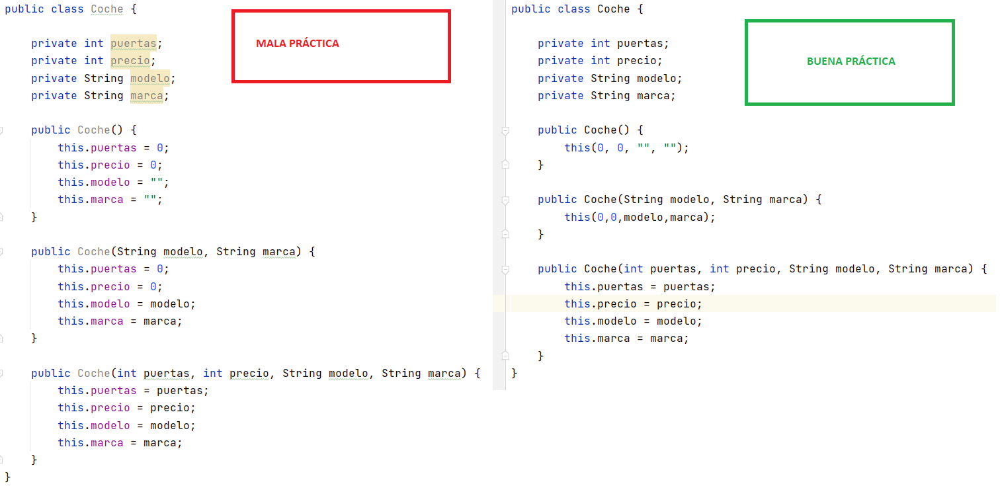

# This vs Super

+ La palabra reservada **super** se usa para acceder a los miembros (atributos y métodos) de la clase padre.

+ La palabra reservada **this** se utiliza para acceder a los miembros (atributos y métodos) de la clase actual en la que se usa.

Las dos palabras pueden usarse en cualquier lugar excepto en bloques de código estático.

## This

`this` es generalmente usada en constructores y en los métodos setters, y opcionalmente en los getters ya que no tenemos parámetro de entrada con el mismo nombre:

```java

public class Coche {

    private int ruedas;

    public Coche(int ruedas) {
        this.ruedas = ruedas;
    }

    public void setRuedas(int ruedas) {
        this.ruedas = ruedas;
    }

    public int getRuedas() {
        return ruedas;
    }
}
```

## Super

`super` es generalmente usada en sobreescritura de métodos al usar herencia. Es decir, se utiliza para llamar desde las clases hijas al método con el mismo nombre en la clase padre.

```java
    @Override
    public void eat() {
        System.out.println("Dog eat");
        chew();
        super.eat();
    }
```

Sin la palabra reservada `super`, se produciría una llamada recursiva al mismo método de forma infinita.

## this()

Usamos `this()` en forma de método dentro del cuerpo de un constructor cuando queremos invocar a otro constructor sobrecargado dentro de la misma clase.
`this()` solo puede usarse en un constructor; y debe de ser la primera sentencia que aparece en el constructor.

## super()

Usamos `super()` en forma de método dentro del cuerpo de un constructor cuando queremos invocar a un constructor de la clase padre.
`super()` solo puede usarse en un constructor; y debe de ser la primera sentencia que aparece en el constructor.

Recordemos que el compilador de Java agrega de forma automática la sentencia `super()` en el constructor de la clase hija si nosotros no lo añadimos.

!!! Note
    Un constructor puede tener las sentencias `this()` o `super()` pero nunca ambas.



En el siguiente ejemplo, usamos las dos sentencias:

```java
class Transporte {

    private int puertas;
    private int precio;

    public Transporte(int puertas, int precio) {
        this.puertas = puertas;
        this.precio = precio;
    }
}

public class Coche extends Transporte {

    private String modelo;
    private String marca;

    public Coche(String modelo, String marca) {
        this(0,0,modelo,marca);
    }

    public Coche(int puertas, int precio, String modelo, String marca) {
        super(puertas, precio);
        this.modelo = modelo;
        this.marca = marca;
    }
}
```
