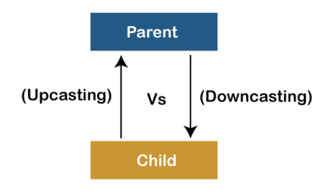

# Polimorfismo

El **Polimorfismo** es uno de los 4 pilares de la programación orientada a objetos (POO) junto con la Abstracción, Encapsulación y Herencia. Para entender que es el polimorfismo _es muy importante que tengáis bastante claro el concepto de la Herencia_.

Polimorfismo significa "que tiene muchas formas", es la capacidad que tienen los objetos de una clase en ofrecer respuesta distinta e independiente en función de los parámetros (diferentes implementaciones) utilizados durante su invocación.

Veamos un ejemplo para entender de forma más clara cómo funciona el polimorfismo.

Crearemos unas clases que heredan de la clase padre `Pelicula`:

```java
class Pelicula {
    private String titulo;

    public Pelicula(String titulo) {
        this.titulo = titulo;
    }

    public String trama() {
        return "No hay trama";
    }
}

class Spiderman extends Pelicula {
    public Spiderman() {
        super("Spiderman");
    }

    @Override
    public String trama() {
        return "Un hombre que le muerde una araña y adquiere sus poderes.";
    }
}

class Batman extends Pelicula {
    public Batman() {
        super("Batman");
    }

    @Override
    public String trama() {
        return "Un hombre que le muerde un murciélago y adquiere sus poderes.";
    }
}

class Zombieland extends Pelicula {
    public Zombieland() {
        super("Zombieland");
    }

    @Override
    public String trama() {
        return "Un puñado de humanos convertidos en zombies tratan de hacerse con el mundo";
    }
}

class StarWars extends Pelicula {
    public StarWars() {
        super("StarWars");
    }

    @Override
    public String trama() {
        return "Las fuerzas imperiales tratan de hacerse con control del mundo";
    }
}

class PeliRandom extends Pelicula {
    public PeliRandom() {
        super("PeliRandom");
    }
}
```

Ahora vamos a crear un método estático que nos va a devolver un objeto de tipo `Pelicula` en la clase `Main`, es decir, nos devolverá una película de manera aleatoria:

```java
    public static Pelicula peliculaAleatoria() {
        int numero = (int) (Math.random()*5) + 1; //genera un número aleatorio entre 1 - 5
        System.out.println(numero);
        switch (numero) {
            case 1:
                return new Spiderman();
            case 2:
                return new Batman();
            case 3:
                return new Zombieland();
            case 4:
                return new StarWars();
            case 5:
                return new PeliRandom();
        }
        return null;
    }
```

Gracias a la herencia, podemos devolver un tipo de la clase padre `Pelicula` aunque en realidad hayamos creado un objeto de una clase hija.

Ahora vamos a ver el polimorfismo, para ello vamos a crear un bucle en el main de la siguiente forma:

```java
    public static void main(String[] args) {
        for (int i = 0; i < 10; i ++) {
            Pelicula pelicula = peliculaAleatoria();
            System.out.println("Pelicula " + i + " " + pelicula.getTitulo() + " \n" + pelicula.trama());
        }
    }
```

Gracias al polimorfismo tenemos la capacidad de llamar al método `trama` con el mismo tipo de objeto, en este caso de tipo `Pelicula` y obtener diferentes resultados, ya que Java automáticamente ve qué tipo de hijo es e imprime el correspondiente método `trama`. Para el caso de que no se haya sobreescrito el método llamará al de la clase padre
Es decir, dependiendo del tipo de objeto invocado se realizan acciones diferentes, teniendo en cuenta, que todas las clases heredan de `Pelicula` eso es el **polimorfismo**.

## Importante

Una variable puede contener una referencia a un objeto cuya clase es descendiente de la clase de la variable.
Ejemplo:

```java
    //La variable a es una referencia a un objeto Perro que es descendiente de Animal. 
    Animal a = new Perro();
```

Un descendiente de una clase es un hijo de esa clase, o un hijo de un hijo de esa clase, y así sucesivamente. Los hermanos no son descendientes entre sí.

**NO podemos asignar un objeto de referencia de padre a una variable de clase hijo** (Perro p = new Animal()). Si queremos convertir un padre en hijo, la variable tiene que ser creada de tipo hijo.
Si queremos convertir un hijo en padre tendremos que hacer un Upcasting, y al revés tendríamos un Downcasting:



Ejemplo

```java
    //NO SE PUEDE HACER
    Perro p = new Animal(); //no compila
    Perro p = (Perro) new Animal(); // compila pero da error de ejecución

    //DOWNCASTING, convertir padre en hijo
    Animal a = new Perro();
    Perro pe = (Perro)a;

    //UPCASTING, convertir hijo en padre
    Animal a = (Animal) new Perro();
```
