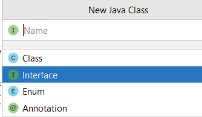
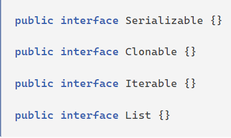
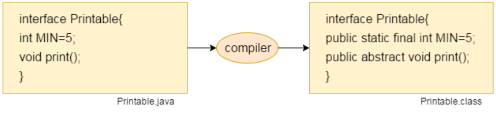
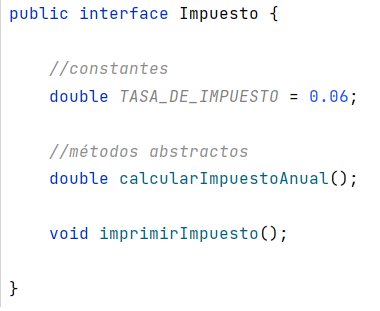
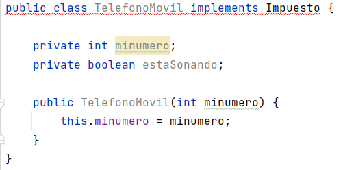
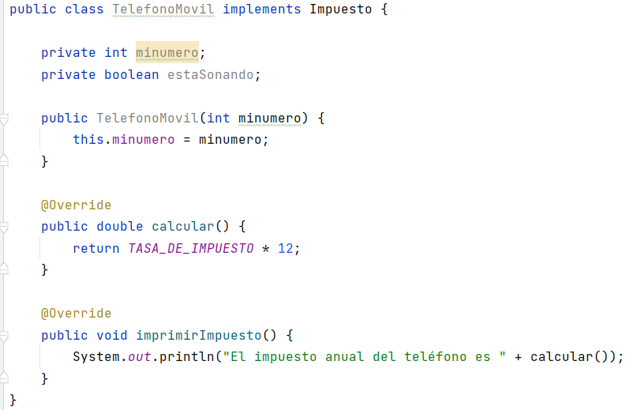

# ⚕️Interfaces

## ❇️ Definición

Una **interfaz** es una clase que define métodos pero no los implementa. La idea es proporcionar un comportamiento común que pueda ser utilizado por varias clases que implemente una interfaz. **No se pueden instanciar**.

Una interfaz es una lista de constantes y signaturas de métodos. Los métodos no están implementados en la interfaz (no hay cuerpo de método).

## ❇️ ¿Por qué se utilizan las interfaces?

Hay principalmente tres razones para usar la interfaz.

- Para lograr la abstracción.
- Dan algunas ventajas de herencia múltiple, sin las desventajas de la herencia.
- Para obtener un mayor desacoplamiento del código.

Las interfaces son muy usadas, de hecho, muchas de las librerías de Java hacen un uso extensivo de las interfaces.

Sabemos que Java tiene herencia única, es decir, una clase hija hereda solo de una clase padre. Esto, por lo general, es suficiente para codificar nuestras aplicaciones. Aunque a veces sería conveniente la herencia múltiple, donde una clase hija pudiera heredar características de varias clases padres. Pero esto puede llegar a ser confuso. ¿Qué sucede cuando dos padres tienen diferentes versiones del mismo método?

Una interfaz describe aspectos de una clase distintos de los que hereda de su padre. **_Una interfaz es un conjunto de requisitos que la clase debe implementar_**.

## ❇️ Interfaz vs Herencia

Una clase puede extender de una clase padre para heredar los métodos y las variables de instancia de ese padre. 

Una clase también puede implementar una interfaz al incluir métodos y constantes adicionales. Sin embargo, los métodos en la interfaz deben escribirse explícitamente como parte de la definición de la clase. La interfaz es una lista de requisitos que debe incluir la definición de clase (a través de código explícito, no a través de herencia).

Por ejemplo, una clase `Coche` podría extender de la clase `Vehiculo`. La herencia le da todos los métodos y variables de instancia. Pero si `Coche` también implementa la interfaz `Impuestos`, entonces su definición debe contener código **para TODOS los métodos enumerados en** `Impuestos`.

En Java las interfaces también representan una relación ES-UN.

{++Una clase extiende de un solo padre, pero puede implementar varias interfaces.++}

## ❇️ Cómo crear una interfaz

Para crear una interfaz en IntelliJ, haremos lo siguiente:

1. Botón derecho en el paquete de nuestra aplicación --> _New_ ---> _Java class_ y seleccionamos **Interface**.




En Java, los nombres de las interfaces, por lo general, deberían ser **adjetivos** o **nombres que describen el concepto abstracto** que representa la interfaz. La primera letra de cada palabra separada en mayúscula. En algunos casos, las interfaces también pueden ser sustantivos cuando presentan una familia de clases, p. `List` o `Map`.



Una vez creada la interfaz definiremos los métodos que desarrollarán las clases que implementen esta interfaz teniendo en cuenta que, **el compilador de Java agrega las palabras clave**:

- `public abstract` cuando se define un método, por lo que se puede omitir en los encabezados de los métodos. 
- `public static final` en el caso de las constantes.



!!! warning Warning
    **Los métodos abstractos NO pueden ser PRIVATE ni PROTECTED.**

Se estructura de forma que primero se sitúan las constantes y luego los métodos.

Si ponemos `public` IntelliJ nos avisa:




## ❇️ Relaciones entre interfaces y clases

Tenemos tres tipos de relaciones:

- `classB` **extends** `classA`: una clase B hereda de una clase A.
- `class` **implements** `interface1`, `interface2`, ...: una clase puede implementar una o varias interfaces, para ello usaremos la palabra reservada implements.
- `interfaceB` **extends** `interfaceA`, `interfaceC`, ...: una interfaz B puede heredar los métodos de una o varias interfaces. Una interfaz NO PUEDE heredar de una clase.

También podemos combinar algunas relaciones:

- `classB` **extends** `classA` **implements** `interface1`, `interface2`, ...:  una clase B hereda de una clase A y también implementa los métodos definidos en las interfaces. (Simulación de la herencia múltiple)


## ❇️ Ejemplo de código

Por ejemplo, vamos a crear la clase TelefonoMovil:



Observamos que IntelliJ nos genera un error, ya que debemos definir o implementar los métodos que habíamos declarado en la interfaz. Si hacemos click en el error, IntelliJ nos ofrece crearlos:




IntelliJ nos ha creado **TODOS** los métodos que habíamos definido en la interfaz, como vemos con la anotación `@Override`, ya que los está sobreescribiendo puesto que estaban declarados en la interfaz.

!!! note Importante
    **TODOS** los métodos definidos en la interfaz se han de implementar en la clase, no podríamos implementar solo algunos.

Veamos como probar el código en nuestra clase `Main`:

```java
public class MainTelefono {

    public static void main(String[] args) {
        Impuesto impuesto = new TelefonoMovil(123456789);
        impuesto.imprimirImpuesto();
    }
}
```

!!! warning  Warning
    Las interfaces _NO PUEDEN INSTANCIARSE_, es decir, no podemos crear objetos de interfaces. Hay que usar una clase que haya implementado la funcionalidad definida por la interfaz.

## ❇️ Novedades

Desde Java 8 podemos incluir en una interfaz:

- **métodos con cuerpo o implementación**: se denominan **_default methods_**. Estos métodos se heredan como cualquier método ordinario más y se pueden sobreescribir en la clase que implementa esa interfaz o sobreescribir en la interfaz que hereda de esa interfaz.

- **métodos estáticos** con cuerpo o implementación. Estos métodos no pueden ser sobreescritos o cambiar en ninguna clase que implemente la interfaz. Aunque si se heredan.

```java title="Impuesto.java"
public interface Impuesto {

    //constantes
    double TASA_DE_IMPUESTO = 0.06;

    //métodos abstractos
    double calcularImpuestoAnual();

    void imprimirImpuesto();

    //default methods
    default void imprimirTasa() {
        System.out.println("La tasa de impuesto es " + TASA_DE_IMPUESTO);
    }

    //métodos estáticos
    static double tax(int precio) {
        return TASA_DE_IMPUESTO * precio;
    }
}
```

### ⚜️ ¿Por qué el uso de default o static methods en el interior de una interfaz?

Imagina que creamos una interfaz en el proyecto. Pasado un tiempo, un gran número de clases implementan esa interfaz.

Si ahora añadimos un nuevo método a esta interfaz, desencadena en que, todas las clases que implementen esa interfaz se verán afectadas con errores, hasta que implementen o le den cuerpo a ese nuevo método. Aunque no es una tarea complicada puede llegar a ser tediosa, o que no sepamos todavía como implementarlo en todas las clases.

Para solventar esto, Java introdujo los _default methods_ y _métodos estáticos_.

---

+ Desde Java 9, podemos tener **métodos privados** en una interfaz.

Los métodos privados se pueden implementar estáticos o no. 

_¿Cuáles son las ventajas de tener métodos privados?_

Las interfaces pueden usar métodos privados para ocultar detalles sobre la implementación de las clases que implementan la interfaz. Como resultado, uno de los principales beneficios de tenerlos en las interfaces es la encapsulación.

```java title="Impuesto.java"
public interface Impuesto {

    //constantes
    double TASA_DE_IMPUESTO = 0.06;

    //métodos abstractos
    double calcularImpuestoAnual();

    void imprimirImpuesto();

    //default methods
    default void imprimirTasa() {
        System.out.println("La tasa de impuesto es " + TASA_DE_IMPUESTO);
    }

    default void aumentarTasa() {
        duplicarTasa();
    }

    //métodos privados de instancia
    private double duplicarTasa() {
        return TASA_DE_IMPUESTO * 2;
    }

    //métodos estáticos
    static double tax(int precio) {
        mostrarPrecio(precio);
        return TASA_DE_IMPUESTO * precio;
    }

    //métodos privados estáticos
    private static void mostrarPrecio(int precio) {
        System.out.println("El precio es " + precio);
    }
    
}
```