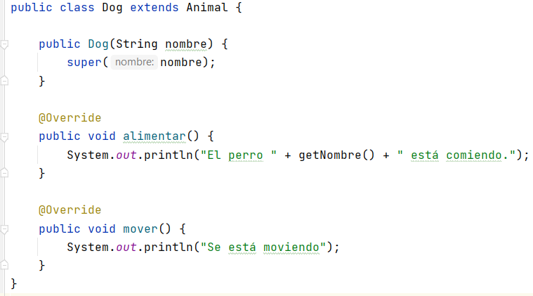
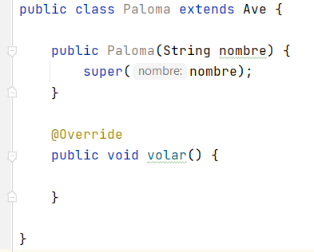

# Abstracción

La abstracción es un proceso de ocultar los detalles de implementación y mostrar solo la funcionalidad al usuario.

De otra manera, muestra solo las cosas esenciales para el usuario y oculta los detalles internos.

Una clase abstracta es una clase **que no se puede instanciar** pero que puede ser el padre de otras clases. Esto es útil, por ejemplo, cuando tenemos un concepto abstracto o amplio como Vehículo o Animal pero en realidad los objetos reales serían tipos específicos como Coche, Avión, Perro, etc.

Aunque no se puede instanciar, una clase abstracta define métodos y variables que heredan las clases hijas.

## Cómo crear una clase abstracta

Para crear una clase abstracta en IntelliJ, haremos lo siguiente:

1. Botón derecho en el paquete de nuestra aplicación --> New ---> Java class y añadimos la palabra reservada `abstract`:

## Métodos abstractos

Las clases abstractas pueden opcionalmente contener métodos abstractos. También pueden contener métodos no abstractos, que serán heredados por los hijos.

**Un método abstracto no tiene cuerpo**. (No tiene código). Solo se escribe la signatura del método con la palabra reservada abstract.

Vamos a crear una clase abstracta `Animal`:

Si ahora creamos una clase hija que herede de `Animal` obtendremos un error:

Esto es debido a que una clase hija no abstracta hereda el método o los métodos abstractos del padre y **debe desarrollarlos como métodos no abstractos**, es decir, con código. Si no lo hace debe declararse como abstracta.

Un hijo abstracto de un padre abstracto no tiene que definir métodos no abstractos para los métodos abstractas que hereda. Esto significa que puede haber varios pasos entre una clase base abstracta y una clase secundaria que no es completamente abstracta.

No todo lo definido en una clase abstracta debe ser abstracto. Sin embargo, **si una clase contiene incluso un método abstracto, entonces la clase en sí debe declararse abstracta**.

Si añadimos otra clase hija `Ave` que hereda de `Animal` y le agregamos un método abstracto. El IntelliJ nos muestra un error.

Tenemos que crear la clase como abstracta, ya que contiene un método abstracto.

Una vez creada la clase `Ave` como abstracta podríamos heredar de ella y crear clases hijas que implementarán el método abstracto volar:

Las clases abstractas se utilizan para organizar programas. Agrupar las clases es importante para mantener un programa organizado y comprensible.

La ventaja de usar una clase abstracta es que puede agrupar varias clases relacionadas como hermanas.

Aunque no se puedan instanciar **las clases abstractas también poseen constructores**. La mayoría de las veces se utilizan cuando quieres realizar alguna inicialización de los campos de la clase abstracta antes de la instanciación de una clase hija.

!!! Warning
    Cuando se invoca un método, es la clase del objeto (no de la variable) la que determina qué método se ejecuta.

## Interfaces vs Clases abstractas

+ Las clases abstractas pueden tener variables de instancia (atributos) que se heredan, al contrario que las interfaces, que no permiten definir variables **solo constantes estáticas**.
+ Ni las interfaces ni las clases abstractas se puede instanciar.
+ Las interfaces no pueden tener constructores y las clases abstractas si.
+ Todos los métodos definidos en una interfaz son por defecto **públicos y abstractos**, mientras que, en un clase abstracta podemos tener métodos con diferentes visibilidades (`public`, `private` o `protected`) y abstractos o con cuerpo.
+ Si implementas una interfaz debes sobreescribir todos sus métodos, si heredas de una clase abstractas solo estás obligado a sobreescribir los métodos abstractos.
