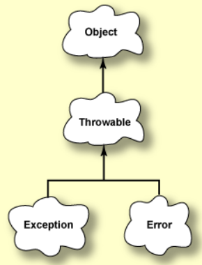
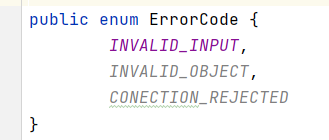

# Excepciones

Una excepción es un evento que ocurre durante la ejecución de una aplicación e interrumpe el flujo normal de las instrucciones del programa.



Class Exception y class Error extienden Throwable. Un método Java puede "lanzar" un objeto de clase Throwable.

Las excepciones son diferentes de los errores porque se pueden escribir programas para recuperarse de excepciones, pero no se pueden escribir programas para recuperarse de errores.

Las excepciones pueden ser detectadas por una parte del programa que intenta recuperarse del problema.

En Java, hay dos tipos de excepciones:

+ **Checked exceptions** (Excepciones verificadas).
+ **Unchecked exceptions** (Excepciones no verificadas).

## Checked exceptions

Estas son las excepciones que se comprueban en tiempo de compilación, es decir, un método debe hacer algo al respecto sino el programa no compila. Si algún código dentro de un método arroja una excepción verificada, entonces el método puede:

1. manejar la excepción en un bloque `try-catch{}`, o
2. `throws` (lanzar) la excepción al que invoca el método.

```java

public void leerFichero(String[] a) throws IOException {
    //código java
}
```

En el ejemplo, `IOException` es una checked exception. Este método lanza una IOException cuando hay un problema de lectura.

La palabra reservada `throws` dice que este método **no** captura la excepción `IOException` con un `catch`, sino que cuando ocurra una, se lanzará a la persona que llama el método `leerFichero`.

Si hiciéramos esto en un método `main`, como por ejemplo:

```java

public static void main(String[] args) throws IOException {
    //código java

}
```

La excepción se lanzará al Java runtime system.
El sistema de tiempo de ejecución de Java detecta las excepciones que se le han lanzado e imprime un mensaje y un seguimiento de la pila utilizando los datos de la excepción.

## Unchecked exceptions

Ocurren en tiempo de compilación, es decir, no se verifican por el compilador. En Java, las excepciones en las clases _RunTimeException_ y _Error_ y sus subclases son unchecked exceptions todo lo demás es es checked.

Depende de los programadores especificar o detectar las excepciones unchecked.
Por ejemplo, imagina que tenemos el siguiente programa Java se compila sin erorres:

```java
public static void main(String[] args) {
        int x = 0;
        int y = 10;
        int z = y / x;
}
```

El compilador nos deja compilar la aplicación porque `ArithmeticException` es una excepción no verificada, pero al ejecutar el programa se lanza la excepción, por tanto, nosotros tendremos que darnos cuenta y controlar este tipo de excepciones.

## Diferencias entre checked y unchecked exceptions

+ Una checked exception se detecta en tiempo de compilación, mientras que una unchecked exception en tiempo de ejecución.
+ Una checked exception debe manejarse o bien con volviéndola a lanzar con un `throw` o con un bloque `try catch`, mientras que una unchecked exception no requiere ser manejada.
+ Una unchecked exception es un error de programación y es fatal, mientras que una checked exception es una condición de excepción dentro de la lógica de su código y se puede recuperar o volver a intentar.


## Throwable

`Throwable` es la superclase de todas las excepciones y errores. Se podria capturar en un bloque `try-catch`, **¡pero nunca se debe hacer!**, ya que, no solo capturará todas las excepciones; sino que también hará lo mismo con todos los errores que genere la aplicacion.

La JVM arroja errores para indicar problemas graves **que no están destinados a ser manejados por una aplicación.**

Ejemplos típicos de eso son `OutOfMemoryError` o `StackOverflowError`. Ambos son causados por situaciones que están fuera del control de la aplicación y no se pueden manejar.

Por lo tanto, es mejor que **NUNCA** captures un Throwable.

## Excecpciones personalizadas

Aunque las excepciones de Java cubren casi todas las excepciones generales que están obligadas a ocurrir en la programación. Sin embargo, a veces necesitamos complementar estas excepciones estándar con las nuestras.

Estas son las principales razones para introducir excepciones personalizadas:

+ Añadir excepciones que son específicas de la lógica de nuestra aplicación o empresa. Éstas ayudan a los usuarios de la aplicación o a los desarrolladores a comprender cuál es el problema exacto.
+ Para capturar y proporcionar un tratamiento específico a un subconjunto de excepciones de Java existentes.
+ Añadir nuevos métodos o atributos que no son parte de las excepciones estándar.

## Buenas prácticas para definir excepciones personalizadas

### **Haz que tenga sentido**

Proporciona información o funcionalidad que no forma parte de las excepciones estándar de Java.

Esa es la esencia de la primera y más importante recomendación. De lo contrario, su excepción no brinda ningún beneficio en comparación con la gran cantidad de excepciones que ya proporciona el JDK.

Si no puede proporcionar ningún beneficio, es mejor que use una de las excepciones estándar, como UnsupportedOperationException o IllegalArgumentException. Todos los desarrolladores de Java ya conocen estas excepciones. Eso hace que su código y API sean más fáciles de entender.

### **Sigue la convención de nomenclatura estándar**

Cuando obsevamos las clases de excepción proporcionadas por el JDK, rápidamente nos damos cuenta que todos sus nombres terminan con `Exception`. Esta convención de nomenclatura general se utiliza en todo el sistema de Java. Y su excepción personalizada también debería seguirlo, por ejemplo, `ImpresoraException`.

### **Añade Javadoc a tu clase de excepción personalizada**

Las API no documentadas son muy difíciles de usar.

Las clases de excepción pueden no ser la parte más obvia de tu API, pero siguen siendo parte de ella. Tan pronto como uno de sus métodos orientados al cliente arroja una excepción, la clase de excepción se convierte en parte de la API. Eso implica que requiere documentación y un buen Javadoc.

El Javadoc debe describir el significado general de la excepción y las situaciones en las que podría ocurrir. El objetivo es ayudar a otros desarrolladores a comprender su API y evitar escenarios de error comunes.

### Proporciona un constructor

Normalmente, nuestro código detectará una excepción estándar antes de lanzar nuestra excepción personalizada. Esto, no debe ocultarse ya que la excepción capturada generalmente contendrá información esencial que necesitaremos para analizar el incidente.

En el siguiente ejemplo, `NumberFormatException` proporciona información detallada sobre el error. Perderá esta información si no la configura como la causa de `MyException`.

```java
public void methodA(String entrada) throws MyException {
    try {
        // código
    } catch (NumberFormatException e) {
        throw new MyException("Mensaje que describe el error.", e, ErrorCode.INVALID_ENTRY);
    }
}
```

`Exception` y `RuntimeException` proporcionan constructores que aceptan un `Throwable` que describe la causa de la excepción. Por tanato, nuestra excepción debería hacer lo mismo. Debemos implementar **al menos un constructor que obtenga el Throwable causante como parámetro y lo establezca en la superclase**.

## Pasos para implementar una excepción personalizada

1. Debemos extender de la clase `java.lang.Exception`.
2. Se debe proporcionar un constructor que establezca la excepción causante y brinde un beneficio en comparación con las excepciones estándar disponibles.

Ejemplo:




`MyException` usa un enum personalizado para almacenar un código de error que identifica el problema de nuestra aplicación. Los clientes pueden usar el código de error para mostrar mensajes de error localizados o decirle al usuario que incluya este código en un ticket de soporte.

Para usar `MyException` en nuestra aplicación o programa necesitaremos especificarlo como parte de la signatura de un método o simplemente capturarla con un bloque `try-catch`.


!!! Note
    Si queremos crear una excepción personalizada de tipo unchecked exception realizaremos el mismo procedimiento con la diferencia de que tendremos que extender de la clase `java.lang.RuntimeException`.
