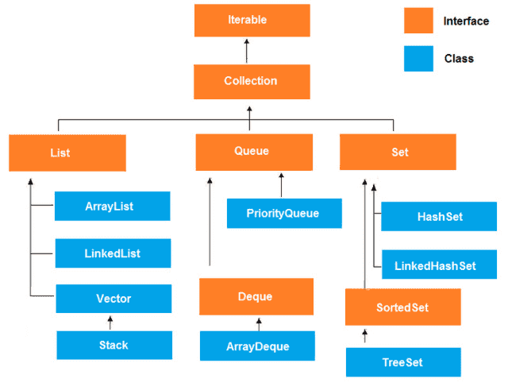
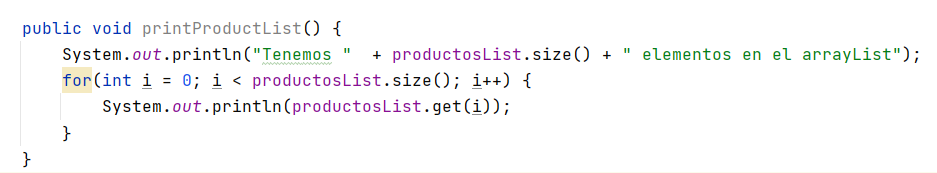
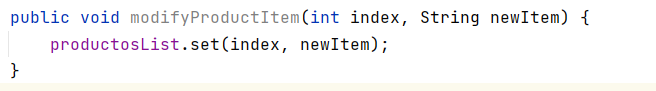

# Estructuras de datos

La estructura de datos es una forma de almacenar y organizar datos de manera eficiente, de modo que las operaciones requeridas en ellos se puedan realizar de manera eficiente con respecto al tiempo y la memoria. Simplemente, la estructura de datos se utiliza para reducir la complejidad (principalmente la complejidad del tiempo) del código.

Las estructuras de datos pueden ser de dos tipos:

1. Estructura de datos estática
2. Estructura de datos dinámica

## Estructuras de datos estáticos

En la estructura de datos estática, el tamaño de la estructura es **fijo**. El contenido de la estructura de datos se puede modificar pero sin cambiar el espacio de memoria que se le asigna. Un ejemplo de estas estructuras son los arrays que vimos en la unidad 4.

Aunque los arrays son muy útiles como hemos estudiado, si queremos redimensionar un array, es decir, cambiar su tamaño una vez lo hemos creado y preservar los valores que se encuentran en él la única forma de hacerlo sería creando un nuevo array y copiar los elementos a este nuevo array.
Hacer esto cada vez que queremos redimensionar el tamaño de un array es muy tedioso y no es nada productivo.

## Estructuras de datos dinámicas

En la estructura de datos dinámica, el tamaño de la estructura no es fijo y puede modificarse durante las operaciones realizadas en él. Las estructuras de datos dinámicas están diseñadas para facilitar el cambio en tiempo de ejecución.

[Documentación oficial Collections Java](https://docs.oracle.com/javase/tutorial/collections/interfaces/index.html)

## List



Una lista se puede ver como un array ya que es una secuencia de elementos o colección ordenada que te permite tener elementos en posiciones consecutivas.

En Java `List` es una interfaz **_Java.util.List_** que exitende de `Collection`. Siempre conserva el orden de los elementos. Los elementos contenidos en una lista se pueden insertar, acceder, iterar y eliminar de acuerdo con el orden en que aparecen internamente en la lista. El orden de los elementos es la razón por la cual esta estructura de datos se llama `List`. Cada elemento en una lista de Java tiene un índice, al igual que ocurría con los arrays.

La interfaz de lista se implementa mediante las clases `ArrayList`, `LinkedList`, `Vector` y `Stack`. Es decir, dado que `List` es una interfaz, no se puede crear una instancia directamente. Sin embargo, uno puede crear objetos de aquellas clases que han implementado esta interfaz e instanciarlos. Por ejemplo:

```java
List a = new ArrayList();
List b = new LinkedList();
List c = new Vector(); 
List d = new Stack(); 
```

De estas implementaciones, `ArrayList` es la más utilizada.

## ArrayList

La primera clase de la que vamos a hablar es `ArrayList`. Un `ArrayList` como su nombre indica basa su implementación de una lista en un array. Es un array dinámico en tamaño (es decir, de tamaño variable), pudiendo agrandarse el número de elementos o disminuirse de forma automática. Implementa todos los métodos de la interfaz List y permite incluir elementos null.

Un `ArrayList` no permite almacenar tipos de datos primitivos, solo puede almacenar objetos. Al contrario que un array que permitía almacenar ambos.
Sin embargo, desde Java 5, las primitivas se convierten automáticamente en objetos, gracias a los Wrappers.

`ArrayList` forma parte de `Collection` en Java. Por lo tanto, a diferencia de los arrays que para acceder a los elementos se hacía usando [], en `ArrayList` tenemos un  conjunto de métodos para acceder a los elementos y modificarlos.

### Crear un `ArrayList`

Para crear un `ArrayList` en IntelliJ escribimos:


Si nos fijamos nos aparece una `<E>`, esto quiere decir que cuando creamos un `ArrayList` no le estamos diciendo el tipo como hacíamos con los arrays: `int[] array;`. Por tanto, para crear un `ArrayList` que almacena objetos necesitamos decirle qué tipo de datos vamos a almacenar en nuestra lista.


En el ejemplo hemos creado una lista que contendrá elementos de tipo `String`. Y si nos fijamos no le hemos especificado ningún tamaño como hacíamos en los arrays puesto que Java maneja el tamaño por nosotros automáticamente.

### Añadir ítem al `ArrayList`

Para agregar un ítem o elemento a la lista utilizaremos los métodos que nos provee la interfaz `List`:


El método `add` agrega automáticamente el elemento en la lista. `ArrayList` es el que tiene toda la funcionalidad sobre dónde guardarlo (posición) y cantidad de espacio para asignar. Eso es abstracto para nosotros y no tenemos que preocuparnos por ello.

### Imprimir los elementos del `ArrayList`



### Modificar un ítem en una posición del `ArrayList`



### Eliminar un ítem de un `ArrayList`


El método remove elimina el elemento de la lista y deja la lista ordenada, es decir, si tuviéramos una lista con los siguientes productos: ["Leche", "Tomate", "Lechuga", "Carne"] y elimináramos el producto `Tomate`, la lista quedaría: ["Leche", "Lechuga", "Carne"], los ítem se moverían de posiciones. Todo eso lo hace Java automáticamente por nosotros.

### Copiar todo el contenido del un `ArrayList` a otro

Se puede hacer de varias formas:

```java
//Forma 1
ArrayList<String> newArray = new ArrayList<String>();
newArray.addAll(productosList);

//Forma 2
ArrayList<String> newArray2 = new ArrayList<String>(productosList);

//Forma 3 - Copiar un ArrayList a un array
String[] myArray = new String[productosList.size()];
myArray = productosList.toArray(myArray);
```

### Buscar un ítem en el `ArrayList`


### Comprobar si existe un ítem en el `ArrayList`


```java
public class ProductList {

    private ArrayList<String> productosList = new ArrayList<String>();

    public void addProduct(String item) {
        productosList.add(item);
    }

    public void printProductList() {
        System.out.println("Tenemos "  + productosList.size() + " elementos en el arrayList");
        for(int i = 0; i < productosList.size(); i++) {
            System.out.println(productosList.get(i));
        }
    }

    public void modifyProductItem(int index, String newItem) {
        productosList.set(index, newItem);
    }

    public void removeProductItem(int index) {
        String item = productosList.get(index);
        productosList.remove(item);
    }

    public boolean existsItem(String searchItem) {
        return productosList.contains(searchItem);
    }

    public String findItem(String searchItem) {
        int index = productosList.indexOf(searchItem);
        if (index >= 0) {
            return productosList.get(index);
        }
        return null;
    }
}
```

### Main

Vamos a crear una clase principal `Main` con un método `main`que imprimirá un menú de opciones relacionadas con la lista de productos y realizará sus respectivas acciones.

```java
public class MainList {

    private static Scanner scanner = new Scanner(System.in);
    private static ProductList productList = new ProductList();

    public static void imprimirMenu() {
        System.out.println("0 - Para imprimir menu");
        System.out.println("1 - Para imprimir productos");
        System.out.println("2 - Para añadir");
        System.out.println("3 - Para modificar");
        System.out.println("4 - Para eliminar");
        System.out.println("5 - Para salir");
    }

    public static void addItem() {
        System.out.println("Inserta el producto: ");
        productList.addProduct(scanner.nextLine());
    }

    public static void modifyItem() {
        System.out.println("Inserta número de posición: ");
        int index = scanner.nextInt();
        scanner.nextLine();
        System.out.println("Escribe el nuevo producto:");
        String newItem = scanner.nextLine();
        productList.modifyProductItem(index, newItem);
    }

    public static void removeItem() {
        System.out.println("Inserta número de posición: ");
        int index = scanner.nextInt();
        scanner.nextLine();
        productList.removeProductItem(index);
    }

    public static void main(String[] args) {
        boolean continuar = true;
        int opcion = 0;
        imprimirMenu();

        while(continuar) {
            System.out.println("Elige una opción: ");
            opcion = scanner.nextInt();
            scanner.nextLine();

            switch (opcion) {
                case 0:
                    imprimirMenu();
                    break;
                case 1:
                    productList.printProductList();
                    break;
                case 2:
                    addItem();
                    break;
                case 3:
                    modifyItem();
                    break;
                case 4:
                    removeItem();
                    break;
                case 5:
                    continuar = false;
                    break;
            }
        }
    }
}

```

## Buenas prácticas

Si nos fijamos, el método para modificar un ítem de la lista espera recibir un índice o posición donde se encuentra el elemento. Pero eso puede se peligroso, puesto que, sabemos que las posiciones empiezan por 0, pero a lo mejor el usuario no lo sabe y piensan que empiezan por 1. Por tanto, no sabemos a qué posición apunta realmente el índice que recibimos.

Una buena práctica es crear otro método que se le pase el nombre, buscarlo y devolver la posición en la lista:

```java
public void modifyProductItem(String actualItem, String newItem) {
    int index = findItem(actualItem);
    if (index >= 0) {
        modifyProductItem(index, newItem);
    }
}

private void modifyProductItem(int index, String newItem) {
    productosList.set(index, newItem);
}

public int findItem(String searchItem) {
    return productosList.indexOf(searchItem);
}
```

Ejercicio. Haz lo mismo con el método de eliminar elemento.
