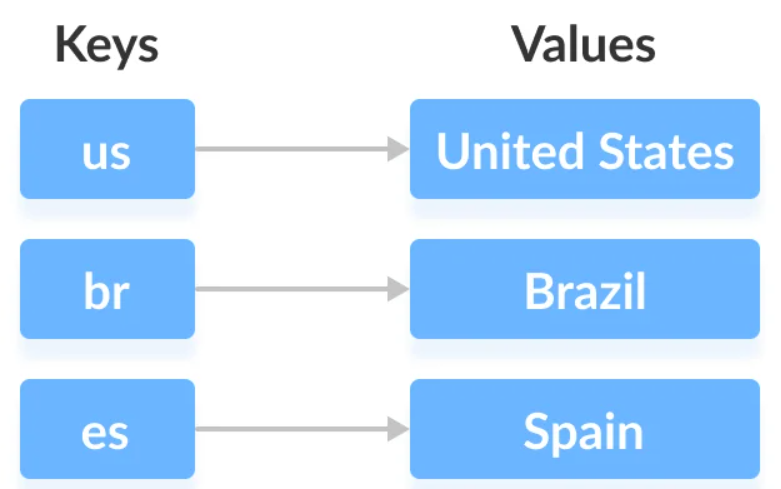

# Map

Aunque las estructura de datos `Map` no forma parte dentro de la jerarquía de la interfaz `Collection`, se considera una interfaz de colección principal de Java Collections Framework.


Un `Map` es un objeto que asigna claves a valores. **Un mapa no puede contener claves duplicadas**: cada clave puede asignarse a un valor como máximo. Sin embargo, los valores asignados a la clave pueden tener valores duplicados. La interfaz `Map` incluye métodos para operaciones básicas (como put, get, remove, containsKey, containsValue, size, y empty) entre muchos otros.



La plataforma Java contiene tres implementaciones de `Map`: `HashMap`, `TreeMap` y `LinkedHashMap`.

## Crear un Mapa

Para crear un objeto `Map` podemos usar cualquiera de las implementaciones para esta interfaz (`HashMap`, `TreeMap` y `LinkedHashMap`), por ejemplo:

```java
Map<String, String> idiomas = new HashMap<>();
```

## Añadir claves y valores en un mapa

Para añadir un par de clave-valor al mapa usamos el método `put`:

```java
public class MainMap {

    public static void main(String[] args) {
        Map<String, String> idiomas = new HashMap<>();
        idiomas.put("es", "Español");
        idiomas.put("en", "English EEUU");
        idiomas.put("ca", "English Canadá");
        idiomas.put("de", "Aleman");
        idiomas.put("fr", "Francés");
        idiomas.put("it", "Italian");
    }
}
```

Las claves de los mapas son **únicas**, si intentamos añadir un nuevo valor para una clave que ya existe, el valor es sobreescrito.

Para saber si estamos agregando una nueva clave o solo modificando el valor, el método `put` nos ayuda, ya que devuelve el valor anterior asociado con la clave, o `null` si no hubo asignación para la clave antes.

Ejemplo:

```java
Map<String, String> idiomas = new HashMap<>();

idiomas.put("es", "Español");
idiomas.put("en", "English EEUU");
idiomas.put("ca", "English Canadá");
idiomas.put("de", "Aleman");
idiomas.put("fr", "Francés");
System.out.println(idiomas.put("it", "Italian")); //devuelve null
System.out.println(idiomas.put("it", "Italiano")); //devuelve el valor previo "Italian", lo que significa que se ha sobreescrito

```

## Obtener el valor para una clave

Para obtener el valor asociado a una clave usamos el método `get`:

```java
String valor = idiomas.get("it");
```

## Comprobar si una clave o valor existe

```java
if (idiomas.containsKey("es")) {
    System.out.println("La clave es ya existe");
}

if (idiomas.containsValue("Español")) {
    System.out.println("El idioma español ya existe");
}
```

## Imprimir todos los valores del `Map`

Lo haremos de la siguiente forma:

```java
for(String key: idiomas.keySet()) {
    System.out.println(key + " " + idiomas.get(key));
}
```

Al imprimir vemos que las claves no aparecen en ningún orden, ni en el que las hemos introducido ni en orden alfabético. Los elementos del `HashMap` no están ordenados.

## Imprimir cada una de las entradas del mapa

Si queremos recorrer las entradas del mapa usaremos:

```java
for (Map.Entry<String, String> entradaMapa: idiomas.entrySet()) {
    System.out.println(entradaMapa.getKey() + " " + entradaMapa.getValue());
}
```

## Eliminar una entrada clave-valor de un `Map`

Tenemos dos formas de eliminar:

1. Eliminar desde una clave existente, o
2. Eliminar un par clave-valor existente.

```java
//Forma 1
boolean eliminado = idiomas.remove("fr");

//Forma 2
if (idiomas.remove("de", "Ingles")) {
    System.out.println("de ha sido eliminado");
} else {
    System.out.println("No existe un par clave-valor con de-Ingles");
}
```

## Reemplazar el valor de una clave

```java
idiomas.replace("es", "Spain");
idiomas.replace("en", "English", "English EEUU");//Reemplazo el antiguo valor por el nuevo, pero antes me aseguro que el antiguo valor sea ese dato antes de cambiarlo
```

## `HashMap`

`HashMap` es una estructura de datos que implementa la `Map<Key,Value>` interfaz y se basa en el principio de hash.

**Una función hash** es una función que convierte datos de entrada de cualquier tamaño (generalmente grande) en datos de tamaño fijo, generalmente compactos. El resultado de esta función de trabajo se llama **código hash**.

Cada objeto Java tiene un código hash. Suele ser un número y se calcula utilizando el método hashCode de la clase Object.
