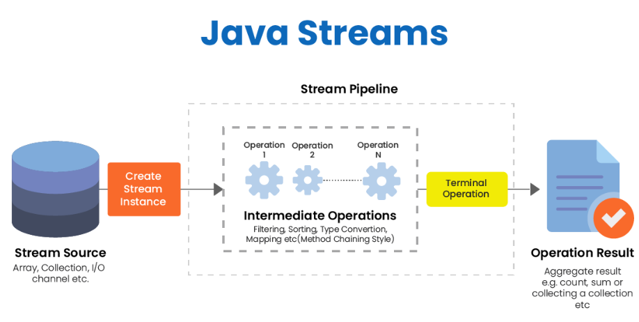
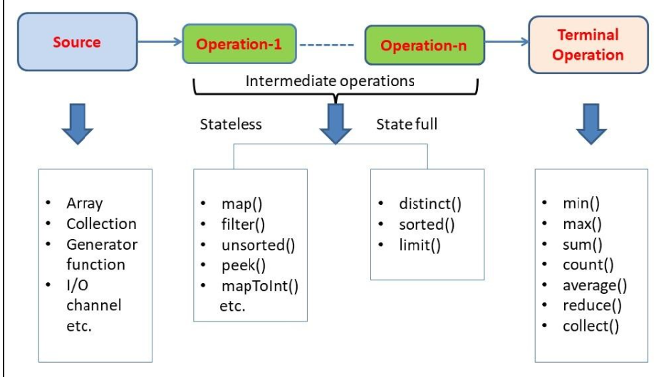

# Streams

Los Streams fueron introducidos en Java 8 para abrir la puerta a la programación funcional al igual que con las expresiones lambda.

La API `Stream` permite manipular las colecciones como nunca antes. Nos permite realizar operaciones sobre la colección, como por ejemplo, buscar, filtrar, reordenar, etc.

Con Streams podemos utilizar cualquier clase que implemente la interfaz `Collection` como si fuese un `Stream` con la ventaja que nos ofrecen las expresiones lambda.

Con streams hay que tener el cuenta que la fuente o colección que utilicemos no se puede modificar y no debe afectar al estado de la misma. Cada operación dentro del stream debe verse como una operación independiente que opera sobre el argumento (colección).

A través del API Stream podemos trabajar sobre colecciones como si estuviéramos realizando sentencias SQL pero de una manera limpia y clara, evitando bucles y algoritmos que ralentizan los programas e incluso hacen que el código se torne inmanejable.

**Cada operación del stream debe verse como un paso independiente, es decir, no se puede usar variables intermedias**.

## Partes de un Stream



De forma genérica existen 3 partes que componen un Stream:

1. Un Stream funciona a partir de una lista o colección, que también se la conoce **como la fuente de donde obtienen información**.
2. **Operaciones intermedias** como por ejemplo el método filter, que permite hacer una selección a partir de un predicado.
3. **Operaciones terminales**, como por ejemplo los métodos max, min, forEach, findFirst etc.



La fuente proporciona los elementos a la tubería.

## Funciones de Stream


## Operaciones intermedias

Las operaciones intermedias obtienen elementos uno por uno y los procesan. Todas las operaciones intermedias son perezosas (lazy) y, como resultado, ninguna operación tendrá ningún efecto hasta que la tubería comience a funcionar.

### `Peek()`

El método `peek` recibe como parámetro una expresión lambda de tipo `Consumer` para poder utilizar cada elemento del stream. Normalmente se utilizar para mostrar por consola el contenido del _stream_.

Este método existe principalmente para la depuración del programa, donde se desea ver los elementos a medida que pasan por un punto determinado en el pipeline.

`peek()` también se utiliza cuando queremos **alterar el estado interno de un elemento** (aunque esto no es muy común).

```java
Stream.of("one", "two", "three", "four")
  .filter(e -> e.length() > 3)
  .peek(e -> System.out.println("Filtered value: " + e))
  .map(String::toUpperCase)
  .peek(e -> System.out.println("Mapped value: " + e))
  .collect(Collectors.toList());
```

### `Filter()`

Como su nombre indica lo que hacemos es filtrar de todos los elementos del _stream_ solo aquellos que cumplan una determinada condición.
Recibe como parámetro una expresión lambda `Predicate` la cual debe devolver `true` solo en aquellos elementos que se quedarán en el _stream_ y `false` para aquellos elementos que se deben eliminar.

### `Sorted()`

Se utiliza para ordenar los elementos del _stream_. Recibe como parámetro una expresión lambda de tipo `Comparator` para que podamos indicar la lógica de la ordenación.

### `Distinct()`

Con `distinct` se seleccionan los elementos distintos dentro del _stream_ eliminando los duplicados.
Los elementos se comparan utilizando el método equals().

### `Map()`

El método `map` recibe como parámetro una expresión lambda de tipo `Function`, por lo que debemos especificar una función que recibe como parámetro de entrada cada elemento del _stream_, y devuelve un objeto que puede ser un tipo de dato distinto o el mismo.

La función se aplica a cada uno de los elementos del _stream_ para realizar alguna transformación sobre cada elemento y devuelve **otro Stream** sobre el cual puedes seguir trabajando.
Se utiliza para modificar el contenido del _stream_.
`map()` devuelve un stream nuevo que consta de los resultados de aplicar la función dada a los elementos del _stream_.

```java
List<Integer> list = Arrays.asList(3, 6, 9, 12, 15);

//Mostramos el nuevo stream devuelto por map
list.stream().map(number -> number * 3).forEach(System.out::println);
//[9 18 27 36 45]
```

### `FlatMap`

Cuando nos encontramos con estructuras más complejas, como por ejemplo una lista con otra lista, trabajar con `map()` no es suficiente, por ello, utilizamos `flatMap()` que lo que hace es "aplanar" listas anidadas y quedarnos con un _stream_ plano.

Es una función que recibe una entrada y devuelve varias salidas para esa entrada. Esa es la diferencia con respecto a `map()` que recibe solo un parámetro de entrada y devuelve una salida.

`flatMap()` es una operación intermedia y devuelve un nuevo _Stream_.
Devuelve un Stream que consiste en los resultados de reemplazar cada elemento del _stream_ dado con el contenido de un _stream_ mapeado producido al aplicar la función de mapeo provista a cada elemento.
La función de mapeo utilizada para la transformación en `flatMap()` es una función sin estado y solo devuelve una secuencia de nuevos valores.

En el siguiente ejemplo el programa usa la operación `flatMap()` para convertir una lista de una lista `List<List<Integer>>` a una lista `List<Integer>`.

```java
List<Integer> list1 = Arrays.asList(1,2,3);
List<Integer> list2 = Arrays.asList(4,5,6);
List<Integer> list3 = Arrays.asList(7,8,9);

List<List<Integer>> listOfLists = Arrays.asList(list1, list2, list3);
 
List<Integer> listOfAllIntegers = listOfLists.stream()
          .flatMap(x -> x.stream())
          .collect(Collectors.toList());

System.out.println(listOfAllIntegers);
//[1, 2, 3, 4, 5, 6, 7, 8, 9]
```

## Operaciones terminales

Las operaciones terminales significan el final del ciclo de vida del steam. Lo más importante para nuestro escenario es que inician el trabajo en la tubería.

### `ForEach()`

Recorremos cada elemento del _stream_ para realizar alguna acción con él. Como bien sabemos recibe como parámetro una exprsión lambda de tipo `Consumer`.

### `Collect()`

Es una operación terminal, se utiliza para indicar el tipo de colección en la que se devolverá el resultado final de todas las operaciones realizadas en el _stream_.

```java
List<String> lista = Arrays.asList("Texto1", "Texto2");
Set<String> set = lista.stream().collect(Collectors.toSet());
```

### `FindFirst()`

Se utiliza para devolver el primer elemento encontrado del _stream_. Se suele utilizar en combinación con otras funciones cuando hay que seleccionar un único valor del _stream_ que cumpla determinadas condiciones.

`findFirst` devuelve un objeto de tipo `Optional` para poder indicar un valor por defecto en caso de que no se pueda devovler ningún elemento del _stream_.

### `ToArray()`

Con este método se puede convertir cualquier tipo de `Collection` en un array de forma sencilla.

### `Min()`

Con `min` se obtiene el elemento del _stream_ con el valor mínimo calculado a partir de una expresión lambda de tipo `Comparator` que indicamos como parámetro.

`min` devuelve un objeto de tipo `Optional` para poder indicar un valor por defecto en caso de que no se pueda devolver ningún elemento del _stream_.

### `Max()`

Con `max` se obtiene el elemento del _stream_ con el valor máximo calculado a partir de una expresión lambda de tipo `Comparator` que indicamos como parámetro de la expresión.

`max` devuelve un objeto de tipo `Optional` para poder indicar un valor por defecto en caso de que no se pueda devolver ningún elemento del _stream_.

## Ventajas de Streams

- Código conciso y más limpio.
- Programación funcional: se programa escribiendo el "qué" en lugar del "cómo" para que sea comprensible de un vistazo.
- Puede leer y comprender fácilmente el código que tiene una serie de operaciones complejas.
- Ejecutar tan rápido como bucles for (o más rápido con operaciones paralelas)
- Ideal para listas grandes.

## Desventajas

- Excesivo para pequeñas colecciones.
- Difícil de aprender si está acostumbrado a la codificación de estilo imperativo tradicional