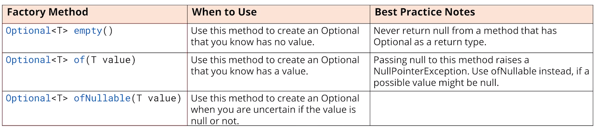

# Optional

`Optional` es una clase genérica, **cuyo propósito es ser un contenedor para un valor que puede o no ser nulo**. Fue creado por los ingenieros de Java, para abordar el problema o excepción tan conocida la `NullPointerException`.

La documentación oficial de Java dice que este tipo está pensado principalmente para un uso como tipo de retorno de método, bajo condiciones específicas.

`Optional` trata de resolver el problema cuando hay ausencia de resultados o datos y no queremos que esto sea un error. Por ejemplo, no todas las personas tienen 2o apellido. Esto sería válido para un optional, pero por ejemplo todo el mundo tenemos fecha de nacimiento, esto si que es un error.

## Crear una instancia de `Optional`

`Optional` es una clase genérica que se declara como cualquier otra, indicando el tipo. Aunque, no se puede construir un `Optional`. En su lugar, se usa uno de sus métodos estáticos: `empty`, `of` or `ofNullable`.



### Ejemplo con `Optional.of`

```java
Student s = new Student("Patricia", 32, LocalDate.now());        
Optional<Student> op = Optional.of(s);
System.out.println("Empty: " + op.isEmpty() + " Present: " + op.isPresent());
```

Output
>Optional[Patricia,32,2023-10-15]

>Empty: false Present: true

Hay que tener cuidado con Optional.of(object), ya que si lo usamos y puede llegar un valor `null`, dará una excepción `NullPointerException`:

```java
Student s = null;
Optional<Student> op = Optional.of(s);
System.out.println(op);
System.out.println("Empty: " + op.isEmpty() + " Present: " + op.isPresent());
```

Output
>`NullPointerException`

Por tanto, no habremos solucionado el problema, en vez de eso, debemos usar el método Optional.ofNullable(object), que si el objeto que se pasa es `null`, devolverá un `Optional` vacío.

```java
Student s = null;
Optional<Student> op = Optional.ofNullable(s);
System.out.println(op);
System.out.println("Empty: " + op.isEmpty() + " Present: " + op.isPresent());
```

Output
>Optional.empty

>Empty: true Present: false

{==

La primera regla para los desarrolladores que utilizan `Optional`, es que cualquier método que devuelva un `Optional`, nunca debe devolver null. En su lugar, debería devolver un optional vacío.

==}

## Cómo obtener el objeto o valor del `Optional`

El tipo `Optional` tiene un método `get()`, que devuelve el valor.

```java
Student student = new Student("Patricia", 32, LocalDate.now());
Optional<Student> op = Optional.ofNullable(student);
System.out.println(op.get());
System.out.println("Empty: " + op.isEmpty() + " Present: " + op.isPresent());
```

Output
>Patricia,32,2023-10-15

>Empty: false Present: true

En el ejemplo anterior, ha funcionado correctamente, hemos obtenido el objeto Student al hacer op.get().
Veamos que pasa, cuando `Optional.ofNullable()` devuelve un optional vacío:

```java
Student studentNull = null;
Optional<Student> op = Optional.ofNullable(studentNull);
System.out.println(op.get());
System.out.println("Empty: " + op.isEmpty() + " Present: " + op.isPresent());
```

Output
>Exception in thread "main" java.util.NoSuchElementException: No value present

El código anterior nos lanza una excepción porque **sólo podemos llamar al método get() si el método isPresent es verdadero, es decir, si tengo valor**. Para corregir el error tendríamos que realizar lo siguiente:

```java
Student studentNull = null;
Optional<Student> op = Optional.ofNullable(studentNull);
if (op.isPresent()) {
  System.out.println(op.get());
}

// también puedes hacerlo en una sola línea de código
op.ifPresent(System.out::println);
```
Ahora vemos que no imprime nada porque isPresent() devuelve false, ya que optional es vacío. Si queremos mostrar algo cuando tengamos un Optional vacío, podemos usar el método `ifPresentOrElse`:

```java
Student studentNull = null;
Optional<Student> op = Optional.ofNullable(studentNull);
op.ifPresentOrElse(System.out::println, ()-> System.out.println("empty object"));
```

El método ifPresentOrElse, recibe un `Consumer`, que es si el objeto no está vacío, y un `Runnable` que se llamará si está vacío.
Como `Runnable` es una interfaz funcional, podemos usar lambda para implementar el método `run`, que será la acción que se realice si el objeto `Optional` es vacío.

Output
>empty object