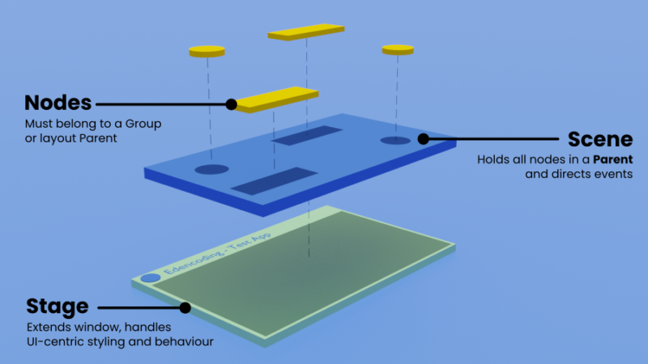

# JavaFX

JavaFX es una plataforma de aplicaciones de cliente de próxima generación de código abierto para sistemas integrados, móviles y de escritorio construidos en Java. Es un esfuerzo de colaboración de muchas personas y empresas con el objetivo de producir un conjunto de herramientas moderno, eficiente y con todas las funciones para desarrollar aplicaciones de clientes enriquecidos.

**En este tema nos centraremos en las aplicaciones de escritorio.**
JavaFX está disponible en Windows, Mac OS X y Linux.

Dado que la biblioteca JavaFX está escrita como una API de Java, el código de la aplicación JavaFX puede hacer referencia a las API de cualquier biblioteca de Java. Por ejemplo, las aplicaciones JavaFX pueden usar bibliotecas API de Java para acceder a las capacidades del sistema nativo y conectarse a aplicaciones de middleware basadas en servidor.

Es en esencia un conjunto de paquetes en Java y el sucesor de swing.

[Documentación oficial para JavaFX JDK11](https://openjfx.io/openjfx-docs/)

[API documentation](https://openjfx.io/javadoc/18/)

## Crear un nuevo proyecto JavaFX

En IntelliJ, seleccionamos File -> New Project

Seleccionamos JavaFX, lo llamamos HolaMundo y le damos a crear.
Para ejecutarlo nos ponemos en la clase principal y hacemos click en Run.

## Workflow de una aplicación JavaFX

1. `Application`
La clase de `Application` del paquete javafx.application es el punto de entrada de la aplicación en JavaFX. Para crear una aplicación JavaFX, se debe heredar esta clase e implementar su método abstracto `start()`. La clase principal tiene el nombre del proyecto seguido de Application y extiende de la clase `Application`, que es la que gestiona el ciclo de vida de una aplicación JavaFX.

2. `main` method
Cuando ejecutamos la aplicación JavaFX por primera vez, se lanza el método `main` que contiene el método `launch` que lanza la aplicación JavaFX y no vuelve hasta que se cierra la aplicación.

3. `init` method
Cuando un aplicación JavaFX es lanzada, el método `init` se ejecuta primero. Este método se encuentra en la clase `Application` y está vacío, por lo que podremos sobreescribirlo si queremos hacer algo con él.

4. `start` method
El método `start` se ejecuta justo después del método `init`. `start` es un método abstracto que heredamos de la clase `Application` por lo que siempre hay que sobreescribirlo y darle cuerpo.

5. `stop` method
Cuando la aplicación acaba porque los usuario cierran la ventana de la aplicación se ejecuta el método `stop`. Igual que pasa con el método `init`, este método se encuentra en la clase `Application` y está vacío también. Si no lo sobreescribimos no se hará nada con él.

## Estructura de una aplicación JavaFX

En general, una aplicación JavaFX tendrá tres componentes principales, **Stage, Scene y Node** como se muestra en la siguiente figura:

