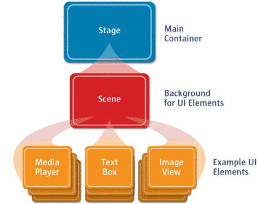

# JavaFX Stage

Uno de los símiles que más se aproxima para entender estos conceptos es ver el stage como un escenario, teatro o cine, en el cual, se desarrollan escenas. Dicho de otro modo, stage es un espacio y una escena define que sucede en ese espacio.
Visto así, tenemos que un stage es el contenedor de nivel superior, que como mínimo consta de una escena, que a su vez es contenedora de otros elementos.

Si nuestra programa es una aplicación de escritorio, el stage será la ventana, con su barra de título, y botones de maximizar, minimizar o cerrar, en el caso que que se ejecutase en un navegador web como Chrome, nuestro stage esta embebido dentro del navegador.

Un `Stage` JavaFX, javafx.stage.Stage, es un contenedor de nivel superior y extiende de la clase `Window`. Representa una ventana en una aplicación de escritorio JavaFX. Dentro de un stage JavaFX, se puede insertar un `Scene` JavaFX que representará el contenido que se muestra dentro de una ventana, dentro de un `Stage`.

Cuando se inicia una aplicación JavaFX, se crea un objeto `Stage` raíz que se pasa al método `start(Stage primaryStage)` de la clase raíz de la aplicación JavaFX. Este objeto Stage representa la ventana principal de la aplicación. Se pueden crear más objetos nuevos `Stage` más adelante si la aplicación necesita abrir más ventanas.

Normalmente las aplicaciones tienen una ventana o stage de nivel superior, ya que muchas ventanas pueden conducir a una mala experiencia por parte del usuario.



## Crear un `Stage`

```java
Stage stage = new Stage();
```

## Mostrar un `Stage`

Solo con crear un objeto Stage no basta para que se muestre en la aplicación. Para que el Stage sea visible, se debe llamar a su método `show()` o `showAndWait()`.

```java
stage.show();
```

La diferencia entre los métodos `show()` y `showAndWait()`, es que show() hace visible el `Stage` y sale del método inmediatamente, mientras que showAndWait() muestra el objeto `Stage` y luego lo bloquea (permanece dentro del método showAndWait()) hasta que se cierre el `stage`.

## Establecer un `Scene` a un `Stage`

Para mostrar algo dentro de un `Stage`, se debe establecer un objeto `Scene` en el Stage. El contenido de `Scene` se mostrará dentro del Stage cuando se muestre el Stage.

```java
VBox vBox = new VBox(new Label("A JavaFX Label"));
Scene scene = new Scene(vBox);

Stage stage = new Stage();
stage.setScene(scene);
stage.show();
```

## Ponerle título a un `Stage`

El título del `Stage` se muestra en la barra de título de la ventana.

```java
stage.setTitle("Aplicación JavaFX");
```

## Posicionar un `Stage`

Se puede establecer la posición (X,Y) de un `Stage` a través de sus métodos setX() y setY(). Los métodos setX() y setY() establecen la posición de la esquina superior izquierda de la ventana.

```java
Stage stage = new Stage();

stage.setX(50);
stage.setY(50);
```

## Dimensionar un `Stage`

Para establecer el ancho y el alto de un `Stage` utilizaremos los métodos `setWidth()` y `setHeight()`.

```java
Stage stage = new Stage();

stage.setWidth(600);
stage.setHeight(300);
```

## Establecer una ventana modal

Si queremos establecer la ventana como modal en un `Stage` usamos el método `initModality()`. La modalidad determina si la ventana que representa el Stage bloqueará otras ventanas abiertas por la misma aplicación.

```java
@Override
public void start(Stage primaryStage) {
    primaryStage.setTitle("JavaFX App");

    Stage stage = new Stage();
    stage.initModality(Modality.APPLICATION_MODAL);
    //stage.initModality(Modality.WINDOW_MODAL);
    //stage.initModality(Modality.NONE);

    primaryStage.show();

    stage.showAndWait();

}
```

+ Modalidad.APPLICATION_MODAL, bloqueará todas las demás ventanas abiertas por esta aplicación. No puede acceder a ninguna otra ventana hasta que se haya cerrado esta ventana.
+ Modality.WINDOW_MODAL el `Stage` creado bloqueará la ventana del `Stage` que "posee" (propietario) el `Stage` creado, pero solo eso. No todas las ventanas de la aplicación.
+ Modalidad.NONE el `Stage` no bloqueará ninguna otra ventana abierta en esta aplicación.

## Establecer propietario de un `Stage`

Un `Stage` puede ser propiedad de otro `Stage`. El propietario de un stage se establece a través de su método `initOwner()`.

```java
@Override
public void start(Stage primaryStage) {
    primaryStage.setTitle("JavaFX App");

    Stage stage = new Stage();
    stage.initModality(Modality.WINDOW_MODAL);

    stage.initOwner(primaryStage);

    primaryStage.show();

    stage.showAndWait();
}
```

## Dar estilo a un `Stage`

Se puede dar estilo a un stage utilizando el método `initStyle()`. Hay un conjunto de estilos diferentes:

+ DECORATED: es una ventana estándar con decoraciones del sistema operativo (barra de título y botones para minimizar/maximizar/cerrar) y un fondo blanco.
+ UNDECORATED: es una ventana estándar sin decoraciones del sistema operativo, pero aún con un fondo blanco.
+ TRANSPARENT: es una ventana sin decorar con un fondo transparente.
+ UNIFIED: es como un escenario decorado, excepto que no tiene borde entre el área de decoración y el área de contenido principal.
+ UTILITY: es una ventana decorada, pero con decoraciones mínimas.

```java
stage.initStyle(StageStyle.DECORATED);
```

## `Stage` a pantalla completa

Se puede establecer el stage a modo de pantalla completa a través del método `setFullScreen()`. Nota: puede que no obtengamos el resultado esperado sino añadimos un `Scene` en el stage.

```java
VBox vbox = new VBox();
Scene scene = new Scene(vbox);

primaryStage.setScene(scene);
primaryStage.setFullScreen(true);

primaryStage.show();
```

## Eventos del ciclo de vida de un `Stage`

`Stage` emite algunos eventos que se pueden escuchar.

+ Close Request: se recibe una notificación cuando el usuario hace click en el botón con la X en la esquina superior derecha de la ventana del escenario. Escuchar el evento de cierre del escenario puede ser útil si se necesita limpiar algunos recursos después de cerrar la ventana principal del escenario, o p. necesita detener algunos hilos, etc.

```java
primaryStage.setOnCloseRequest((event) -> {
    System.out.println("Closing Stage");
});
```

+ Hiding: se llama antes de que se oculte el stage, pero después de que se haya solicitado ocultarlo.

```java
primaryStage.setOnHiding((event) -> {
    System.out.println("Hiding Stage");
});
```

+ Hidden: se llama después de que se oculta el Stage.

```java
primaryStage.setOnHidden((event) -> {
    System.out.println("Stage hidden");
});
```

+ Showing: se llama después de que se solicite que se muestre el stage, pero antes de que se muestre.

```java
primaryStage.setOnShowing((event) -> {
    System.out.println("Showing Stage");
});
```

+ Shown: se llama después de que se muestre el stage.

```java
primaryStage.setOnShown((event) -> {
    System.out.println("Stage Shown");
});
```

## Eventos de teclado del `Stage`

Podemos escuchar eventos de teclado en un stage. De esta forma, se puede capturar todos los eventos del teclado que ocurren mientras el stage tiene el foco. Ejemplo que escucha las teclas ESC y Retorno en el teclado cuando un Stage tiene foco:

```java
primaryStage.addEventHandler(KeyEvent.KEY_PRESSED,  (event) -> {
    System.out.println("Key pressed: " + event.toString());

    switch(event.getCode().getCode()) {
        case 27 : { // 27 = ESC key
            primaryStage.close();
            break;
        }
        case 10 : { // 10 = Return
            primaryStage.setWidth( primaryStage.getWidth() * 2);
        }
        default:  {
            System.out.println("Unrecognized key");
        }
    }
});
```
