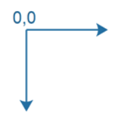

# JavaFX Node

La clase `Node`, javafx.scene.Node, es la clase base (superclase) para todos los componentes agregados a **JavaFX Scene Graph**. La clase `Node` es abstracta, por lo que solo agregará subclases de la clase Node al Scene Graph. Todas las instancias de `Node` en el escenario gráfico comparten un conjunto de propiedades comunes que están definidas por la clase JavaFX `Node` y que veremos a continuación.

## Conceptos básicos de `Node`

Cada instancia de `Node` (subclase) solo se puede agregar al Scene Graph una vez. En otras palabras, cada instancia de Node solo puede aparecer en un lugar en el escenario gráfico. **Si intenta agregar la misma instancia de Node, o instancia de subclase de Node, al gráfico de escena más de una vez, se generará una excepción.**

Un nodo JavaFX a veces puede tener subelementos, que también se denominan elementos secundarios.

Una vez que se adjunta una instancia de node al gráfico de escena, solo el hilo de la aplicación JavaFX puede modificar la instancia de node.

## Propiedades de JavaFX `Node`

La clase `Node` y, por lo tanto, todas las subclases de Node, tienen las siguientes propiedades comunes:

### 1. Sistema de coordenadas (Coordinate System)

Cada nodo JavaFX tiene su propio sistema de coordenadas cartesianas. La única diferencia con un sistema de coordenadas cartesianas regular es que **el eje Y está invertido**. Eso significa que el origen del sistema de coordenadas está en la esquina superior izquierda del sistema de coordenadas. A medida que aumentan los valores de Y, el punto se mueve hacia abajo desde la parte superior del sistema de coordenadas. Esta inversión del eje Y es normal en los sistemas de coordenadas de gráficos 2D.

Es posible que un nodo JavaFX tenga coordenadas X e Y negativas.

Cada nodo tiene su propio sistema de coordenadas. Este sistema de coordenadas se utiliza para colocar instancias de nodos secundarios dentro del nodo principal o al dibujar en un lienzo JavaFX. Eso significa que un nodo que es hijo de otro nodo tiene su propio sistema de coordenadas y una ubicación (X,Y) dentro del sistema de coordenadas de su nodo principal.

A continuación se muestra un ejemplo de un sistema de coordenadas de nodo principal en el que un nodo secundario está ubicado en (25,25) en el sistema de coordenadas del nodo principal. El nodo secundario también tiene su propio sistema de coordenadas que tiene su (0,0) donde el nodo secundario se encuentra en el sistema de coordenadas principal, es decir, en (25,25) en el sistema de coordenadas del nodo principal.

### 2. Cuadro delimitador (Bounding Box)

Un nodo JavaFX tiene un cuadro delimitador. El cuadro delimitador es un cuadro lógico alrededor de la forma del nodo. El nodo completo se encuentra dentro del cuadro delimitador, es decir, gráficamente. En otras palabras, todas las esquinas y bordes del Nodo están contenidos dentro del cuadro delimitador, y no hay espacio adicional alrededor del Nodo, a menos que se agregue a través de un efecto, relleno u otra cosa aplicada al Nodo.

En realidad, un nodo tiene 3 cuadros delimitadores:

+ **layoutBounds** Los límites del nodo en su propio espacio de coordenadas, sin aplicar ningún efecto, recorte o transformación.
+ **boundsInLocal** Los límites del nodo en su propio espacio de coordenadas, con efectos y clip aplicados, pero sin transformaciones.
+ **boundsInParent** Los límites del nodo en su espacio de coordenadas principal, con efectos, recorte y transformaciones aplicadas.

Cada una de estas dimensiones del cuadro delimitador se puede leer desde sus propiedades correspondientes con el mismo nombre, es decir, propiedades denominadas layoutBounds,boundsInLocal yboundsInParent.

El cuadro boundsInParent es utilizado por el nodo padre (padre) para diseñar sus hijos. El nodo principal necesita conocer el espacio total, incluidos todos los efectos, clips y transformaciones de un nodo para poder asignarle espacio.

### 3. layoutX y layoutY

Las propiedades layoutX y layoutY de un objeto de nodo contienen la X y la Y del nodo dentro de su padre.

### 4. Preferred height and width

Las propiedades de ancho y alto preferidas de un objeto de nodo especifican el ancho y alto preferidos del objeto de nodo dado (normalmente subclase de nodo). No todas las clases de nodos principales respetarán el ancho preferido y la altura preferida de un nodo secundario. Depende de la implementación concreta del nodo padre.

### 5. Minimum height and Minimum width

Las propiedades mínimas de ancho y alto de un objeto de nodo JavaFX especifican el ancho y el alto mínimos que un nodo quiere (o necesita) para mostrarse. No todas las clases de nodos principales pueden respetar estas propiedades. Depende de la implementación concreta del nodo padre.

### 6. Maximum height and Maximum width

Las propiedades máximas de ancho y alto de un objeto de nodo especifican el ancho y alto máximo que un nodo quiere (o necesita) para mostrarse. No todas las clases de nodos principales pueden respetar estas propiedades. Depende de la implementación concreta del nodo padre.

### 7. User data

Puede establecer datos de usuario en un nodo utilizando el método `setUserData()`. Este método toma cualquier objeto Java de su elección. De esta manera puede adjuntar, por ejemplo objetos de instancias de nodo.

### 8. Items (Child nodes)

Muchas subclases de nodos pueden contener elementos o nodos secundarios. La forma exacta en que agrega y accede a estos nodos secundarios depende de la subclase de nodo concreta. Algunas clases tienen un método `getItems()` que devuelve una lista de elementos. Otras clases tienen un método `getChildren()` que hace lo mismo. Se tendrá que comprobar la subclase de Nodo concreta para averiguar si puede tener elementos o nodos secundarios, y cómo los agrega y accede a ellos.
