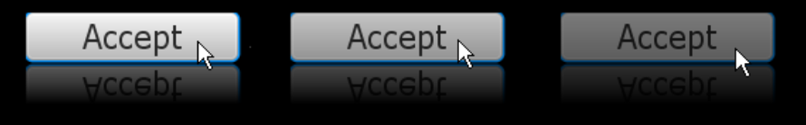

# UI Controls (User Interface Controls)

Los controles de la interfaz de usuario de JavaFX disponibles a través de la API de JavaFX se crean mediante el uso de nodos en el gráfico de escena. Pueden aprovechar al máximo las funciones visualmente ricas de la plataforma JavaFX y son portátiles entre diferentes plataformas. JavaFX CSS permite la creación de temas y estilos a los diferentes ontroles de la interfaz de usuario.


Las clases para construir controles de interfaz de usuario residen en el paquete `javafx.scene.control` de la API de JavaFX.

La lista de controles de IU incluye componentes de IU típicos que puede reconocer de su desarrollo anterior de aplicaciones cliente en Java. Sin embargo, el SDK de JavaFX presenta nuevos controles de interfaz de usuario de Java, como `TitledPane`, `ColorPicker` y `Pagination` entre otros.

Podemos obtener información detallada sobre todos los controles de interfaz de usuario de JavaFX disponibles en [Documentación JavaFX UI](https://docs.oracle.com/javase/8/javafx/user-interface-tutorial/index.html) y en la [documentación de la API](https://openjfx.io/javadoc/18/javafx.controls/javafx/scene/control/package-summary.html) para el paquete javafx.scene.control.

## Funciones y efectos

Dado que los controles de la interfaz de usuario del paquete javafx.scene.control son extensiones de la clase Node, se pueden integrar con la representación, la animación, las transformaciones y las transiciones animadas del gráfico de escena.

Considere la tarea de crear un botón, aplicarle un reflejo y animar el botón alterando su opacidad de su valor máximo a su valor mínimo.

La siguiente figura muestra tres estados del botón a través de la línea de tiempo de la animación. La imagen de la izquierda muestra el botón cuando su opacidad se establece en 1,0, la imagen central muestra la opacidad establecida en 0,8 y la imagen de la derecha muestra la opacidad establecida en 0,5.



El siguiente ejemplo crea e inicia una línea de tiempo indefinida, donde dentro de un cuadro de 600 milisegundos, la opacidad del botón cambia de su valor predeterminado (1,0) a 0,0.

```java
Button button = new Button();
    button.setText("OK");
    button.setFont(new Font("Tahoma", 24));
    button.setEffect(new Reflection());
 
final Timeline timeline = new Timeline();
timeline.setCycleCount(Timeline.INDEFINITE);
timeline.setAutoReverse(true);
final KeyValue kv = new KeyValue(button.opacityProperty(), 0);
final KeyFrame kf = new KeyFrame(Duration.millis(600), kv);
timeline.getKeyFrames().add(kf);
timeline.play();
```

Podemos aplicar otros efectos visuales disponibles en el paquete `javafx.scene.effect`, como sombra, iluminación o desenfoque de movimiento.

## Aplicar estilo a los controles de la interfaz de usuario con CSS

Podemos personalizar el aspecto de los controles de la interfaz de usuario definiendo sus propias hojas de estilo en cascada (CSS). Usar CSS en aplicaciones JavaFX es muy similar a usar CSS en HTML, porque cada caso se basa en la misma especificación de CSS. El estado visual de un control se define mediante el archivo .css, como se muestra en el ejemplo.

```css
/*controlStyle.css */
 
.scene{
    -fx-font: 14pt "Cambria Bold";
    -fx-color: #e79423;
    -fx-background: #67644e;
}
 
.button{
    -fx-text-fill: #006464;
    -fx-background-color: #e79423;
    -fx-border-radius: 20;
    -fx-background-radius: 20;
    -fx-padding: 5;
}
```

```java
Scene scene = new Scene();
scene.getStylesheets().add("uicontrolssample/controlStyle.css");
```

Además, también podemos definir el estilo de un control directamente en el código de la aplicación utilizando el método `setStyle()`.

## Gráficos (Charts)

Además de los elementos típicos de una interfaz de usuario, JavaFX proporciona gráficos predefinidos en el paquete `javafx.scene.chart`. Actualmente se admiten los siguientes tipos de gráficos: gráfico de áreas, gráfico de barras, gráfico de burbujas, gráfico de líneas, gráfico circular y gráfico de dispersión. Un gráfico puede contener varias series de datos.

## Preferred Size (tamaño preferido)

Cada control calcula su preferred size en función de su contenido, es decir, el alto y el ancho del control cuando se muestra.

Por ejemplo, en el caso de un button se redimensionará a si mismo de forma que haya espacio suficiente para mostrar su contenido, en su caso el texto.
